# NSS ADD_INSTANCE Operation - Complete Flow

---

## Architecture Overview

```
┌──────────────┐     ┌──────────────┐     ┌──────────────┐     ┌──────────────┐     ┌──────────────┐
│              │     │              │     │              │     │              │     │              │
│ NSS Operator │────▶│  HelixACM    │────▶│  Helix REST  │────▶│    Helix     │────▶│  Espresso    │
│              │     │   Service    │     │     API      │     │  Controller  │     │     Node     │
│              │◀────│              │◀────│              │◀────│              │◀────│              │
└──────────────┘     └──────────────┘     └──────────────┘     └──────────────┘     └──────────────┘
       │                     │                     │                     │                     │
       │                     │                     │                     │                     │
       └─────────────────────┴─────────────────────┴─────────────────────┴─────────────────────┘
                                              ZooKeeper
                                       (Metadata & Coordination)
```

### Key Points:
1. **NSS** sends ClusterUpdateRequest to **HelixACM** every 5 seconds
2. **HelixACM** orchestrates through its state machine: INIT → PREPARING → READY → ACKED → COMPLETED
3. **HelixACM** uses **Helix REST API** for health checks and cluster operations
4. **Helix Controller** detects changes via **ZooKeeper** watches
5. **Espresso Node** (participant) receives state transition messages from Controller

---

## ACM State Machine for ADD_INSTANCE

```
     ┌─────────────────────────────────────────────────┐
     │                    INIT                         │
     │   Operation assigned to instance inst1          │
     └────────────────┬────────────────────────────────┘
                      │ Health checks & validations
                      │ (Stoppable check via Helix REST)
                      ▼
     ┌─────────────────────────────────────────────────┐
     │                 PREPARING                        │
     │   Instance approved, waiting for readiness      │
     │   (For ADD: Auto-approved via NoOpContext)      │
     └────────────────┬────────────────────────────────┘
                      │ ACM transitions to READY
                      │ (No evacuation needed for ADD)
                      ▼
     ┌─────────────────────────────────────────────────┐
     │                   READY                          │
     │   Operation ready for NSS to execute            │
     │   State: READY (no state change yet)            │
     └────────────────┬────────────────────────────────┘
                      │ NSS receives ack,
                      │ moves inst1: pending → running
                      ▼
     ┌─────────────────────────────────────────────────┐
     │                   ACKED                          │
     │   NSS confirms received READY state             │
     │   NSS provisions & starts inst1                 │
     └────────────────┬────────────────────────────────┘
                      │ NSS completes provisioning,
                      │ inst1 joins Helix, gets partitions
                      ▼
     ┌─────────────────────────────────────────────────┐
     │                 COMPLETED                        │
     │   NSS reports: completed_instances: [inst1]     │
     │   Execute post-operation hooks                  │
     └────────────────┬────────────────────────────────┘
                      │ Post-hooks complete,
                      │ operation committed
                      ▼
     ┌─────────────────────────────────────────────────┐
     │                   INIT                           │
     │   Operation finished, ready for next            │
     └─────────────────────────────────────────────────┘
```

---

## Complete Sequence Diagram

```mermaid
sequenceDiagram
    participant NSS as NSS Operator
    participant ACM as HelixACM Service<br/>(gRPC + Pipeline)
    participant REST as Helix REST API
    participant ZK as ZooKeeper
    participant CTRL as Helix Controller
    participant INST as Espresso inst1<br/>(New Node)

    Note over NSS,INST: PHASE 1: NSS Initiates ADD_INSTANCE via ACM
    rect rgb(255, 250, 240)
        NSS->>NSS: Aggregate operations<br/>for LiStatefulSet
        NSS->>ACM: ClusterUpdateRequest<br/>{<br/>  pending_instances: [inst1],<br/>  running_instances: [],<br/>  completed_instances: []<br/>}
        activate ACM

        Note right of ACM: ACM State: INIT<br/>Operation assigned to inst1

        ACM->>ACM: Immediate async response<br/>(non-blocking)
        ACM-->>NSS: ClusterUpdateResponse<br/>{request accepted}
        deactivate ACM

        ACM->>ACM: Queue in DedupEventProcessor
    end

    Note over NSS,INST: PHASE 2: ACM Pipeline - Health Check (INIT → PREPARING)
    rect rgb(240, 255, 240)
        activate ACM
        ACM->>ACM: Pipeline: Health Check Stage<br/>Select instances for checks

        ACM->>REST: POST /clusters/{cluster}/instances/stoppable<br/>{instances: [existing_nodes]}
        activate REST
        REST->>ZK: Read IdealState, ExternalView,<br/>CurrentState
        activate ZK
        ZK-->>REST: Cluster state
        deactivate ZK

        REST->>REST: Evaluate:<br/>✓ Min active replicas<br/>✓ Zone distribution<br/>✓ Capacity available
        REST-->>ACM: Stoppable check: OK ✓
        deactivate REST

        Note right of ACM: ACM State: INIT → PREPARING

        ACM->>ACM: Select preparation context:<br/>ADD_INSTANCE → NoOpContext<br/>(No evacuation needed)

        ACM->>ACM: NoOpContext.prepare(inst1)<br/>Auto-approve: true

        Note right of ACM: ACM State: PREPARING → READY<br/>(No Helix operation needed)

        ACM->>ZK: Persist ACM state:<br/>/acm-record/{cluster}/inst1<br/>State: READY
        activate ZK
        ZK-->>ACM: Persisted ✓
        deactivate ZK
        deactivate ACM
    end

    Note over NSS,INST: PHASE 3: NSS Receives READY, Provisions Instance
    rect rgb(255, 255, 240)
        Note right of NSS: NSS polls every 5 seconds

        NSS->>ACM: ClusterUpdateRequest<br/>{<br/>  pending_instances: [inst1],<br/>  running_instances: [],<br/>  completed_instances: []<br/>}
        activate ACM
        ACM->>ACM: Read state: inst1 = READY
        ACM-->>NSS: ClusterUpdateResponse<br/>{acks: [inst1]}
        Note right of ACM: ACM State: READY<br/>(NSS will transition to ACKED next cycle)
        deactivate ACM

        NSS->>NSS: Move inst1:<br/>pending → running

        NSS->>NSS: Provision new host:<br/>- Allocate hardware<br/>- Install OS<br/>- Deploy Espresso service

        INST->>INST: Espresso service starts

        INST->>INST: Initialize HelixManager:<br/>ZKHelixManager.connect()

        INST->>ZK: Create ephemeral LiveInstance:<br/>/CLUSTER/LIVEINSTANCES/inst1<br/>{<br/>  sessionId: 0x1abc...,<br/>  helixVersion: 1.4.4,<br/>  processId: 12345<br/>}
        activate ZK
        Note right of ZK: Ephemeral node created
        deactivate ZK

        INST->>ZK: Setup watchers:<br/>/INSTANCES/inst1/MESSAGES
        activate ZK
        ZK-->>INST: Watcher registered ✓
        deactivate ZK

        Note right of INST: inst1 is now LIVE<br/>but has no partitions yet
    end

    Note over NSS,INST: PHASE 4: NSS Reports Running, ACM Moves to ACKED
    rect rgb(250, 245, 255)
        NSS->>ACM: ClusterUpdateRequest<br/>{<br/>  pending_instances: [],<br/>  running_instances: [inst1],<br/>  completed_instances: []<br/>}
        activate ACM
        ACM->>ACM: Update state:<br/>inst1: READY → ACKED
        ACM-->>NSS: ClusterUpdateResponse<br/>{no new acks}
        Note right of ACM: ACM State: ACKED<br/>Waiting for NSS completion
        deactivate ACM
    end

    Note over NSS,INST: PHASE 5: Helix Controller Detects New Instance
    rect rgb(245, 240, 255)
        ZK->>CTRL: ZK Watch Event:<br/>NodeChildrenChanged<br/>/LIVEINSTANCES
        activate CTRL

        CTRL->>ZK: Re-subscribe + fetch LiveInstances
        activate ZK
        ZK-->>CTRL: LiveInstances:<br/>[existing-node1, existing-node2, inst1]
        deactivate ZK

        CTRL->>CTRL: onLiveInstanceChange()<br/>New instance detected: inst1

        CTRL->>ZK: Setup watchers for inst1:<br/>/INSTANCES/inst1/CURRENTSTATE<br/>/INSTANCES/inst1/MESSAGES
        activate ZK
        ZK-->>CTRL: Watchers registered ✓
        deactivate ZK

        Note right of CTRL: Trigger Helix Pipeline

        CTRL->>CTRL: Stage 1-5: Read cluster data,<br/>compute current state

        CTRL->>ZK: Read:<br/>- IdealStates<br/>- CurrentStates (all instances)<br/>- InstanceConfigs<br/>- Topology
        activate ZK
        ZK-->>CTRL: Complete cluster state
        deactivate ZK

        Note right of CTRL: Stage 6: BestPossibleStateCalcStage<br/>(WAGED Rebalancer)

        CTRL->>CTRL: WAGED Rebalancer compute:<br/>━━━━━━━━━━━━━━━━━━━━━<br/>Input:<br/>  • Live instances: 3<br/>  • Current: 2 replicas<br/>    - existing-node1: LEADER<br/>    - existing-node2: STANDBY<br/>  • Required: 3 replicas<br/>  • MinActiveReplicas: 2<br/>  • Topology: 3 zones<br/>━━━━━━━━━━━━━━━━━━━━━<br/>Decision:<br/>  Assign partition P0<br/>  to inst1 as STANDBY<br/>  (lowest utilization, zone spread)

        Note right of CTRL: New Best Possible State:<br/>P0:<br/>  existing-node1: LEADER<br/>  existing-node2: STANDBY<br/>  inst1: STANDBY ← NEW

        Note right of CTRL: Stage 7: MessageGenerationPhase

        CTRL->>CTRL: Compare Best vs Current:<br/>inst1 Best: STANDBY<br/>inst1 Current: OFFLINE<br/>→ Transition: OFFLINE → STANDBY

        CTRL->>CTRL: Create state transition message:<br/>Target: inst1<br/>Resource: Database_P0<br/>Partition: P0<br/>FROM_STATE: OFFLINE<br/>TO_STATE: STANDBY<br/>StateModel: LeaderStandby

        Note right of CTRL: Stages 8-12:<br/>Selection, Throttling, Dispatch

        CTRL->>CTRL: Check constraints:<br/>✓ MinActiveReplicas (2) maintained<br/>✓ No throttle limits

        CTRL->>ZK: Write message:<br/>/INSTANCES/inst1/MESSAGES/msg-abc123<br/>{<br/>  FROM_STATE: OFFLINE,<br/>  TO_STATE: STANDBY,<br/>  PARTITION: Database_P0_0,<br/>  RESOURCE: Database_P0,<br/>  STATE_MODEL: LeaderStandby<br/>}
        activate ZK
        ZK-->>CTRL: Message written ✓
        deactivate ZK

        deactivate CTRL
    end

    Note over NSS,INST: PHASE 6: Participant Executes State Transition
    rect rgb(255, 245, 250)
        ZK->>INST: ZK Watch Event:<br/>NodeChildrenChanged<br/>/INSTANCES/inst1/MESSAGES
        activate INST

        INST->>ZK: Re-subscribe + fetch messages
        activate ZK
        ZK-->>INST: Message: OFFLINE → STANDBY
        deactivate ZK

        INST->>INST: HelixStateMachineEngine:<br/>Create transition handler

        INST->>INST: Get StateModel:<br/>LeaderStandby (Espresso impl)

        Note right of INST: Execute State Transition:<br/>onBecomeStandbyFromOffline()

        INST->>INST: Application logic (~3-5s):<br/>━━━━━━━━━━━━━━━━━━━━━<br/>• Open partition files<br/>• Start replication from LEADER<br/>• Build indexes<br/>• Mark partition ready for reads<br/>━━━━━━━━━━━━━━━━━━━━━

        INST->>ZK: Update CurrentState:<br/>/INSTANCES/inst1/CURRENTSTATE/<br/>{session}/Database_P0<br/>{<br/>  STATE: STANDBY,<br/>  PREVIOUS_STATE: OFFLINE,<br/>  START_TIME: ...,<br/>  END_TIME: ...<br/>}
        activate ZK
        ZK-->>INST: CurrentState updated ✓
        deactivate ZK

        INST->>ZK: Delete message:<br/>/INSTANCES/inst1/MESSAGES/msg-abc123
        activate ZK
        ZK-->>INST: Message deleted ✓
        deactivate ZK

        deactivate INST
    end

    Note over NSS,INST: PHASE 7: Controller Verification & ExternalView Update
    rect rgb(245, 255, 255)
        ZK->>CTRL: ZK Watch Event:<br/>NodeDataChanged<br/>/INSTANCES/inst1/CURRENTSTATE
        activate CTRL

        CTRL->>ZK: Re-subscribe + fetch CurrentState
        activate ZK
        ZK-->>CTRL: inst1 CurrentState: STANDBY ✓
        deactivate ZK

        CTRL->>CTRL: onStateChange()<br/>Trigger verification pipeline

        CTRL->>CTRL: Compute aggregated state:<br/>existing-node1: P0: LEADER<br/>existing-node2: P0: STANDBY<br/>inst1: P0: STANDBY ← NEW

        CTRL->>CTRL: Verify convergence:<br/>Current == Best Possible ✓<br/>No further messages needed

        CTRL->>ZK: Update ExternalView:<br/>/EXTERNALVIEW/Database_P0<br/>{<br/>  Database_P0_0: {<br/>    existing-node1: LEADER,<br/>    existing-node2: STANDBY,<br/>    inst1: STANDBY<br/>  }<br/>}
        activate ZK
        Note right of ZK: ExternalView published<br/>Routers/clients can see inst1
        deactivate ZK

        deactivate CTRL
    end

    Note over NSS,INST: PHASE 8: NSS Completes Operation via ACM
    rect rgb(250, 250, 255)
        NSS->>NSS: Verify inst1 health:<br/>✓ Serving traffic<br/>✓ Partitions assigned<br/>✓ Replication healthy

        NSS->>ACM: ClusterUpdateRequest<br/>{<br/>  pending_instances: [],<br/>  running_instances: [],<br/>  completed_instances: [inst1]<br/>}<br/>CompletionReason: SUCCESS
        activate ACM

        Note right of ACM: ACM State: ACKED → COMPLETED

        ACM->>ACM: Operation Complete Stage:<br/>Process completion

        ACM->>ACM: Execute post-operation hooks<br/>(custom validation, cleanup)

        ACM->>ACM: Based on CompletionReason:<br/>• SUCCESS → No action needed<br/>  (inst1 already in cluster)<br/>• FAILED → Would DISABLE inst1

        Note right of ACM: ACM State: COMPLETED → INIT

        ACM->>ZK: Update ACM state:<br/>/acm-record/{cluster}/inst1<br/>State: INIT<br/>(operation finished)
        activate ZK
        ZK-->>ACM: State persisted ✓
        deactivate ZK

        ACM-->>NSS: ClusterUpdateResponse<br/>{committedOperations: [operation_id]}
        deactivate ACM

        NSS->>NSS: Remove inst1 from operation list<br/>Operation committed ✓
    end

    Note over NSS,INST: 🎉 ADD_INSTANCE COMPLETE 🎉<br/>inst1 successfully added to cluster<br/>Serving Database_P0 as STANDBY<br/>Total time: ~10-15 seconds

```



---

## Timeline (Approximate)

| Time | Component | Action |
|------|-----------|--------|
| T+0ms | NSS | Send ClusterUpdateRequest (pending: [inst1]) |
| T+50ms | ACM | Queue request, return immediate response |
| T+100ms | ACM Pipeline | Health Check stage: stoppable check via REST |
| T+500ms | ACM | NoOpContext: auto-approve, transition to READY |
| T+1s | NSS | Poll ACM, receive ack, move inst1 to running |
| T+5s | NSS | Provision hardware, install Espresso |
| T+10s | inst1 | Espresso starts, connect to Helix |
| T+10.1s | inst1 | Create LiveInstance in ZK (ephemeral) |
| T+10.2s | Helix Controller | Detect new LiveInstance, trigger pipeline |
| T+10.5s | Helix Controller | WAGED rebalance: assign P0/STANDBY to inst1 |
| T+10.6s | Helix Controller | Write state transition message to ZK |
| T+10.7s | inst1 | Receive message, execute onBecomeStandbyFromOffline() |
| T+14s | inst1 | Complete transition (open files, replicate, index) |
| T+14.1s | inst1 | Update CurrentState to STANDBY |
| T+14.2s | Helix Controller | Verify convergence, update ExternalView |
| T+16s | NSS | Verify inst1 healthy, send completion |
| T+16.1s | ACM | Execute post-hooks, transition to INIT |
| T+16.2s | NSS | Operation committed ✓ |

**Total Duration: ~16 seconds**

---

## Key Differences: ADD vs REMOVE Operations

| Aspect | ADD_INSTANCE | REMOVE_INSTANCE |
|--------|--------------|-----------------|
| **ACM Context** | NoOpContext or AutoAckContext | PreparingByEvacuateContext |
| **Helix Operation** | None (or ENABLE) | EVACUATE |
| **Preparation Time** | Instant (auto-approved) | Wait for evacuation to complete |
| **Helix REST Calls** | Stoppable check only | Stoppable check + setInstanceOperation + isEvacuateFinished |
| **Helix Controller** | Assigns partitions TO new node | Moves partitions OFF old node |
| **State Transitions** | New node: OFFLINE → STANDBY/LEADER | Old node: current → OFFLINE |
| **Post-Completion** | No action needed | DELETE instance from cluster |
| **Total Duration** | ~10-16 seconds | ~30-60 seconds (depends on partition size) |

---

## Component Interactions Summary

### 1. NSS Operator
- **Role**: Orchestrates ADD_INSTANCE operation
- **Actions**:
  - Sends ClusterUpdateRequest every 5 seconds
  - Tracks instance state: pending → running → completed
  - Provisions hardware when ACM signals READY
  - Verifies instance health before marking complete

### 2. HelixACM Service
- **Role**: Operation coordination and safety validation
- **Actions**:
  - Receives operation via gRPC
  - Runs async pipeline (Health Check → Operation Prepare)
  - Selects NoOpContext for ADD_INSTANCE (no preparation needed)
  - Manages state machine: INIT → PREPARING → READY → ACKED → COMPLETED → INIT
  - Calls Helix REST for stoppable checks
  - Executes post-operation hooks

### 3. Helix REST API
- **Role**: Stateless API layer for Helix operations
- **Actions**:
  - Performs stoppable checks (validate cluster health)
  - Reads cluster state from ZooKeeper
  - Returns stoppable instance lists
  - (For ADD: minimal interaction, no instance operation set)

### 4. ZooKeeper
- **Role**: Metadata store and coordination
- **Actions**:
  - Stores LiveInstance (ephemeral, created by participant)
  - Stores IdealState, CurrentState, ExternalView
  - Stores ACM operation state (/acm-record)
  - Fires watches to notify Controller of changes
  - Stores state transition messages

### 5. Helix Controller
- **Role**: Partition assignment and rebalancing
- **Actions**:
  - Detects new LiveInstance via ZK watch
  - Runs 19-stage pipeline
  - WAGED rebalancer computes optimal partition placement
  - Generates state transition messages
  - Dispatches messages to participants
  - Updates ExternalView after convergence

### 6. Espresso Node (Participant)
- **Role**: Application that serves data
- **Actions**:
  - Creates ephemeral LiveInstance on startup
  - Watches /MESSAGES for instructions
  - Executes state transitions (OFFLINE → STANDBY)
  - Updates CurrentState after transitions
  - Implements application logic (file I/O, replication, indexing)

---

## ACM Pipeline Stages for ADD_INSTANCE

### Stage 1: Health Check and Operation Prepare (INIT → PREPARING)
```java
// Pseudo-code
instances = getInstancesInState(INIT)
stoppableResult = helixRestClient.instancesStoppable(cluster, existingInstances)
if (stoppableResult.canAddNewInstance()) {
    // For ADD_INSTANCE: use NoOpContext
    context = new NoOpContext()
    context.prepare(inst1)  // Auto-approves immediately
    setState(inst1, PREPARING)
}
```

**Result**: Instance moves to PREPARING (no Helix operation needed)

### Stage 2: Operation Selection (PREPARING → READY)
```java
// Pseudo-code
instances = getInstancesInState(PREPARING)
for (inst in instances) {
    if (context.isReady(inst)) {  // NoOpContext always returns true
        setState(inst, READY)
    }
}
```

**Result**: Instance moves to READY immediately

### Stage 3: Operation Update (via NSS polling)
```java
// Pseudo-code
// NSS sends: pending_instances=[], running_instances=[inst1]
if (nssRequest.running_instances.contains(inst1)) {
    setState(inst1, ACKED)
}

// NSS sends: completed_instances=[inst1]
if (nssRequest.completed_instances.contains(inst1)) {
    setState(inst1, COMPLETED)
}
```

**Result**: READY → ACKED → COMPLETED based on NSS updates

### Stage 4: Operation Complete (COMPLETED → INIT)
```java
// Pseudo-code
instances = getInstancesInState(COMPLETED)
for (inst in instances) {
    executePreCompletionHooks(inst)

    if (completionReason == SUCCESS) {
        // For ADD_INSTANCE: no action needed
        // Instance already in cluster via direct Helix join
    } else if (completionReason == FAILED) {
        // Optionally DISABLE instance
        helixRestClient.setInstanceOperation(inst, DISABLE)
    }

    executePostCompletionHooks(inst)
    setState(inst, INIT)
}
```

**Result**: Instance moves to INIT, operation complete

---

## ZooKeeper Paths

### ACM State (at /acm-record):
```
/acm-record/
└── ESPRESSO_MYDB/
    └── inst1
        ├── state: READY
        ├── operationType: ADD_INSTANCE
        ├── lastUpdateTime: 1738234567890
        └── metadata: {...}
```

### Helix Cluster State:
```
/ESPRESSO_MYDB/
├── LIVEINSTANCES/
│   ├── existing-node1_11932              [EPHEMERAL]
│   ├── existing-node2_11932              [EPHEMERAL]
│   └── inst1_11932                       [EPHEMERAL] ← NEW
├── INSTANCES/
│   └── inst1_11932/
│       ├── MESSAGES/
│       │   └── msg-abc123 (OFFLINE → STANDBY)
│       └── CURRENTSTATE/
│           └── {sessionId}/
│               └── Database_P0
│                   └── {STATE: STANDBY, ...}
├── IDEALSTATES/
│   └── Database_P0
│       └── {Database_P0_0: {...}}
├── EXTERNALVIEW/
│   └── Database_P0
│       └── {Database_P0_0: {existing-node1: LEADER, existing-node2: STANDBY, inst1: STANDBY}}
└── CONFIGS/
    ├── CLUSTER/
    │   └── {MinActiveReplicas: 2, ...}
    ├── PARTICIPANT/
    │   ├── existing-node1_11932
    │   ├── existing-node2_11932
    │   └── inst1_11932                   ← NEW
    └── RESOURCE/
        └── Database_P0
```

---

## Error Handling

### ACM Pipeline Errors
- **Stoppable check fails**: Instance remains in INIT, retries with exponential backoff
- **Cluster in safety mode**: Operations rejected until cluster healthy
- **ZooKeeper write fails**: Pipeline retries on next cycle (idempotent)

### NSS Errors
- **Provisioning fails**: NSS sends CompletionReason: FAILED
- **ACM unavailable**: NSS continues polling until ACM recovers
- **Timeout**: NSS marks operation failed after configurable timeout

### Helix Controller Errors
- **Rebalance fails**: Controller logs error, retries on next pipeline cycle
- **Constraint violation**: No messages generated until constraints satisfied
- **Participant timeout**: Controller marks partition ERROR after timeout

### Participant Errors
- **State transition fails**: Participant reports ERROR in CurrentState
- **Message processing fails**: Message remains until successfully processed
- **ZK connection lost**: Ephemeral LiveInstance disappears, Controller rebalances

---

## Safety Guarantees

### HelixACM Safety Checks
1. **Stoppable Check**: Ensures cluster can handle new instance without violating constraints
2. **Min Active Replicas**: Verified before any partition reassignment
3. **Zone Distribution**: New instance placed in optimal zone for fault tolerance
4. **Safety Mode**: Auto-activates if >25% instances offline (blocks unsafe operations)
5. **Operation Yielding**: Urgent operations (disruptions) can preempt ADD operations

### Helix Controller Guarantees
1. **At-least MinActiveReplicas**: Never violates min active replica constraint during transitions
2. **Atomic State Transitions**: All-or-nothing message delivery per partition
3. **Best Possible State Convergence**: Continuously works toward optimal assignment
4. **Fault Tolerance**: Controller failover via super controller reassignment

### Participant Guarantees
1. **Idempotent Transitions**: State transitions can be safely retried
2. **Consistent State**: CurrentState always reflects actual application state
3. **Message Acknowledgment**: Messages deleted only after successful transition

---

**End of Document**
