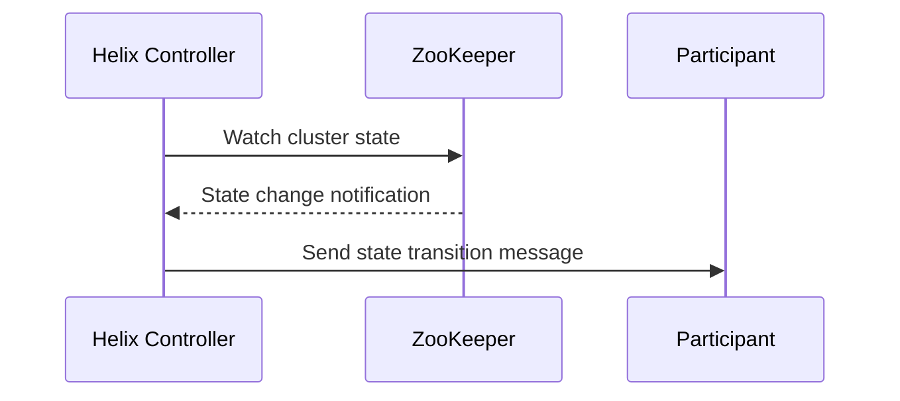
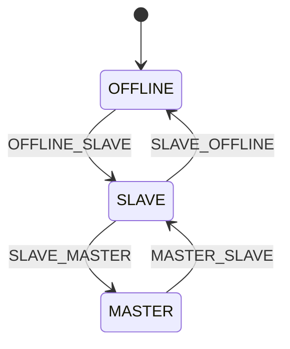

# [Title]

| Field       | Value                                      |
|-------------|--------------------------------------------|
| **Authors** | [names]                                    |
| **Status**  | Draft / In Review / Approved / Implementing / Done |
| **Created** | YYYY-MM-DD                                 |
| **Updated** | YYYY-MM-DD                                 |
| **Modules** | helix-core, helix-rest, ...                |
| **JIRA**    | [HELIX-XXXX](link) (if applicable)         |

---

## Table of Contents

<!-- Update this after writing the doc. -->

- [Summary](#summary)
- [Problem Statement](#problem-statement)
- [Goals / Non-Goals](#goals--non-goals)
- [Background](#background)
- [Design](#design)
- [API Changes](#api-changes)
- [Data / State Changes](#data--state-changes)
- [Implementation Plan](#implementation-plan)
- [Testing Strategy](#testing-strategy)
- [Rollout Plan](#rollout-plan)
- [Risks and Mitigations](#risks-and-mitigations)
- [Open Questions](#open-questions)

---

## Summary

<!--
2-4 sentences. What is the change and why is it needed?
Include: current problem, proposed solution, and key impact.
A reader should know whether this doc is relevant to them after this section.
-->

## Problem Statement

<!--
Describe the problem in concrete terms.
Include failure scenarios, metrics, or user-visible symptoms.
Use timelines or numbered steps to illustrate failure sequences:

```
T0: Cluster has 100 healthy nodes
T1: Rolling restart takes 25 nodes offline
T2: Helix enters maintenance mode (false positive)
```
-->

## Goals / Non-Goals

### Goals

<!-- Bulleted list. What this design WILL accomplish. Be specific and measurable. -->

- Goal 1
- Goal 2

### Non-Goals

<!-- Equally important. What this design explicitly will NOT address. Prevents scope creep. -->

- Non-goal 1
- Non-goal 2

## Background

<!--
Context a reader needs to understand the design. Link to:
- Prior design docs: `[Maintenance Mode](./NNN-title.md)`
- Key source files: `helix-core/src/main/java/org/apache/helix/controller/GenericHelixController.java`
- External references: ZooKeeper docs, Kubernetes APIs, etc.
- Architecture diagrams showing how existing components interact.

If comparing options, summarize rejected alternatives here or in Design.
-->

## Design

<!--
The core of the doc. Structure with subsections as needed.
Use Mermaid diagrams for architecture and sequence flows:



For state machines, use state diagrams:



If there are multiple viable approaches, present them as options with
a clear recommendation and rationale for the chosen one.
-->

## API Changes

<!--
REST API, ZooKeeper znode, or Java API changes.
Use tables for REST endpoints:

| Method | Path                          | Change      | Description          |
|--------|-------------------------------|-------------|----------------------|
| GET    | /clusters/{cluster}/instances | Modified    | Added `status` field |
| POST   | /clusters/{cluster}/maintenance | New       | Trigger maintenance  |

For Java API changes, show before/after signatures:

```java
// Before
public void enableMaintenanceMode(String clusterName);

// After
public void enableMaintenanceMode(String clusterName, MaintenanceReason reason);
```

For ZooKeeper state changes, document znode paths and data format changes.

Write "No API changes" if not applicable.
-->

## Data / State Changes

<!--
ZooKeeper znode changes, new config keys, new cluster properties,
new IdealState/ExternalView fields, schema migrations.

Write "No data or state changes" if not applicable.
-->

## Implementation Plan

<!--
Ordered steps. Each step should be independently mergeable and testable.
Reference specific files and modules.

### Step 1: <short description>
- **Module**: helix-core
- **Files to modify**:
  - `helix-core/src/main/java/org/apache/helix/controller/stages/MaintenanceModeStage.java`
  - `helix-core/src/main/java/org/apache/helix/model/ClusterConfig.java`
- **Files to create**:
  - `helix-core/src/main/java/org/apache/helix/controller/stages/MaintenanceReason.java`
- **What**: Add `MIN_ENABLED_LIVE_INSTANCES` field to ClusterConfig.
- **Depends on**: None
- **Validation**: `mvn test -pl helix-core -Dtest=TestClusterConfig`

### Step 2: <short description>
- **Module**: helix-core, helix-rest
- **Files to modify**: ...
- **What**: ...
- **Depends on**: Step 1
- **Validation**: `mvn test -pl helix-core,helix-rest`

Keep steps small enough that each is a single PR.
-->

## Testing Strategy

<!--
Cover all three levels:

### Unit Tests
- What classes/methods are tested
- Key edge cases
- Files: `helix-core/src/test/java/org/apache/helix/controller/stages/TestMaintenanceModeStage.java`

### Integration Tests
- Scenario-based tests using ZkIntegrationTestBase or similar
- Run with: `mvn verify -pl helix-core -P integration-test`
- Files: `helix-core/src/test/java/org/apache/helix/integration/TestClusterMaintenanceMode.java`

### Manual Validation
- Steps to verify in a dev/staging cluster if applicable
-->

## Rollout Plan

<!--
How will this change reach production?

- Feature flag / cluster config gating
- Phased rollout: dev cluster -> staging -> canary -> production
- Rollback procedure: what to do if something goes wrong
- Monitoring: what metrics/alerts to watch during rollout
-->

## Risks and Mitigations

<!--
| Risk | Likelihood | Impact | Mitigation |
|------|-----------|--------|------------|
| False maintenance mode during large-scale failures | Low | High | Configurable threshold with safe defaults |
-->

## Open Questions

<!--
Numbered list of unresolved items. Update this section as questions are answered.
Mark resolved items with ~~strikethrough~~ and the answer.

1. Should we deprecate the old threshold or keep it as a fallback?
2. ~~How should we handle ZK session expiry during maintenance?~~ → Resolved: retry with backoff.
-->
