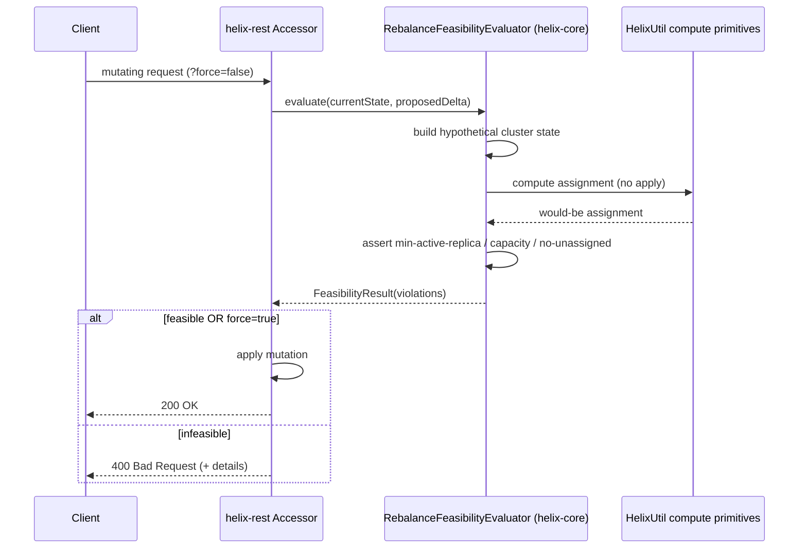
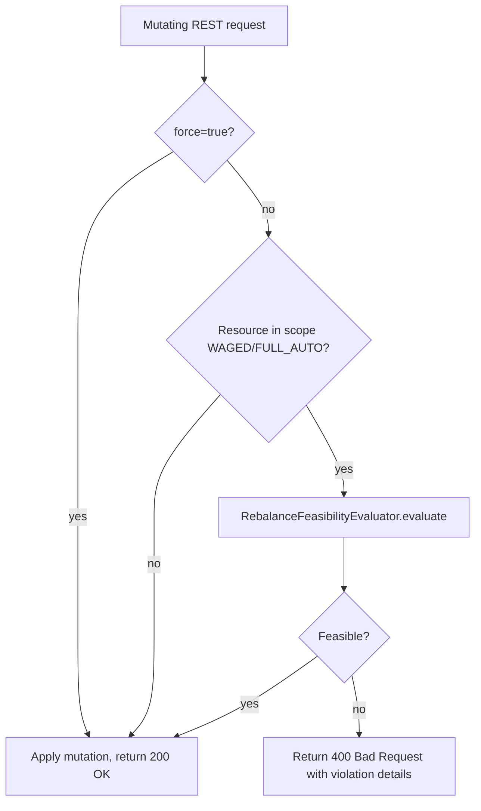

# Helix REST Guard Rails for Known Rebalance-Failure Scenarios

| Field       | Value                                      |
|-------------|--------------------------------------------|
| **Authors** | Arkesh Mishra                              |
| **Status**  | Draft                                      |
| **Created** | 2026-06-24                                 |
| **Updated** | 2026-06-24                                 |
| **Modules** | helix-rest, helix-core                     |
| **JIRA**    | [CICP-3788](https://linkedin.atlassian.net/browse/CICP-3788) |

---

## Table of Contents

- [Summary](#summary)
- [Problem Statement](#problem-statement)
- [Goals / Non-Goals](#goals--non-goals)
- [Background](#background)
- [Design](#design)
  - [Central decision: shared evaluator vs per-endpoint checks](#central-decision-shared-evaluator-vs-per-endpoint-checks)
  - [The RebalanceFeasibilityEvaluator](#the-rebalancefeasibilityevaluator)
  - [Per-scenario guard rails](#per-scenario-guard-rails)
  - [Where the code goes](#where-the-code-goes)
  - [helix-rest integration and customer usage](#helix-rest-integration-and-customer-usage)
- [API Changes](#api-changes)
- [Data / State Changes](#data--state-changes)
- [Implementation Plan](#implementation-plan)
- [Testing Strategy](#testing-strategy)
- [Rollout Plan](#rollout-plan)
- [Risks and Mitigations](#risks-and-mitigations)
- [Open Questions](#open-questions)

---

## Summary

Several mutating Helix REST operations — dropping an instance, shrinking instance capacity,
marking an instance `EVACUATE`, and onboarding a new resource — are accepted unconditionally
today and only fail **later**, on the controller's next rebalance cycle, when the WAGED
rebalancer can no longer satisfy `minActiveReplicas` or capacity constraints. By then the
caller has already gotten a `200 OK` and the cluster is in a degraded or stuck state.

This document scopes a set of **guard rails**: a pre-flight feasibility check on each of these
endpoints that rejects a mutation (`400 Bad Request`) when it would make the cluster
un-rebalanceable, with a `?force=true` escape hatch for operators who accept the risk. The
core recommendation is to back all guard rails with a single, reusable
**`RebalanceFeasibilityEvaluator`** in `helix-core` that reuses Helix's existing
"compute assignment without applying it" primitives — the same ones that already power the
`ResourceAssignmentOptimizerAccessor` dry-run endpoint. This also answers the ticket's
open question about whether a dry-run feature would help: the primitive already exists; we
make it enforce automatically.

No production code lands with this document. It defines **what** guard rails will be added,
**where** the code lives, **how** it integrates with helix-rest and existing customer
workflows, **how** it is tested, and the **backward-compatibility** plan for each API.

## Problem Statement

Helix REST write endpoints mutate cluster intent (instance set, instance capacity, instance
operation, resource set) and return immediately. The WAGED rebalancer runs asynchronously on
the controller and only then discovers that the new intent is infeasible. The failure surfaces
as a stuck rebalance, unassigned partitions, or a `MissingTopState`-class alert — far from the
API call that caused it.

Concrete failure timelines:

```
Scenario 1 — drop instance below min-active-replica
T0: Resource MyDB, replicas=3, minActiveReplicas=2. Two replicas of MyDB_7 are already OFFLINE.
T1: Operator calls DELETE /clusters/c/instances/host-7  -> 200 OK (only liveness is checked).
T2: Controller rebalances: MyDB_7 now has 0 active replicas. -> SLA breach, no top state.
```

```
Scenario 2 — stop instance the cluster cannot absorb (ACM)
T0: WAGED cluster at 95% capacity utilization across remaining nodes.
T1: ACM stoppable check returns stoppable=true (min-active-replica passes for each partition).
T2: Instance stops; its weight redistributes; some node exceeds capacity. -> WAGED cannot
    place all partitions. -> rebalance failure.
```

```
Scenario 3 — EVACUATE with nowhere to evacuate to
T0: Operator POSTs setInstanceOperation=EVACUATE on host-3.
T1: Helix tries to move host-3's partitions elsewhere, but remaining capacity is insufficient.
T2: Partitions cannot be re-placed. -> evacuation stalls, rebalance failure.
```

```
Scenario 4 — add a resource that does not fit
T0: Operator POSTs addWagedResource with partition weights that exceed cluster headroom.
T1: Resource is created in IDEALSTATES. -> next WAGED cycle cannot place it -> rebalance failure.
```

In every case the information needed to reject the request was available *at request time*:
Helix can compute what the rebalancer *would* produce for the proposed cluster state without
applying it.

## Goals / Non-Goals

### Goals

- Define guard rails for the five scenarios in CICP-3788: (1) instance removal / capacity
  shrink, (2) ACM stoppable check completeness, (3) `EVACUATE`, (4) new-resource onboarding,
  (5) a dry-run capability.
- Specify a single shared feasibility mechanism that all guard rails reuse, rather than
  per-endpoint bespoke logic.
- Specify exactly **where** the code lives (module/package/class), **how** each REST endpoint
  integrates it, and **how** existing customers (ACM, deployment/evacuation tooling,
  resource-onboarding tooling) are affected and migrate.
- Specify a concrete **testing strategy** (unit + integration + backward-compat) with
  validation commands.
- Provide a per-endpoint **backward-compatibility** analysis with the standard
  enforce-by-default + `?force=true` contract.

### Non-Goals

- Implementing the guard rails. Each is a follow-up PR/ticket referenced from the
  [Implementation Plan](#implementation-plan).
- Changing the WAGED algorithm, the rebalancer pipeline, or the controller.
- Guard rails for non-WAGED / non-FULL_AUTO (e.g. SEMI_AUTO, CUSTOMIZED) resources beyond a
  documented no-op (their placement is operator-controlled, so there is nothing to validate).
- A new general-purpose simulation framework. We reuse existing compute primitives.

## Background

**WAGED capacity model.** WAGED placement requires every instance to declare an
`INSTANCE_CAPACITY_MAP` covering `ClusterConfig.getInstanceCapacityKeys()`, and every partition
to declare a weight. `WagedValidationUtil.validateAndGetInstanceCapacity(clusterConfig,
instanceConfig)` and `validateAndGetPartitionCapacity(...)`
(`helix-core/.../controller/rebalancer/util/WagedValidationUtil.java`) are the existing
validators for these invariants. A mutation that removes a required capacity key, or adds
weight the cluster cannot host, breaks the next rebalance.

**Min-active-replica.** Resources may declare `minActiveReplicas`. Dropping or stopping a
replica that pushes a partition below this threshold is the most common rebalance-failure
trigger. `InstanceValidationUtil.siblingNodesActiveReplicaCheckWithDetails(...)`
(`helix-core/.../util/InstanceValidationUtil.java`) already computes, for a target instance,
whether its hosted partitions retain enough healthy siblings.

**ACM stoppable flow.** `MaintenanceManagementService.batchGetInstancesStoppableChecks(...)`
(`helix-rest/.../clusterMaintenanceService/MaintenanceManagementService.java:403`) runs in two
phases: `batchHelixInstanceStoppableCheck` (Helix-owned checks driven by the `HealthCheck`
enum) then `batchCustomInstanceStoppableCheck` (client-side + partition checks). The
`HealthCheck` enum (`.../clusterMaintenanceService/HealthCheck.java`) already includes
`MIN_ACTIVE_REPLICA_CHECK_FAILED` in `STOPPABLE_CHECK_LIST`, and the batch path threads a
`toBeStoppedInstances` set so checks account for instances already slated to stop. ACM consumes
these checks through the existing `/instances/{name}/stoppable` and batch endpoints. Take/free
operations additionally run pluggable `OperationInterface` checks
(`operationCheckForTakeSingleInstance` / `operationCheckForFreeSingleInstance`).

**The dry-run primitive already exists.** `ResourceAssignmentOptimizerAccessor`
(`helix-rest/.../resources/helix/ResourceAssignmentOptimizerAccessor.java`) exposes
`POST /clusters/{id}/resources?command=...` (`computePotentialAssignment`). It:

1. Builds a **hypothetical** cluster state: current live instances, plus `ActivateInstances`,
   minus `DeactivateInstances`, with `InstanceConfigs` overrides (L200–254).
2. Computes the resulting assignment **without applying it** — `HelixUtil
   .getIdealAssignmentForFullAuto(...)` for FULL_AUTO/CRUSH resources (L286–289) and
   `HelixUtil.getTargetAssignmentForWagedFullAuto(...)` for WAGED resources (L364–367).
3. Returns the assignment map to the caller.

That is exactly the computation a feasibility guard rail needs. The dry-run "engine" Item 5
asks us to explore is already in the codebase; the gap is that nothing **enforces** it on
mutating endpoints.

**Prior art: PR #163.** [linkedin/helix#163](https://github.com/linkedin/helix/pull/163)
(open) adds two guard rails to `PerInstanceAccessor`: a min-active-replica check on
`deleteInstance()` and a capacity-key check on `updateInstanceConfig()`, both with `?force=true`
bypass, and standardizes `IllegalArgumentException` → `400`. This document treats PR #163 as
the **reference pattern** (Scenario 1) and generalizes it.

## Design

### Central decision: shared evaluator vs per-endpoint checks

**Option A — per-endpoint ad-hoc checks (PR #163 style).** Each endpoint calls a narrow
validator: `siblingNodesActiveReplicaCheck` on delete, `validateAndGetInstanceCapacity` on
config update, etc.

- Pros: minimal, already proven by PR #163, cheap (no full assignment computation).
- Cons: each endpoint reimplements a slice of the logic; none catches *full-cluster*
  infeasibility (e.g. Scenario 2, where every individual partition passes min-active-replica
  but the cluster as a whole cannot host the redistributed weight); `EVACUATE` and
  new-resource cases have no natural narrow validator.

**Option B — shared `RebalanceFeasibilityEvaluator` (recommended).** A single helix-core
component takes the *current* cluster state plus a *proposed delta*, reuses the optimizer's
hypothetical-state build and the existing `HelixUtil` compute primitives to produce the
would-be assignment, and then asserts post-conditions. Every mutating endpoint calls it.

- Pros: one code path, one error contract; catches whole-cluster infeasibility, not just
  per-partition; naturally covers all of Scenarios 1–4; *is* the dry-run of Scenario 5
  (operators can call it explicitly, the same way they call the optimizer today).
- Cons: computes a full assignment (heavier than a narrow check); must bound latency on large
  clusters (see [Risks](#risks-and-mitigations)).

**Recommendation: Option B**, with Option A's narrow checks retained as a fast pre-filter where
they are sufficient and cheap (e.g. the capacity-key presence check on config update). This
gives correctness for the hard cases and speed for the easy ones.

### The RebalanceFeasibilityEvaluator

A new helix-core component (proposed: `org.apache.helix.util.RebalanceFeasibilityEvaluator`).

**Input:** a `FeasibilityRequest` describing the current cluster plus one proposed delta:

| Delta type | Produced by | Hypothetical-state change |
|------------|-------------|---------------------------|
| Drop instance | `deleteInstance` | remove instance from live + config set |
| Shrink capacity | `updateInstanceConfig` | override target `InstanceConfig` with merged capacity |
| EVACUATE | `setInstanceOperation` | set target instance operation to `EVACUATE` (excluded from placement) |
| Add resource | `addResource` / `addWagedResource` | add the new `IdealState` (+ `ResourceConfig`) to the resource set |

**Compute:** reuse the optimizer's two primitives against the hypothetical state —
`HelixUtil.getIdealAssignmentForFullAuto(...)` (FULL_AUTO/CRUSH) and
`HelixUtil.getTargetAssignmentForWagedFullAuto(...)` (WAGED). The hypothetical-state builder
currently private in `ResourceAssignmentOptimizerAccessor` (L200–254) is extracted into a
shared helper so the evaluator and the optimizer endpoint use one code path.

**Assert (post-conditions) — a `FeasibilityResult` listing any violations:**

1. **Min-active-replica:** every partition retains ≥ `minActiveReplicas` assigned replicas.
2. **Capacity:** no instance exceeds any `INSTANCE_CAPACITY_MAP` dimension (WAGED).
3. **No-unassigned:** no partition that was assignable becomes unassigned.

The result carries structured details (`resource`, `partition`, `activeReplicas/required`,
`capacityKey/instance`) so endpoints can return actionable `400` bodies and ACM can surface a
specific failed-check reason.

**Scope guard:** if no resource in scope is WAGED or FULL_AUTO/CRUSH, the evaluator returns
"feasible (not evaluated)" — preserving today's behavior for operator-controlled placement.



### Per-scenario guard rails



| # | Scenario | Endpoint | Guard rail |
|---|----------|----------|------------|
| 1 | Drop instance / shrink capacity | `DELETE /instances/{n}`, `POST /instances/{n}/configs` | Evaluator with drop / shrink-capacity delta. Retain PR #163's narrow checks as fast pre-filter. |
| 2 | ACM stoppable completeness | `/instances/{n}/stoppable`, batch | New `HealthCheck` (e.g. `REBALANCE_FEASIBILITY_CHECK_FAILED`) added to `STOPPABLE_CHECK_LIST`, evaluated via the evaluator (stop = deactivate delta, honoring `toBeStoppedInstances`). |
| 3 | EVACUATE | `POST /instances/{n}?command=setInstanceOperation&instanceOperation=EVACUATE` | Evaluator with EVACUATE delta before persisting the operation; alternatively expose as an `OperationInterface` check for the take/free path. |
| 4 | Add resource | `POST /resources/{r}` (`addResource`, `addWagedResource`) | Evaluator with add-resource delta (validate new partition weights fit cluster headroom). |
| 5 | Dry-run | (existing) `ResourceAssignmentOptimizerAccessor`; optional explicit `?dryRun=true` on the mutating endpoints | No new engine. Document that the evaluator *is* the dry-run; optionally let callers invoke it without mutating. |

All four enforcing guard rails share one contract: **enforce by default, bypass with
`?force=true`,** and return a uniform `400` violation body.

### Where the code goes

| Layer | Module | Component |
|-------|--------|-----------|
| Feasibility engine | **helix-core** | `org.apache.helix.util.RebalanceFeasibilityEvaluator` (new) + `FeasibilityRequest` / `FeasibilityResult` value types. Reuses `HelixUtil`, `WagedValidationUtil`, `InstanceValidationUtil`. |
| Hypothetical-state builder | **helix-core** (or shared util) | Extracted from `ResourceAssignmentOptimizerAccessor` (L200–254) so the evaluator and the optimizer endpoint share one builder. |
| Instance guard rails | **helix-rest** | `PerInstanceAccessor.deleteInstance` / `updateInstanceConfig` / `updateInstance(setInstanceOperation)` call the evaluator. |
| Resource guard rail | **helix-rest** | `ResourceAccessor.addResource` / `addWagedResource` call the evaluator. |
| ACM stoppable | **helix-rest** | New `HealthCheck` value + wiring in `MaintenanceManagementService.batchHelixInstanceStoppableCheck`. |
| Error contract | **helix-rest** | Shared helper to render `FeasibilityResult` as a uniform `400` body; common `force` query param. |

Engine and invariants live in helix-core (reusable, unit-testable without a REST server);
helix-rest only builds the delta, calls the evaluator, and renders the result.

### helix-rest integration and customer usage

- **Call pattern per endpoint:** parse request → build the `FeasibilityRequest` delta → if
  `force=false` and scope is WAGED/FULL_AUTO, call the evaluator → on violations return `400`
  with details, else apply the mutation. `force=true` skips the evaluator entirely.
- **Uniform error body** (all guard rails):

  ```json
  {
    "error": "REBALANCE_FEASIBILITY_CHECK_FAILED",
    "violations": [
      {"resource": "MyDB", "partition": "MyDB_7", "activeReplicas": 1, "required": 2}
    ],
    "hint": "Use force=true to override."
  }
  ```

- **Customer usage today vs after:**
  - *Today*, customers can call `ResourceAssignmentOptimizerAccessor` to dry-run an instance
    change explicitly. After, the **same computation runs automatically** on mutating
    endpoints — the dry-run becomes a pre-flight nobody has to remember to run.
  - *ACM* needs **no new endpoint**: the new `HealthCheck` flows through the existing
    `/stoppable` and batch APIs; ACM simply observes a new failed-check reason and treats the
    instance as not-stoppable.
  - *Deployment / evacuation tooling* calling `setInstanceOperation=EVACUATE` will get a `400`
    when evacuation is infeasible; tooling that must proceed adds `force=true`.
  - *Resource-onboarding tooling* calling `addWagedResource` will get a `400` when the cluster
    cannot host the new resource; same `force=true` opt-out.

## API Changes

No new endpoints. The following endpoints gain a `force` query param (default `false`) and a
feasibility pre-check:

| Method | Path | Change | Description |
|--------|------|--------|-------------|
| DELETE | `/clusters/{c}/instances/{n}` | Modified | Feasibility check (drop delta); `?force=true` bypass. |
| POST | `/clusters/{c}/instances/{n}/configs` | Modified | Feasibility check on capacity-affecting updates; `?force=true` bypass. |
| POST | `/clusters/{c}/instances/{n}?command=setInstanceOperation` | Modified | Feasibility check for `EVACUATE`; `?force=true` bypass. |
| POST | `/clusters/{c}/resources/{r}` | Modified | Feasibility check for `addResource`/`addWagedResource`; `?force=true` bypass. |
| GET/POST | `/clusters/{c}/instances/{n}/stoppable` (+ batch) | Modified | New `HealthCheck` reason `REBALANCE_FEASIBILITY_CHECK_FAILED` in results. |

Behavior change for all four enforcing endpoints: an operation that would make the cluster
un-rebalanceable now returns `400 Bad Request` instead of `200 OK`. See
[Rollout Plan](#rollout-plan) for the migration contract.

## Data / State Changes

- **`HealthCheck` enum:** add `REBALANCE_FEASIBILITY_CHECK_FAILED` and include it in
  `STOPPABLE_CHECK_LIST`.
- **No new ZooKeeper znodes, no new `ClusterConfig` keys.** The chosen posture is
  enforce-by-default with a per-request `force` flag, so no persistent gating state is needed.
  (A per-cluster opt-out flag is listed as a rejected alternative in
  [Open Questions](#open-questions).)

## Implementation Plan

Each step is an independently mergeable, testable follow-up PR/ticket. This design document
itself lands first (no code).

### Step 1: RebalanceFeasibilityEvaluator + shared hypothetical-state builder
- **Module**: helix-core (+ minor helix-rest refactor)
- **Files to create**: `helix-core/src/main/java/org/apache/helix/util/RebalanceFeasibilityEvaluator.java`,
  `.../util/FeasibilityRequest.java`, `.../util/FeasibilityResult.java`
- **Files to modify**: extract the hypothetical-state builder from
  `helix-rest/.../resources/helix/ResourceAssignmentOptimizerAccessor.java` into a shared helper
- **What**: evaluator computes a would-be assignment via `HelixUtil
  .getTargetAssignmentForWagedFullAuto` / `getIdealAssignmentForFullAuto` and asserts
  min-active-replica / capacity / no-unassigned.
- **Depends on**: None
- **Validation**: `mvn test -pl helix-core -Dtest=TestRebalanceFeasibilityEvaluator`

### Step 2: Instance guard rails (Scenario 1, generalizes PR #163)
- **Module**: helix-rest
- **Files to modify**: `helix-rest/.../resources/helix/PerInstanceAccessor.java`
  (`deleteInstance`, `updateInstanceConfig`)
- **What**: call the evaluator with drop / shrink-capacity deltas; `?force=true` bypass; uniform
  `400` body. Reconcile with PR #163 (land #163 first, then route it through the evaluator).
- **Depends on**: Step 1
- **Validation**: `mvn test -pl helix-rest -Dtest=TestPerInstanceAccessor`

### Step 3: EVACUATE guard rail (Scenario 3)
- **Module**: helix-rest
- **Files to modify**: `PerInstanceAccessor.updateInstance` (`setInstanceOperation` case)
- **What**: feasibility check for the EVACUATE delta before persisting the operation.
- **Depends on**: Step 1
- **Validation**: `mvn test -pl helix-rest -Dtest=TestPerInstanceAccessor`

### Step 4: Add-resource guard rail (Scenario 4)
- **Module**: helix-rest
- **Files to modify**: `helix-rest/.../resources/helix/ResourceAccessor.java`
  (`addResource`, `addWagedResource`)
- **What**: feasibility check for the add-resource delta.
- **Depends on**: Step 1
- **Validation**: `mvn test -pl helix-rest -Dtest=TestResourceAccessor`

### Step 5: ACM stoppable HealthCheck (Scenario 2)
- **Module**: helix-rest
- **Files to modify**: `.../clusterMaintenanceService/HealthCheck.java`,
  `.../clusterMaintenanceService/MaintenanceManagementService.java`
- **What**: add `REBALANCE_FEASIBILITY_CHECK_FAILED`, evaluate it in
  `batchHelixInstanceStoppableCheck` (deactivate delta honoring `toBeStoppedInstances`).
- **Depends on**: Step 1
- **Validation**: `mvn test -pl helix-rest -Dtest=TestMaintenanceManagementService,TestInstancesAccessor`

### Step 6: Explicit dry-run affordance (Scenario 5, optional)
- **Module**: helix-rest
- **What**: document the optimizer endpoint as the dry-run; optionally add `?dryRun=true` to the
  mutating endpoints to run the evaluator and return the verdict without mutating.
- **Depends on**: Steps 1–5
- **Validation**: `mvn test -pl helix-rest`

## Testing Strategy

### Unit Tests (helix-core)
- `TestRebalanceFeasibilityEvaluator`: feed synthetic `ClusterConfig` / `InstanceConfig` /
  `IdealState` / `ResourceConfig` and assert feasible vs infeasible verdicts for:
  - min-active-replica violation on a drop/stop delta,
  - WAGED capacity overflow after redistribution,
  - unassigned partition after add-resource,
  - non-WAGED/non-FULL_AUTO scope → "not evaluated" (no-op).
- File: `helix-core/src/test/java/org/apache/helix/util/TestRebalanceFeasibilityEvaluator.java`

### Integration Tests (helix-rest)
- Harness: `AbstractTestClass` (embedded ZK at `localhost:2123`, Jersey container,
  `ClusterSetup _gSetupTool`, `NUM_REPLICA=2`, `MIN_ACTIVE_REPLICA=3`, `STOPPABLE_CLUSTER`).
- Pattern (mirrors PR #163's `TestPerInstanceAccessor`): stand up a cluster, drive it to the
  boundary condition, attempt the mutation → assert `400` + violation details; repeat with
  `?force=true` → assert `200`.
- Extend: `TestPerInstanceAccessor` (delete, capacity, EVACUATE), `TestResourceAccessor`
  (add resource), `TestMaintenanceManagementService` / `TestInstancesAccessor` (stoppable).
- Run: `mvn test -pl helix-rest -Dtest=TestPerInstanceAccessor,TestResourceAccessor,TestMaintenanceManagementService`

### Backward-Compatibility Tests
- Non-WAGED / non-FULL_AUTO cluster → mutation still returns `200` (evaluator no-ops).
- `?force=true` on each endpoint preserves the pre-guard-rail `200` behavior.

### Manual Validation
- On a staging WAGED cluster, attempt each mutation at the capacity/replica boundary and
  confirm `400` + details, then confirm `force=true` proceeds.

## Rollout Plan

- **Posture:** enforce-by-default + `?force=true` bypass (consistent with PR #163), applied
  uniformly across all four enforcing endpoints.
- **Phasing:** land Step 1 (engine, no behavior change) → land per-endpoint guard rails behind
  the `force` contract → enable in dev/staging → canary → production.
- **Caller migration (required by CICP-3788):**
  - Inventory callers of the four endpoints (ACM stoppable flow, deployment/evacuation tooling,
    resource-onboarding tooling).
  - Callers that must preserve old behavior add `force=true`; this is the documented escape
    hatch and the single migration action required.
  - ACM requires no code change to *call* — only to interpret the new failed-check reason if it
    surfaces check names to users.
- **Rollback:** guard rails are gated per-request by `force`; an emergency global disable can be
  achieved by clients sending `force=true`, and code-level revert is per-endpoint and isolated.
- **Monitoring:** count guard-rail rejections and `force=true` overrides per endpoint to detect
  false positives and bypass abuse.

## Risks and Mitigations

| Risk | Likelihood | Impact | Mitigation |
|------|-----------|--------|------------|
| False positive blocks a legitimate operation | Medium | High | `?force=true` escape hatch; structured violation details; reject-rate monitoring; retain cheap narrow checks where exact. |
| Full-assignment computation adds latency on large clusters | Medium | Medium | Fast narrow pre-filters; scope the evaluator to affected resources; consider a short cache of the optimizer's cluster read; bound/measure compute time. |
| `force=true` becomes the default in tooling, defeating the guard rail | Medium | Medium | Monitor override rate per caller; require a reason; alert on high bypass usage. |
| Behavior change breaks existing automation expecting `200` | Medium | Medium | Documented migration to `force=true`; phased rollout; non-WAGED clusters unaffected. |
| Evaluator verdict diverges from the controller's actual rebalance | Low | High | Reuse the *same* `HelixUtil` primitives the controller-adjacent optimizer uses; integration tests assert parity at boundaries. |

## Open Questions

1. New `HealthCheck` naming: `REBALANCE_FEASIBILITY_CHECK_FAILED` vs a more specific
   `WAGED_CAPACITY_CHECK_FAILED`. Leaning to the general name since it also covers
   no-unassigned and min-active-replica at cluster scope.
2. Should the evaluator be exposed as a first-class `?dryRun=true` on each mutating endpoint, or
   left to the existing optimizer endpoint? (Scenario 5; Step 6 is optional.)
3. ~~Per-cluster opt-out `ClusterConfig` flag instead of per-request `force`?~~ → Rejected for
   now: the confirmed posture is enforce-by-default + per-request `force`; a persistent flag adds
   state and a second bypass path.
4. Latency budget for the evaluator on the largest clusters, and whether a cached cluster read
   is needed on hot paths (ACM batch stoppable in particular).
5. Reconciliation order with PR #163: land #163 as-is first, then refactor it onto the shared
   evaluator, or hold #163 and land the evaluator first?
