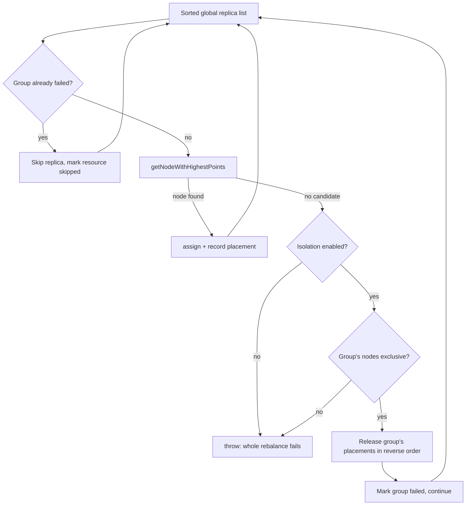

# WAGED Instance Tag Failure Isolation

| Field       | Value                     |
|-------------|---------------------------|
| **Authors** | LZD-PratyushBhatt         |
| **Status**  | In Review                 |
| **Created** | 2026-08-20                |
| **Updated** | 2026-08-20                |
| **Modules** | helix-core                |
| **JIRA**    | N/A                       |

**Contents:** [Summary](#summary) | [Problem](#problem-statement) |
[Goals](#goals--non-goals) | [Background](#background) | [Design](#design) |
[API](#api-changes) | [State](#data--state-changes) | [Plan](#implementation-plan) |
[Testing](#testing-strategy) | [Rollout](#rollout-plan) | [Risks](#risks-and-mitigations) |
[Open Questions](#open-questions)

## Summary

WAGED is a global rebalancer: it evaluates every replica of every WAGED managed
resource in one pass and aborts the entire pass as soon as one replica cannot be
placed. In a cluster partitioned into disjoint groups of instances by
`INSTANCE_GROUP_TAG` (commonly called cliques), one unplaceable clique freezes the
rebalance of every other clique. This design adds an opt-in cluster config flag,
`WAGED_INSTANCE_TAG_ISOLATION_ENABLED` (default `false`), that contains such a failure
to the tag group that caused it: that group is rolled back and carried over unchanged,
while every other group still receives a freshly calculated assignment. When the flag
is off, behavior is byte for byte identical to today.

## Problem Statement

Consider 200 instances split into 20 cliques of 10 nodes. Each instance carries exactly
one tag (`clique_0` .. `clique_19`) and each resource is pinned to one tag via
`INSTANCE_GROUP_TAG`. Cliques share nothing.

```
T0: All 20 cliques healthy, WAGED rebalances normally.
T1: Clique 3 becomes unplaceable, e.g. a partition weight increase pushes its replicas
    past the remaining DISK capacity of all 10 of its nodes.
T2: ConstraintBasedAlgorithm hits the first clique 3 replica, finds no candidate node,
    throws FAILED_TO_CALCULATE / NO_CANDIDATE_NODE.
T3: The whole OptimalAssignment is discarded. WagedRebalancer falls back to the last
    known good assignment for ALL 20 cliques.
T4: The other 19 cliques stop reacting to any topology change (node added, EVACUATE,
    capacity weight change) until clique 3 is repaired.
```

This is a cluster wide rebalance freeze, not a serving outage: existing assignments
keep serving. The hazard is that unrelated cliques silently stop converging, and the
cause (one bad clique) is invisible in the symptom (nothing moves anywhere).

A second form occurs even earlier: `ConstraintBasedAlgorithm` first runs a cluster wide
capacity check that sums capacity and demand across all instances, ignoring tags. One
oversubscribed clique can drag that sum negative and throw `CAPACITY_DEFICIT` before
the assignment loop starts.

## Goals / Non-Goals

**Goals**

- Contain a WAGED placement failure to the instance tag group that caused it, so the
  remaining groups still get a newly calculated assignment.
- Exact parity when the flag is off, and full WAGED feature parity (fault zones,
  capacity constraints, delayed rebalance, evacuation) for groups still calculated when
  it is on.
- Keep the assignment metadata store blobs complete, so WAGED determinism and
  controller failover are unaffected.
- One cluster config field of operator surface: no new endpoint, znode, or dashboard.
- Fail closed: when isolation cannot be proven safe, behave exactly as today.

**Non-Goals**

- Splitting WAGED into per tag cluster models, metadata store entries, or rebalance
  threads. The assignment stays one global calculation.
- Isolating at any granularity other than the instance tag, such as per resource.
- Repairing a broken clique automatically. It keeps its previous assignment until an
  operator fixes the constraint violation.
- Any behavior change for clusters that do not set the flag.

## Background

- `ConstraintBasedAlgorithm` (`.../rebalancer/waged/constraints/`) builds a flat,
  globally sorted list of every `AssignableReplica` and walks it once. Its
  `getNodeWithHighestPoints` returns `Optional.empty()` from exactly one place: when the
  hard constraint filter empties the candidate list. Soft constraints never fail a
  placement, they only rank survivors. So "a replica failed" always means every node was
  rejected by a hard constraint.
- `WagedRebalancer` drives four phases (global baseline, partial, emergency, delayed
  rebalance overwrites), all funneling through `WagedRebalanceUtil.calculateAssignment`.
- `AssignmentMetadataStore` persists two cluster wide blobs, `BASELINE` and
  `BEST_POSSIBLE`, each written with `clear()` then `putAll()`. A partial write would
  erase other cliques' entries.

## Design

### Core idea

Keep the single global interleaved loop exactly as it is. Change only what happens when
a placement fails.



After the loop, if every group failed the original exception is rethrown, so existing
failure handling, metrics, and last known good fallback still apply. Otherwise the
skipped resources are attached to the `OptimalAssignment`.

### Why keep the interleaved loop

An earlier design assigned one tag group fully, then the next. It was rejected because
reordering changes the result even when nothing fails. Take `N1` (tag A, capacity 10)
and `N2` (tag A, capacity 9), resource RA with `pA1=5` and `pA2=5`, an untagged resource
with `pU=5`, and global sort order `[pA1, pU, pA2]`:

- Global order gives `pA1 -> N1`, `pU -> N2`, `pA2 -> N1`.
- Group sequential gives `pA1 -> N1`, `pA2 -> N2`, `pU -> N1`.

Leaving the loop untouched makes parity **unconditional**: if nothing fails, the emitted
assignment is identical for any topology, not just cleanly partitioned ones.

### Why the isolation unit is the tag, not the resource

Rolling back only the broken resource would free capacity that its healthy siblings
sharing the same tag immediately consume. The emitted result, mixing recalculated
siblings with the carried over broken resource, could then overcommit the clique's
nodes. Rolling back the whole tag group avoids this by construction.

### The exclusivity gate

The same overcommit argument applies across groups whenever two groups can land on the
same node. Isolation therefore engages only when the failing group's node domain is
provably exclusive. `InstanceTagIsolation.exclusiveGroups()` maps each group to its tag
(`null` for untagged, which can use every node), then per node collects the groups that
could use it; any node usable by more than one group marks those groups shared, and the
remainder are exclusive. It is computed lazily on the first failure, so the happy path is
untouched. In the target clique topology every instance carries exactly one tag, so every
clique is exclusive and isolation always engages. If an untagged resource exists, no group
is exclusive and the rebalance fails exactly as today, so the feature is never worse than
the default.

### Cluster wide capacity deficit attribution

The pre-loop capacity check is tag blind, so it needs its own handling or the feature
would silently not apply in exactly the scenario it targets.
`InstanceTagIsolation.absorbCapacityDeficit` computes, per exclusive tagged group, the
demand of its own replicas and the capacity of its own nodes. Any group whose demand
exceeds its own capacity in any dimension is set aside, subtracted from both residual
demand and residual capacity, and the check is re-evaluated on the remainder. If nothing
can be attributed, or the remainder is still negative, it returns `null` and the caller
throws the original `CAPACITY_DEFICIT`. Every line of this path sits inside a branch that
already throws today, so parity is safe by construction.

### Keeping the emitted assignment complete

A skipped resource must not disappear or be persisted half assigned. In the partial,
emergency, and delayed overwrite scopes the nodes arrive pre-loaded with already
allocated replicas, so a skipped resource could otherwise emit a partial entry.
`WagedRebalanceUtil.calculateAssignment` gains a third parameter, the assignment the
phase started from. For each skipped resource it replaces the entry with a deep copy of
the previous assignment, or removes it when there is none. Global baseline passes
`currentBaseline`; partial and emergency pass `currentBestPossibleAssignment`; delayed
rebalance overwrites passes `null`, since an absent resource correctly means "no
overwrite applied".

Because the emitted map is always complete, `AssignmentMetadataStore` needs no change at
all. Controller failover, controller crash, and flipping the flag back off are all safe:
any controller reads a whole blob.

### Rejected alternatives

| Alternative | Why rejected |
|---|---|
| Group sequential assignment | Breaks parity even when nothing fails (counterexample above) |
| Per tag cluster models and metadata store entries | Large blast radius, changes the metadata store contract, loses cross group capacity accounting |
| Roll back only the failing resource | Can overcommit a clique's nodes when siblings share the tag |
| Catch and retry without the bad resource | Needs N passes, and the retry discards the successful pass's placements |

## API Changes

One new cluster config field. No breaking REST, znode, or Java API change.

```java
// New in ClusterConfig. Default false.
public void setWagedInstanceTagIsolationEnabled(boolean enabled);
public boolean isWagedInstanceTagIsolationEnabled();

// New overload in WagedRebalanceUtil. The 2 argument method is preserved and
// delegates with a null previousAssignment.
public static Map<String, ResourceAssignment> calculateAssignment(ClusterModel model,
    RebalanceAlgorithm algorithm, Map<String, ResourceAssignment> previousAssignment)
    throws HelixRebalanceException;
```

`OptimalAssignment` gains additive `getSkippedResources()` and `setSkippedResources(Set)`.
The flag is settable through the existing generic path
`POST /clusters/{cluster}/configs?command=update`, which has no field allowlist, so no
new endpoint is needed.

## Data / State Changes

- One new `SIMPLE_FIELD` on the cluster config znode,
  `WAGED_INSTANCE_TAG_ISOLATION_ENABLED`. Absent on existing clusters, read as `false`.
- The field is added to `ClusterConfigTrimmer`'s non-trimmable allowlist. Without this,
  `ResourceChangeDetector` would not see the flag change, so turning it on would have no
  effect until an unrelated config change triggered a rebalance.
- No change to `ASSIGNMENT_METADATA`, `IDEALSTATES`, or `EXTERNALVIEW` znodes.

## Implementation Plan

All steps are in module **helix-core**; paths are relative to
`helix-core/src/main/java/org/apache/helix/`. Each step is independently mergeable and
depends on the previous one. Validate with
`mvn test -pl helix-core -Djacoco.skip=true -Dtest='<classes>'`. Production diff is 10
files, roughly +646 / -33 lines.

**Step 1: add the flag.** Modify `model/ClusterConfig.java` and
`controller/changedetector/trimmer/ClusterConfigTrimmer.java`: add
`WAGED_INSTANCE_TAG_ISOLATION_ENABLED`, its `false` default, getter and setter, and the
trimmer allowlist entry. Validate `TestClusterConfig,TestHelixPropoertyTimmer`.

**Step 2: carry the flag and skip set.** Modify
`controller/rebalancer/waged/model/{ClusterContext,OptimalAssignment}.java`: read the
flag into `ClusterContext`, add the `_skippedResources` carrier with a defensive copy
setter. Validate `TestClusterContext,TestOptimalAssignment`.

**Step 3: isolation collaborator.** Create
`controller/rebalancer/waged/constraints/InstanceTagIsolation.java` holding group keys,
the exclusivity gate, rollback bookkeeping, and deficit attribution; modify
`.../constraints/ConstraintBasedAlgorithm.java` with four one line hooks in
`calculateInternal`. Validate
`TestWagedInstanceTagIsolation,TestCliqueFailureBlastRadius`.

**Step 4: carry skipped resources forward.** Modify
`controller/rebalancer/util/WagedRebalanceUtil.java` and
`controller/rebalancer/waged/{GlobalRebalanceRunner,PartialRebalanceRunner,WagedRebalancer}.java`:
add the 3 argument overload and pass the correct previous assignment at each of the four
phase call sites. Validate `TestWagedRebalanceInstanceTagIsolation`.

## Testing Strategy

63 dedicated tests were added and pass, alongside the surrounding suites: 505 controller
package tests, 75 WAGED integration tests, 19 tagging and evacuation tests.

**Unit.** `.../rebalancer/waged/model/TestWagedInstanceTagIsolation.java`, 48 tests on a
fixture of 20 cliques by 10 nodes with a single `DISK` dimension. Covers a broken clique
not blocking healthy ones; byte for byte parity between flag on and off when nothing
fails; rollback fully restoring node capacity; multiple resources per tag; non exclusive
domains and untagged resources rethrowing; all four rebalance scopes; deficit attribution
and its determinism across repeated runs; the replace and drop paths in
`WagedRebalanceUtil`; and observability parity, since a skipped clique still feeds the
existing hard constraint failure reporters so operators need no new dashboards.
`.../TestCliqueFailureBlastRadius.java`, 5 tests, pins the flag off blast radius so a
regression that silently changes the default is caught.

**Integration.**
`.../integration/rebalancer/WagedRebalancer/TestWagedRebalanceInstanceTagIsolation.java`,
10 chained tests with real ZooKeeper, a controller, and participants: enabling on a
healthy cluster moves nothing; flag off freezes everything; flag on unfreezes the healthy
cliques; controller failover with a broken clique; instance operation changes (EVACUATE,
UNKNOWN); a participant dropped while another clique is broken; a repaired clique
converging on its own; disabling again moves nothing; cluster wide capacity deficit; and
multiple broken cliques.

**Manual.** On staging: set the flag and confirm no partition moves; break one clique by
raising a partition weight past its nodes' capacity; confirm the other cliques still react
to a node addition while the broken clique's `EXTERNALVIEW` stays unchanged; repair it and
confirm it converges without a controller restart.

## Rollout Plan

Ships disabled (`DEFAULT_WAGED_INSTANCE_TAG_ISOLATION_ENABLED = false`), so an upgrade
alone changes nothing. Enable per cluster with the single config field, ordered dev,
staging, one canary production cluster, then the rest. Rollback is setting the field back
to `false`, effective on the next rebalance, with no restart and no data migration because
the metadata store blobs stay complete. Mixed version controllers are safe: an older
controller ignores the unknown field and uses global behavior, and both versions read and
write complete blobs. For monitoring, the existing WAGED hard constraint failure metrics
keep firing for skipped cliques, and every skip logs a WARN prefixed
`Instance tag isolation` naming the group.

## Risks and Mitigations

| Risk | L | I | Mitigation |
|---|---|---|---|
| Broken clique stays frozen unnoticed since the cluster looks healthy | Med | Med | Hard constraint failure metrics still fire per skipped clique; every skip logs a WARN naming it |
| Rollback frees capacity another group consumes, overcommitting a node | Low | High | Exclusivity gate: isolation engages only for a provably exclusive node domain, else it rethrows |
| Assignment drift between isolated and global mode | Low | High | Isolation only alters the path that already throws; a run where nothing fails is byte for byte identical, asserted by parity tests |
| Operator turns the flag on and nothing happens | Med | Low | Flag added to the `ClusterConfigTrimmer` allowlist so the change detector triggers a global rebalance |

## Open Questions

1. Should a dedicated JMX metric expose the count of currently skipped instance tag
   groups, rather than relying on hard constraint failure metrics plus logs?
2. `PartialRebalanceRunner`'s baseline divergence gauge includes carried forward skipped
   resources. Should those be excluded so it reflects only recalculated resources?
