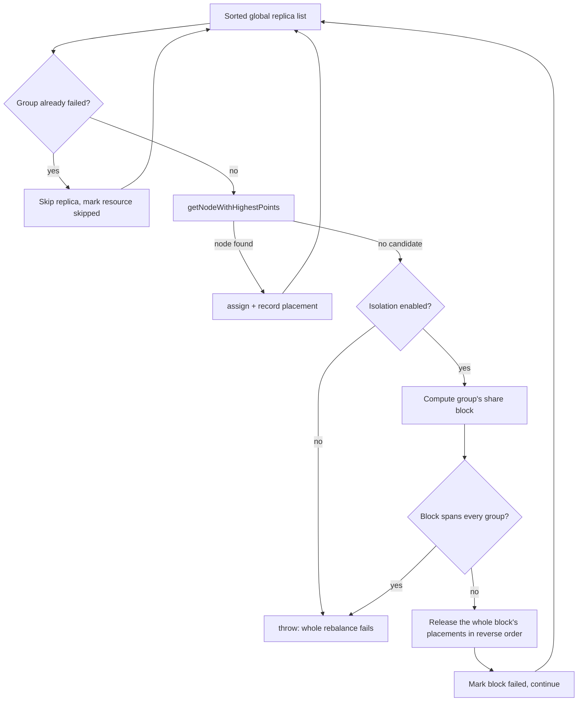

# WAGED Instance Tag Failure Isolation

| Field       | Value                     |
|-------------|---------------------------|
| **Authors** | LZD-PratyushBhatt         |
| **Status**  | In Review                 |
| **Created** | 2026-08-20                |
| **Updated** | 2026-09-20                |
| **Modules** | helix-core                |
| **JIRA**    | N/A                       |

**Contents:** [Summary](#summary) | [Problem](#problem-statement) |
[Goals](#goals--non-goals) | [Background](#background) | [Design](#design) |
[API](#api-changes) | [State](#data--state-changes) | [Open Questions](#open-questions)

## Summary

WAGED is a global rebalancer: it evaluates every replica of every WAGED managed
resource in one pass and aborts the entire pass as soon as one replica cannot be
placed. In a cluster partitioned into disjoint groups of instances by
`INSTANCE_GROUP_TAG` (commonly called cliques), one unplaceable clique freezes the
rebalance of every other clique. This design adds an opt-in cluster config flag,
`WAGED_INSTANCE_TAG_ISOLATION_ENABLED` (default `false`), that contains such a failure
to the tag group that caused it: that group is rolled back and carried over unchanged,
while every other group still receives a freshly calculated assignment. When the flag
is off, behavior is byte for byte identical to today.

## Problem Statement

Consider 200 instances split into 20 cliques of 10 nodes. Each instance carries exactly
one tag (`clique_0` .. `clique_19`) and each resource is pinned to one tag via
`INSTANCE_GROUP_TAG`. Cliques share nothing.

```
T0: All 20 cliques healthy, WAGED rebalances normally.
T1: Clique 3 becomes unplaceable, e.g. a partition weight increase pushes its replicas
    past the remaining DISK capacity of all 10 of its nodes.
T2: ConstraintBasedAlgorithm hits the first clique 3 replica, finds no candidate node,
    throws FAILED_TO_CALCULATE / NO_CANDIDATE_NODE.
T3: The whole OptimalAssignment is discarded. WagedRebalancer falls back to the last
    known good assignment for ALL 20 cliques.
T4: The other 19 cliques stop reacting to any topology change (node added, EVACUATE,
    capacity weight change) until clique 3 is repaired.
```

This is a cluster wide rebalance freeze, not a serving outage: existing assignments
keep serving. The hazard is that unrelated cliques silently stop converging, and the
cause (one bad clique) is invisible in the symptom (nothing moves anywhere).

A second form occurs even earlier: `ConstraintBasedAlgorithm` first runs a cluster wide
capacity check that sums capacity and demand across all instances, ignoring tags. One
oversubscribed clique can drag that sum negative and throw `CAPACITY_DEFICIT` before
the assignment loop starts.

## Goals / Non-Goals

**Goals**

- Contain a WAGED placement failure to the instance tag group that caused it, so the
  remaining groups still get a newly calculated assignment.
- Exact parity when the flag is off, and full WAGED feature parity (fault zones,
  capacity constraints, delayed rebalance, evacuation) for groups still calculated when
  it is on.
- Keep the assignment metadata store blobs complete, so WAGED determinism and
  controller failover are unaffected.
- One cluster config field of operator surface: no new endpoint, znode, or dashboard.
- Fail closed: when isolation cannot be proven safe, behave exactly as today.

**Non-Goals**

- Splitting WAGED into per tag cluster models, metadata store entries, or rebalance
  threads. The assignment stays one global calculation.
- Isolating at any granularity other than the instance tag, such as per resource.
- Repairing a broken clique automatically. It keeps its previous assignment until an
  operator fixes the constraint violation.
- Any behavior change for clusters that do not set the flag.

## Background

- `ConstraintBasedAlgorithm` (`.../rebalancer/waged/constraints/`) builds a flat,
  globally sorted list of every `AssignableReplica` and walks it once. Its
  `getNodeWithHighestPoints` returns `Optional.empty()` from exactly one place: when the
  hard constraint filter empties the candidate list. Soft constraints never fail a
  placement, they only rank survivors. So "a replica failed" always means every node was
  rejected by a hard constraint.
- `WagedRebalancer` drives four phases (global baseline, partial, emergency, delayed
  rebalance overwrites), all funneling through `WagedRebalanceUtil.calculateAssignment`.
- `AssignmentMetadataStore` persists two cluster wide blobs, `BASELINE` and
  `BEST_POSSIBLE`, each written with `clear()` then `putAll()`. A partial write would
  erase other cliques' entries.

## Design

### Core idea

Keep the single global interleaved loop exactly as it is. Change only what happens when
a placement fails.



After the loop, if every group failed the original exception is rethrown, so existing
failure handling, metrics, and last known good fallback still apply. Otherwise the
skipped resources are attached to the `OptimalAssignment`.

### Why keep the interleaved loop

An earlier design assigned one tag group fully, then the next. It was rejected because
reordering changes the result even when nothing fails. Take `N1` (tag A, capacity 10)
and `N2` (tag A, capacity 9), resource RA with `pA1=5` and `pA2=5`, an untagged resource
with `pU=5`, and global sort order `[pA1, pU, pA2]`:

- Global order gives `pA1 -> N1`, `pU -> N2`, `pA2 -> N1`.
- Group sequential gives `pA1 -> N1`, `pA2 -> N2`, `pU -> N1`.

Leaving the loop untouched makes parity **unconditional**: if nothing fails, the emitted
assignment is identical for any topology, not just cleanly partitioned ones.

### Why the isolation unit is the tag, not the resource

Rolling back only the broken resource would free capacity that its healthy siblings
sharing the same tag immediately consume. The emitted result, mixing recalculated
siblings with the carried over broken resource, could then overcommit the clique's
nodes. Rolling back the whole tag group avoids this by construction.

### The share closure

The same overcommit argument applies across groups whenever two groups can land on the
same node. The requirement is precise: carrying a set of groups over is sound exactly
when **no group outside the set can reach a node the set occupies**. An earlier revision
met that requirement by demanding the failing group own its nodes outright, and refused to
isolate otherwise. That was needlessly coarse. It let a single mis tagged instance take
down cliques that had nothing to do with it.

`InstanceTagIsolation.shareBlocks()` computes the requirement directly instead. It closes
over the share relation: if two groups can reach the same node they belong together,
followed transitively. The property above then holds by construction, because an outside
group `H` reaching a node `N` that a member `G` also reaches would have been pulled in when
`N` merged them. So a whole block can be carried over together and everything else
recalculated around it, and `blockOf()` returns the block to roll back.

Sharing a node is symmetric, so the relation is an equivalence and the blocks are a genuine
**partition** of the groups, called *share blocks*. The property the capacity arithmetic
needs is weaker and also holds: no node is ever counted for two blocks. This is not a
partition of the nodes, since an instance carrying only labels no resource is pinned to
belongs to no block at all. Blocks are computed lazily on the first failure, so the happy
path is untouched.

The partition is built with union-find rather than a per group fixpoint. A tagged group is
keyed by its tag, so tag to group is a bijection and the groups reaching a node are just
that node's own tags. That is what keeps the cost near zero: a naive fixpoint rescans every
group for every node it visits, which on a cluster of 1200 untagged resources over 300 nodes
added **12.6 seconds** to a 9 ms rebalance, on the failure path where the controller is
already behind. The same run now costs **tens of milliseconds**.

This is a strict generalization of the old gate: for the one tag per instance topology this
mode targets, every block is a single clique and the two are identical. Isolation only
gives up when a block spans **every** group, which is genuine global failure and matches
the default mode exactly.

### Instances that carry more than one tag

The two sides of `INSTANCE_GROUP_TAG` are not symmetric, and the distinction decides
everything here:

- A **resource** has at most one tag. `ResourceConfig.getInstanceGroupTag()` returns a
  single `String`, which `AssignableReplica` stores as one field.
- An **instance** has a set of tags. `AssignableNode.getInstanceTags()` returns a `Set`.

Because the group key is read off the *resource*, a multi tag instance never makes it
ambiguous which group a replica belongs to. Groups are always keyed by exactly one tag.
What multi tag instances change is *which nodes a group can reach*, and therefore which
block a group lands in.

| Topology | Effect |
|---|---|
| One clique tag per instance (the target) | Each node is reachable by one clique, every block is a single clique, isolation is per clique |
| One instance carries `clique_3` and `clique_7` | Those two cliques form one block. A failure in either carries **both** over together, and every other clique keeps rebalancing normally |
| A chain, one instance carries `clique_3` and `clique_7`, another carries `clique_7` and `clique_9` | All three are one block. `clique_3` and `clique_9` share no node directly, but the chain through `clique_7` means rolling one back frees capacity the others could claim |
| Instance also carries unrelated labels such as `ssd` or an AZ tag | No effect. Only tags that some resource is actually pinned to take part, so a tag no resource references can never join two blocks |
| Any untagged WAGED resource exists | Its group can use every node, so everything collapses into one block and the cluster behaves exactly as it does today |

The reason a block must be carried over whole is capacity, not bookkeeping. Carrying a
group over means keeping its old placements while everything else is recalculated. That is
only sound when the capacity those placements occupy cannot be claimed by anyone else. On a
shared node it can: rolling the group back frees capacity, a replica from a group that
reaches the same node takes it, and re invoking the carried over assignment on top would
overcommit the node. Carrying the whole block over removes that possibility by
construction, which is why the closure is transitive rather than a single hop.
The gate fails closed instead.

The important property is that this degradation is **scoped to the groups that actually
overlap**. One badly tagged instance does not switch the whole cluster back to global
behavior, it only removes isolation from the specific groups sharing that instance, and an
overlapping topology still produces the identical assignment with the flag on and off.

### Cluster wide capacity deficit attribution

The pre-loop capacity check is tag blind, so it needs its own handling or the feature
would silently not apply in exactly the scenario it targets.
`InstanceTagIsolation.absorbCapacityDeficit` computes, per share block, the demand of its
own replicas and the capacity of its own nodes. Every group reaching a node is in that
node's block, so any one of them identifies it and the node is credited exactly once, which
is what makes the arithmetic sound. An untagged group reaches every node, so when one exists
it names the block that every node is credited to. Any block whose
demand exceeds its own capacity in any dimension is set aside, subtracted from both residual
demand and residual capacity, and the check is re-evaluated on the remainder. If nothing
can be attributed, every block is at fault, or the remainder is still negative, it returns
`null` and the caller throws the original `CAPACITY_DEFICIT`. Every line of this path sits
inside a branch that already throws today, so parity is safe by construction.

Attributing per block rather than per single group matters: an overlapping culprit could
not be blamed at all under the earlier rule, so a single oversubscribed clique sharing one
instance with a neighbour would freeze the entire cluster.

The residual capacity is used only as a scoring denominator, never as a hard gate, so an
attribution that is too generous cannot cause an overcommit: `NodeCapacityConstraint` still
rejects the placement. The denominator is floored above zero, since a residual can reach
zero when every node belongs to a block that was set aside, and dividing by it would score
`Infinity` or `NaN` and break the ordering the algorithm sorts on.

### Keeping the emitted assignment complete

A skipped resource must not disappear or be persisted half assigned. In the partial,
emergency, and delayed overwrite scopes the nodes arrive pre-loaded with already
allocated replicas, so a skipped resource could otherwise emit a partial entry.
`WagedRebalanceUtil.calculateAssignment` gains a third parameter, the assignment the
phase started from. For each skipped resource it replaces the entry with a deep copy of
the previous assignment, or removes it when there is none. Global baseline passes
`currentBaseline`; partial and emergency pass `currentBestPossibleAssignment`; delayed
rebalance overwrites passes `null`, since an absent resource correctly means "no
overwrite applied".

Because the emitted map is always complete, `AssignmentMetadataStore` needs no change at
all. Controller failover, controller crash, and flipping the flag back off are all safe:
any controller reads a whole blob.

### The stale carry over guard

The share closure has one blind spot, and it is a question of time rather than of tags.
The closure reasons about the tags instances carry **now**, while a carried over assignment
records where replicas were placed **before**. Those disagree when an instance is retagged
out of a group while that group is unplaceable. The group's previous assignment still names
the instance, the closure does not pull in the new owner because no *current* tag joins
them, and the group that now owns the instance is free to place there. Persisting both
overcommits the node. A retagged instance is still active, so
`ClusterModelProvider.getValidStateInstanceMap` does not remove it either.

This is a real regression introduced by the flag rather than a pre-existing gap. With the
flag off a failed rebalance discards everything and reuses one self consistent snapshot, so
placements from two different points in time can never be mixed.

The guard checks the **result** instead of the tags, which is what makes it robust against
cases nobody enumerated. After carrying skipped resources forward,
`WagedRebalanceUtil.assertCarriedOverNodesAreNotReused` throws if any instance named by a
carried over resource also received a freshly calculated replica. The caller then keeps its
last known good assignment, exactly as the default global mode does on a failed rebalance.
Resources are visited in sorted order so the reported conflict is stable across controller
failovers, since the message is the operator's only clue about which retag caused it.

The check sits inside the skipped resources block, and `OptimalAssignment` leaves that set
empty unless isolation actually skipped something. *With the feature disabled the guard is
unreachable, not merely inert.*

### Rejected alternatives

| Alternative | Why rejected |
|---|---|
| Group sequential assignment | Breaks parity even when nothing fails (counterexample above) |
| Per tag cluster models and metadata store entries | Large blast radius, changes the metadata store contract, loses cross group capacity accounting |
| Roll back only the failing resource | Can overcommit a clique's nodes when siblings share the tag |
| Catch and retry without the bad resource | Needs N passes, and the retry discards the successful pass's placements |
| Prune stale instances from a carried over assignment instead of failing closed | Silently drops replicas, turning a capacity breach into invisible under replication |
| Refuse to isolate unless the failing group owns its nodes outright | Correct but needlessly coarse: one mis tagged instance anywhere freezes cliques that share nothing with it. The share closure enforces the same safety property with the smallest set that satisfies it |

## API Changes

One new cluster config field. No breaking REST, znode, or Java API change.

```java
// New in ClusterConfig. Default false.
public void setWagedInstanceTagIsolationEnabled(boolean enabled);
public boolean isWagedInstanceTagIsolationEnabled();

// New overload in WagedRebalanceUtil. The 2 argument method is preserved and
// delegates with a null previousAssignment.
public static Map<String, ResourceAssignment> calculateAssignment(ClusterModel model,
    RebalanceAlgorithm algorithm, Map<String, ResourceAssignment> previousAssignment)
    throws HelixRebalanceException;
```

`OptimalAssignment` gains additive `getSkippedResources()` and `setSkippedResources(Set)`.
The flag is settable through the existing generic path
`POST /clusters/{cluster}/configs?command=update`, which has no field allowlist, so no
new endpoint is needed.

## Data / State Changes

- One new `SIMPLE_FIELD` on the cluster config znode,
  `WAGED_INSTANCE_TAG_ISOLATION_ENABLED`. Absent on existing clusters, read as `false`.
- The field is added to `ClusterConfigTrimmer`'s non-trimmable allowlist. Without this,
  `ResourceChangeDetector` would not see the flag change, so turning it on would have no
  effect until an unrelated config change triggered a rebalance.
- No change to `ASSIGNMENT_METADATA`, `IDEALSTATES`, or `EXTERNALVIEW` znodes.

## Open Questions

1. Should a dedicated JMX metric expose the count of currently skipped instance tag
   groups, rather than relying on hard constraint failure metrics plus logs?
2. `PartialRebalanceRunner`'s baseline divergence gauge includes carried forward skipped
   resources. Should those be excluded so it reflects only recalculated resources?
