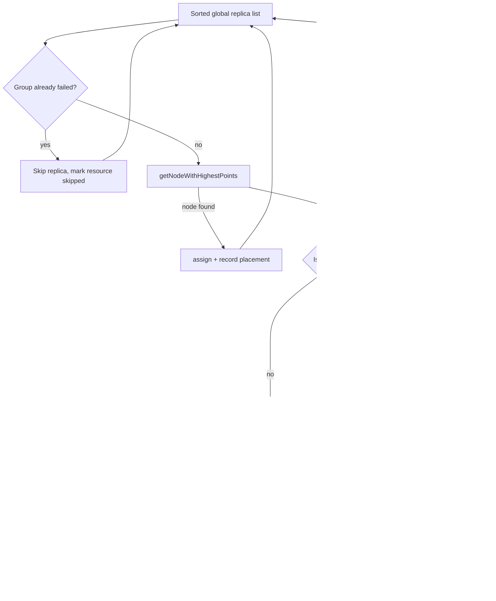

# WAGED Instance Tag Failure Isolation

| Field       | Value                     |
|-------------|---------------------------|
| **Authors** | LZD-PratyushBhatt         |
| **Status**  | Approved                  |
| **Created** | 2026-08-20                |
| **Updated** | 2026-10-05                |
| **Modules** | helix-core                |
| **JIRA**    | N/A                       |

**Contents:** [Summary](#summary) | [Problem](#problem-statement) |
[Goals](#goals--non-goals) | [Background](#background) | [Design](#design) |
[API](#api-changes) | [State](#data--state-changes) | [Implementation](#implementation-plan) |
[Testing](#testing-strategy) | [Rollout](#rollout-plan) | [Risks](#risks-and-mitigations) |
[Open Questions](#open-questions)

## Summary

WAGED uses a **single globally ordered assignment loop**, but an individual calculation
may contain only the replicas that need work. Without isolation, one unplaceable clique
can fail that calculation and stop independent cliques from progressing.

This design adds an **opt-in cluster config flag**,
`WAGED_INSTANCE_TAG_ISOLATION_ENABLED` (default `false`), that contains such a failure
to the tag group that caused it and any group linked to it through shared nodes: those
groups are rolled back and carried over unchanged, while independent groups continue the
work required by that rebalance phase. When the flag is off, behavior is byte for byte
identical to WAGED without this feature.

**Isolation covers all four rebalance scopes, not just full baseline calculations.**
It adds no per-clique rebalancer, no new assignment-store format and no new ZooKeeper
record.

## Problem Statement

Consider 200 instances split into 20 cliques of 10 nodes. Each instance carries exactly
one tag (`clique_0` .. `clique_19`) and each resource is pinned to one tag via
`INSTANCE_GROUP_TAG`. Cliques share nothing.

```
T0: All 20 cliques healthy, WAGED rebalances normally.
T1: Clique 3 becomes unplaceable, e.g. a partition weight increase pushes its replicas
    past the remaining DISK capacity of all 10 of its nodes.
T2: ConstraintBasedAlgorithm hits the first clique 3 replica, finds no candidate node,
    throws FAILED_TO_CALCULATE / NO_CANDIDATE_NODE.
T3: The whole OptimalAssignment is discarded. WagedRebalancer falls back to the last
    known good assignment for ALL 20 cliques.
T4: The other 19 cliques stop reacting to any topology change (node added, EVACUATE,
    capacity weight change) until clique 3 is repaired.
```

This is a cluster wide rebalance freeze, not a serving outage: existing assignments
keep serving. The hazard is that unrelated cliques silently stop converging, and the
cause (one bad clique) is invisible in the symptom (nothing moves anywhere).

A second form occurs even earlier: `ConstraintBasedAlgorithm` first runs a cluster wide
capacity check that sums capacity and demand across all instances, ignoring tags. One
oversubscribed clique can drag that sum negative and throw `CAPACITY_DEFICIT` before
the assignment loop starts.

## Goals / Non-Goals

**Goals**

- Contain a WAGED placement failure to the instance tag group that caused it, so the
  remaining groups still get a newly calculated assignment.
- Apply that containment to full and incremental baselines, partial rebalance, emergency
  recovery, and delayed min-active top-ups.
- Exact parity when the flag is off, and full WAGED feature parity (fault zones,
  capacity constraints, delayed rebalance, evacuation) for groups still calculated when
  it is on.
- Keep the assignment metadata store blobs complete, so WAGED determinism and
  Helix controller failover are unaffected.
- One cluster config field and one JMX gauge of operator surface: no new endpoint, znode,
  or dashboard.
- Fail closed: when isolation cannot be proven safe, behave exactly as the default mode.

**Non-Goals**

- Splitting WAGED into per tag cluster models, metadata store entries, or rebalance
  threads. The assignment stays one global calculation.
- Isolating at any granularity other than the instance tag, such as per resource.
- Repairing a broken clique automatically. It keeps its previous assignment until an
  operator fixes the constraint violation.
- Any behavior change for clusters that do not set the flag.

## Background

- `ConstraintBasedAlgorithm` (`.../rebalancer/waged/constraints/`) builds a flat,
  globally sorted list of outstanding `AssignableReplica` objects and walks it once. Its
  `getNodeWithHighestPoints` returns `Optional.empty()` from exactly one place: when the
  hard constraint filter empties the candidate list. Soft constraints never fail a
  placement, they only rank survivors. So "a replica failed" always means every node was
  rejected by a hard constraint.
- `WagedRebalancer` drives four phases (global baseline, partial, emergency, delayed
  rebalance overwrites), all funneling through `WagedRebalanceUtil.calculateAssignment`.
- `AssignmentMetadataStore` persists two cluster wide blobs, `BASELINE` and
  `BEST_POSSIBLE`, each written with `clear()` then `putAll()`. A partial write would
  erase other cliques' entries.

## Design

### Core idea

**Keep the single global interleaved loop and placement constraints unchanged.**
Contain failures per share block and retry unfinished baseline work on normal baseline events.


```mermaid
flowchart TD
    A[Sorted global replica list] --> B{Group already failed?}
    B -- yes --> C[Skip replica, mark resource skipped] --> A
    B -- no --> D[getNodeWithHighestPoints]
    D -- node found --> E[assign + record placement] --> A
    D -- no candidate --> F{Isolation enabled?}
    F -- no --> G[throw: whole rebalance fails]
    F -- yes --> H[Compute group's share block]
    H --> K{Block spans every group?}
    K -- yes --> G
    K -- no --> I[Release the whole block's placements]
    I --> J[Mark block failed, continue] --> A
```

After the loop, if every group that reaches a node of the scope's model failed, the original
exception is rethrown, in every scope, so existing failure handling, metrics, and last known
good fallback still apply. Otherwise the skipped resources are attached to the
`OptimalAssignment`. Groups are made of resources. A tag carried only by nodes no resource
uses, such as a spare pool or a clique provisioned before its resources, holds no work, so it
can neither fail nor stand in for a part of the cluster that survived. A resource whose tag no
node of the model carries is the mirror case: it has nowhere to go, so it cannot stand in for
a part that survived either, even when it has nothing to place and so never fails.

### All four rebalance scopes

**The failure boundary rule is the same in every scope.** It applies to the instances and
resources that scope models, so the blocks themselves can differ between scopes. Group
membership comes from the full cluster context, including already-allocated siblings and
untagged resources, not just the outstanding replica list.

| Scope | Failed block | Independent healthy blocks |
|---|---|---|
| `GLOBAL_BASELINE` | Carry forward the complete previous baseline entries | Recompute the requested baseline work, including incremental changes |
| `PARTIAL` | Carry forward the complete previous best-possible entries | Continue moving toward the baseline |
| `EMERGENCY` | Carry forward the complete previous best-possible entries | Replace replicas lost with inactive instances |
| `DELAYED_REBALANCE_OVERWRITES` | Omit the block from the temporary overwrite | Continue live-instance min-active top-ups |

**A baseline calculation is not necessarily a full recomputation.** A resource edit can
leave every other resource preallocated, so failure of the only outstanding clique must
not be mistaken for failure of the cluster.

**A partial rebalance sees only what the baseline holds.** A resource the baseline does not
include yet is left out of its context, so a clique made only of such resources looks like
idle nodes there and does not count as surviving. That costs nothing, because a partial
rebalance could not place those resources anyway.

**Live-instance loss does not require a baseline calculation.** Emergency and delayed
recovery apply isolation directly; a skipped resource without a previous assignment is
omitted rather than given a fabricated fallback.

### Why keep the interleaved loop

Assigning one tag group fully, then the next, is rejected because reordering changes the
result even when nothing fails. Take `N1` (tag A, capacity 10)
and `N2` (tag A, capacity 9), resource RA with `pA1=5` and `pA2=5`, an untagged resource
with `pU=5`, and global sort order `[pA1, pU, pA2]`:

- Global order gives `pA1 -> N1`, `pU -> N2`, `pA2 -> N1`.
- Group sequential gives `pA1 -> N1`, `pA2 -> N2`, `pU -> N1`.

Leaving the loop untouched preserves the **existing placement rules and scoring** for
any topology. When no failed work needs retrying, the normal incremental selection is
unchanged; after a failure, the skipped resources are retried together in the next baseline
calculation.

### Why the isolation unit is the tag, not the resource

Rolling back only the broken resource would free capacity that its healthy siblings
sharing the same tag immediately consume. The emitted result, mixing recalculated
siblings with the carried over broken resource, could then overcommit the clique's
nodes. Rolling back the whole tag group avoids this by construction.

### The share closure

The same overcommit argument applies across groups whenever two groups can land on the
same node. The requirement is precise: carrying a set of groups over is sound exactly
when **no group outside the set can reach a node the set occupies**. Demanding that the
failing group own its nodes outright, and refusing to isolate otherwise, meets it too, but
far too coarsely: a single mis tagged instance would take down cliques that have nothing to
do with it.

`InstanceTagIsolation.shareBlocks()` computes the requirement directly instead. It closes
over the share relation: if two groups can reach the same node they belong together,
followed transitively. The property above then holds by construction, because an outside
group `H` reaching a node `N` that a member `G` also reaches would have been pulled in when
`N` merged them. So a whole block can be carried over together and everything else
recalculated around it, and `blockOf()` returns the block to roll back.

Sharing a node is symmetric, so the relation is an equivalence and the blocks are a genuine
**partition** of the groups, called *share blocks*. The property the capacity arithmetic
needs is weaker and also holds: no node is ever counted for two blocks. This is not a
partition of the nodes, since an instance carrying only labels no resource is pinned to
belongs to no block at all. Blocks are computed lazily on the first failure, so the happy
path is untouched.

The partition is built with union-find rather than a per group fixpoint. A tagged group is
keyed by its tag, so tag to group is a bijection and the tagged groups reaching a node are
just that node's own tags. That is what keeps the cost near zero: a naive fixpoint rescans
every group for every node it visits, which on a cluster of 1200 untagged resources over 300
nodes adds **12.6 seconds** to a 9 ms rebalance, on the failure path where the Helix
controller is already behind. With union-find the same run costs **tens of milliseconds**.

For the one tag per instance topology this mode targets, every block is a single clique, so
isolation is exactly per clique. Isolation only gives up when a block spans **every** group
that reaches a node, or every block that reaches a node fails, which is genuine global
failure and matches the default mode exactly.

### Instances that carry more than one tag

The two sides of `INSTANCE_GROUP_TAG` are not symmetric, and the distinction decides
everything here:

- A **resource** has at most one tag. `ResourceConfig.getInstanceGroupTag()` returns a
  single `String`, which `AssignableReplica` stores as one field.
- An **instance** has a set of tags. `AssignableNode.getInstanceTags()` returns a `Set`.

Because the group key is read off the *resource*, a multi tag instance never makes it
ambiguous which group a replica belongs to. A tagged group is always keyed by exactly one
tag, and an untagged resource is a group of its own with no tag.
What multi tag instances change is *which nodes a group can reach*, and therefore which
block a group lands in.

| Topology | Effect |
|---|---|
| One clique tag per instance (the target) | Each node is reachable by one clique, every block is a single clique, isolation is per clique |
| One instance carries `clique_3` and `clique_7` | Those two cliques form one block. A failure in either carries **both** over together, and every other clique keeps rebalancing normally |
| A chain, one instance carries `clique_3` and `clique_7`, another carries `clique_7` and `clique_9` | All three are one block. `clique_3` and `clique_9` share no node directly, but the chain through `clique_7` means rolling one back frees capacity the others could claim |
| Instance also carries unrelated labels such as `ssd` or an AZ tag | No effect. Only tags that some resource is actually pinned to take part, so a tag no resource references can never join two blocks |
| An untagged WAGED resource exists | Its group can use every node, connecting every node-backed group it can reach. A single shared block has no isolation boundary |

The reason a block must be carried over whole is capacity, not bookkeeping. Carrying a
group over means keeping its old placements while everything else is recalculated. That is
only sound when the capacity those placements occupy cannot be claimed by anyone else. On a
shared node it can: rolling the group back frees capacity, a replica from a group that
reaches the same node takes it, and re invoking the carried over assignment on top would
overcommit the node. Carrying the whole block over removes that possibility by
construction, which is why the closure is transitive rather than a single hop.
When the block spans every group, there is nothing left to recalculate around it, so
isolation fails closed and the whole rebalance fails exactly as in the default mode.

The important property is that this degradation is **scoped to the groups that actually
overlap**. One badly tagged instance does not switch the whole cluster back to global
behavior. It only merges the groups sharing that instance into one block, so a failure in
any of them carries that whole block over while every other block keeps rebalancing. When
nothing fails, an overlapping topology produces the identical assignment with the flag on
and off.

### Cluster wide capacity deficit attribution

The pre-loop capacity check is tag blind, so it needs its own handling or the feature
would silently not apply in exactly the scenario it targets.
`InstanceTagIsolation.absorbCapacityDeficit` splits the check's totals across the
*attribution blocks* (the share blocks plus the node-only blocks described below), sets
aside the blocks that cannot hold their own replicas on their own nodes, and re-evaluates
the check on the remainder. If nothing can be attributed, every block that
holds resources is at fault, or the remainder is still negative, it returns `null` and the
caller throws the original `CAPACITY_DEFICIT`. Every line of this path sits inside a branch
where the default mode throws, so parity is safe by construction.

**Every node is credited to exactly one block.** Every group reaching a node is in that
node's block, so any one of them identifies it. An untagged group reaches every node, so
when one exists it names the block that every node is credited to. A node no group
reaches, because it carries no tag or only labels shared with nodes that resources do use,
gets a block of its own: nothing can be placed on it, but what is left on it still counts
toward the total.

**A block's demand starts from every replica its resources own, placed or not.** It is
summed over the same replicas as the cluster wide total, `ClusterContext.getManagedReplicas()`,
so the blocks always add up to the check's totals and the residual stays consistent with
it. The scope's own model is not enough, because the check also counts replicas a narrower
model leaves out: partitions a carried clique never had placed, which neither an emergency
nor a delayed overwrite model holds, and replicas on nodes still inside their delay window,
which a delayed overwrite model leaves out along with the nodes.

**A replica sitting on another block's node moves there only as far as it fits.** A carried
clique's replica on a node since retagged takes room from the node's new groups, so it is
charged to the node's block up to the room those groups leave, in a fixed order by resource,
partition and state. Anything past that stays with the clique it belongs to, so a healthy
clique is never blamed for a node another clique overfilled. Placed replicas are counted
against what their partition holds, a block's own replicas first, so a replica the check
never summed, such as one of a partition removed from its resource, moves nothing.

Nodes that carry only tags no resource is pinned to, such as a spare pool or a clique
provisioned before its resources, form blocks of their own in this arithmetic, as do nodes
no group reaches, and take every replica left on them. A stale placement that overcommits
such a node is then set aside together with the node, instead of dragging the remainder
negative and freezing every healthy clique. These blocks hold no work, so they never count
toward the second block attribution needs, and whether every block is at fault is judged
over the blocks that hold resources. A single clique next to a spare pool therefore still
throws the original deficit, exactly as the default mode does.

**A block is first judged by what this scope must place.** That is its demand minus the
replicas parked on nodes outside the scope's model: replicas the scope neither finds on its
nodes nor has to assign, while the current assignment still places them on a node that is
offline inside its delayed rebalance window or disabled. They are part of the check's total
but need no room in this scope, so a clique running above its live share while a node is
away is never blamed for another clique's shortfall. Only when that verdict leaves no usable
remainder is every block judged by all the replicas it owns, which covers a deficit that
parked replicas create on their own. Either way the blocks at fault are set aside with
everything they own, so the remainder is computed the same way. The remainder is always
held to the check's full totals, the test the default mode applies to a cluster made of
the remainder alone, so a clique running above its live share keeps rebalancing only while
the remainder's spare capacity covers its parked replicas.

Attributing per block rather than per single group matters: a per group rule could not
blame an overlapping culprit at all, so a single oversubscribed clique sharing one instance
with a neighbour would freeze the entire cluster.

The residual capacity is used only as a scoring denominator, never as a hard gate, so an
attribution that is too generous cannot cause an overcommit: `NodeCapacityConstraint` still
rejects the placement. The denominator is floored above zero, since a residual can reach
zero when every node belongs to a block that was set aside, and dividing by it would score
`Infinity` or `NaN` and break the ordering the algorithm sorts on.

### Keeping the emitted assignment complete

A skipped resource must not disappear or be persisted half assigned. In incremental
baseline, partial, emergency, and delayed overwrite calculations the nodes can arrive with
allocated replicas, so a skipped resource could otherwise emit a partial entry.
A `WagedRebalanceUtil.calculateAssignment` overload takes a third parameter, the assignment
the phase started from; the two parameter form remains and passes `null`. For each skipped
resource it replaces the entry with a deep copy of the previous assignment, or removes it
when there is none. Global baseline passes
`currentBaseline`; partial and emergency pass `currentBestPossibleAssignment`; delayed
rebalance overwrites passes `null`, since an absent resource correctly means "no
overwrite applied".

**The assignment-store format is unchanged.** A carried-forward resource retains its
complete previous serialized assignment; healthy changes can still advance the shared
metadata record's version.

**Consumers of the best possible output tolerate a missing resource.** A skipped
resource with no previous assignment is absent, so `BestPossibleStateCalcStage` skips it
when adding live SWAP_IN instances instead of aborting the pipeline for every clique. The
guard rail what-if `WagedRebalanceFeasibilityWhatIf` counts a replica only when its instance
is known, assignable and carries the resource's tag, so a clique carried onto the instance
a mutation removes still registers the loss. Both run only with the flag on.

### Recovery and Helix controller failover

**An in-memory retry set retains unfinished baseline work.** The next normally triggered
baseline re-evaluates skipped resources, including allocated siblings and resources that
yielded to carry-forward collisions.

**Whole-calculation and metadata-write failures retain the full workload for the next
attempt.** A successful baseline, after any required write succeeds, narrows the retry set
to the remaining skipped resources.

**Retries create no background loop and do not make node loss trigger a baseline.** The
next Helix controller evaluates the full workload from existing configuration and
assignment metadata, so recovery does not depend on persisting the retry set.

### The stale carry over guard

The share closure has one blind spot, and it is a question of time rather than of tags.
The closure reasons about the tags instances carry **now**, while a carried over assignment
records where replicas were placed **before**. Those disagree when an instance is retagged
out of a group while that group is unplaceable. The group's previous assignment still names
the instance, the closure does not pull in the new owner because no *current* tag joins
them, and the group that now owns the instance is free to place there. Persisting both
overcommits the node. A retagged instance is still active, so
`ClusterModelProvider.getValidStateInstanceMap` does not remove it either.

The hazard exists only with the flag on. With the flag off a failed rebalance discards
everything and reuses one self consistent snapshot, so placements from two different points
in time can never be mixed.

The guard checks the **emitted result**, not just current tags.
`WagedRebalanceUtil.resolveCarriedOverNodeReuse` carries forward a freshly calculated
resource if it claims an instance already named by a carried-forward resource.

**Only resources that collide yield their fresh result.** The check follows any further
collisions until none remain; every resource that does not collide keeps its new
assignment.

**Carried entries are not checked against each other.** They are not one snapshot either:
the callers fill the persisted assignment in with current states for resources it does not
hold yet. Two carried entries can therefore name one instance for more than it holds, for
example when what is running has not caught up with the persisted assignment. That is no
worse than the default mode, which fails the whole rebalance in the same situation.
Carrying moves no replica and every fresh placement still passes `NodeCapacityConstraint`,
so the worst case is a baseline that overcommits an instance. The partial rebalance treats
it as a soft goal, and the next baseline calculation replaces it.

The check sits inside the skipped resources block, and `OptimalAssignment` leaves that set
empty unless isolation actually skipped something. *With the feature disabled the guard is
unreachable, not merely inert.*

### Reporting partial failures

**`WagedInstanceTagIsolationSkippedResourcesGauge`, a JMX gauge on `ClusterStatusMonitor`,
counts distinct resources skipped across all four scopes**, including collision-related
carry-forward. Each phase owns its report; a healthy phase does not clear another phase's
failure, and an incremental baseline clears only resources it re-evaluates.

**WARN logs identify the cluster, scope, affected groups and resources, and failure
reason.** Existing failure metrics continue to report uncontained failures. A contained
placement failure still feeds the hard constraint failure counters and, in partial and
emergency, the hard constraint blocking gauges. A skipped resource with no previous
assignment gets no ideal state, so `BestPossibleStateCalcStage` marks it failed and sets
`RebalanceFailureGauge` to 1.

**Operators can alert on the gauge, for example on any value above zero.** A contained
failure returns successfully, so it does not trip the WAGED whole-rebalance failure gauges.
Reports clear on recovery, resource removal, feature disable, or a Helix controller
monitoring reset; after a reset the next pipeline reports whatever is still skipped.

### Rejected alternatives

| Option | Why it was rejected |
|---|---|
| Group sequential assignment | Breaks parity even when nothing fails (counterexample above) |
| Per tag cluster models and metadata store entries | Large blast radius, changes the metadata store contract, loses cross group capacity accounting |
| Roll back only the failing resource | Can overcommit a clique's nodes when siblings share the tag |
| Catch and retry without the bad resource | Needs N passes, and the retry discards the successful pass's placements |
| Prune stale instances from a carried over assignment instead of yielding the colliding resource | Silently drops replicas, turning a capacity breach into invisible under replication |
| Refuse to isolate unless the failing group owns its nodes outright | Correct but needlessly coarse: one mis tagged instance anywhere freezes cliques that share nothing with it. The share closure enforces the same safety property with the smallest set that satisfies it |
| Charge every placed replica to the block of the node it sits on | A carried clique's replicas on a retagged node would be blamed on the healthy clique that now owns the node |
| Charge every replica only to the block that owns it | A stale placement on a spare pool would stay with its clique, freezing it for capacity the pool absorbs |
| Judge each block only by all the replicas it owns | A clique running above its live share while a node is offline inside its delay window would be blamed for another clique's shortfall |
| Judge each block only by what the scope must place | Replicas parked on offline nodes can create the deficit on their own, and then nothing is blamed and every healthy clique fails with it |
| Leave nodes that no group reaches out of every block | Stale replicas beyond such a node's room would stay with their cliques and could put every clique at fault at once |
| Count a tag that only idle nodes carry as a block that survives | A spare pool holds no work and can never fail, so a cluster with one clique and a spare pool would carry everything over instead of failing, silencing the whole-rebalance failure metrics |
| Count an idle resource whose tag no node carries as a group that survives | It has nowhere to go and can never fail, so when every clique fails the whole cluster would be carried over instead of failing, silencing the whole-rebalance failure metrics |

## API Changes

One new cluster config field, one new JMX gauge, and additive Java methods. No breaking
REST, znode, or Java API change: every Java change is an addition or a widening, and the
new `RebalanceAlgorithm` methods have default implementations.

```java
// ClusterConfig. ClusterConfigProperty gains WAGED_INSTANCE_TAG_ISOLATION_ENABLED.
public final static boolean DEFAULT_WAGED_INSTANCE_TAG_ISOLATION_ENABLED = false;
public void setWagedInstanceTagIsolationEnabled(boolean enabled);
public boolean isWagedInstanceTagIsolationEnabled();

// WagedRebalanceUtil. New overload; the 2 argument method is preserved and delegates with
// a null previousAssignment.
public static Map<String, ResourceAssignment> calculateAssignment(ClusterModel model,
    RebalanceAlgorithm algorithm, Map<String, ResourceAssignment> previousAssignment)
    throws HelixRebalanceException;

// RebalanceAlgorithm. Default methods, so existing implementations need not change.
default String getName(); // the simple class name, reported in the calculation logs
default void onAssignmentComputed(ClusterModel.RebalanceScopeType scope,
    Set<String> evaluatedResources, Set<String> skippedResources); // no-op

// OptimalAssignment. The resources isolation skipped; never null, empty when none.
public void setSkippedResources(Set<String> skippedResources);
public Set<String> getSkippedResources();

// ClusterContext. What isolation reads from the cluster model.
public boolean isInstanceTagIsolationEnabled();
public Map<String, String> getResourceInstanceGroupTags();
public Set<AssignableReplica> getManagedReplicas();

// AssignableNode. Widened from package private to public.
public Set<AssignableReplica> getAssignedReplicas();

// ClusterStatusMonitorMBean. JMX attribute WagedInstanceTagIsolationSkippedResourcesGauge.
long getWagedInstanceTagIsolationSkippedResourcesGauge();

// ClusterStatusMonitor. The reporting lifecycle behind the gauge.
public long configureWagedInstanceTagIsolation(boolean enabled, Set<String> resources);
public void resetWagedInstanceTagIsolation();
public void updateWagedInstanceTagIsolationSkippedResources(long generation,
    ClusterModel.RebalanceScopeType scope, Set<String> evaluatedResources,
    Set<String> skippedResources);
```

`onAssignmentComputed` runs after carry-forward and collision handling, so its skipped set
includes resources that yielded to a collision; a phase with no work reports empty sets.
`getResourceInstanceGroupTags()` covers the full model, allocated resources included, and
`getManagedReplicas()` holds the replicas the cluster wide capacity totals are summed over,
empty unless isolation is enabled. The flag is settable through the existing generic path
`POST /clusters/{cluster}/configs?command=update`, which has no field allowlist, so no
new endpoint is needed.

## Data / State Changes

- One new `SIMPLE_FIELD` on the cluster config znode,
  `WAGED_INSTANCE_TAG_ISOLATION_ENABLED`. Absent on existing clusters, read as `false`.
- The field is added to `ClusterConfigTrimmer`'s non-trimmable allowlist. Without this,
  `ResourceChangeDetector` would not see the flag change, so the global baseline would not
  be recalculated under the new value until an unrelated change triggered one. The partial,
  emergency and delayed overwrite calculations read the flag from the cluster config on
  every run either way. The flag is compared by the value it reads as. Anything that reads
  as `false` compares like an absent field and `true` compares equal in any case, so
  rewriting the flag without changing its value does not start a full baseline
  recalculation.
- No change to `ASSIGNMENT_METADATA`, `IDEALSTATES`, or `EXTERNALVIEW` znodes.
- Retry hints and phase-owned metric snapshots remain in memory. No isolation decisions
  are persisted, and shared ZooKeeper or assignment-store outages remain global failures.

## Implementation Plan

The change is 19 stacked commits, each depending on the one before it, grouped below into
the steps that review together. Main source paths are relative to
`helix-core/src/main/java/org/apache/helix/`, with `waged/` short for
`controller/rebalancer/waged/`; tests are named by class.

| Step | What | Module | Key files | Validation |
|---|---|---|---|---|
| 1 | The flag, its trimmer allowlist entry, and its read into the cluster model | helix-core | `model/ClusterConfig.java`, `controller/changedetector/trimmer/ClusterConfigTrimmer.java`, `waged/model/ClusterContext.java` | `mvn test -pl helix-core -Dtest=TestHelixPropoertyTimmer` |
| 2-3 | Carry skipped resources forward, and make a fresh resource that collides with a carried one yield | helix-core | `controller/rebalancer/util/WagedRebalanceUtil.java`, `waged/model/OptimalAssignment.java`, `waged/GlobalRebalanceRunner.java`, `waged/PartialRebalanceRunner.java`, `waged/WagedRebalancer.java` | `mvn test -pl helix-core -Dtest=TestWagedRebalanceUtilCarryForward,TestOptimalAssignment` |
| 4-6 | Placement bookkeeping, share blocks, and the rollback of a failed block; nothing calls them before step 7 | helix-core | `waged/constraints/InstanceTagIsolation.java` (new) | `mvn test -pl helix-core -Dtest=TestConstraintBasedAlgorithm,TestWagedRebalancer` |
| 7 | Hook isolation into the assignment loop of all four scopes, with the `RebalanceAlgorithm` name and observer, the SWAP_IN guard and the what-if guard | helix-core | `waged/constraints/ConstraintBasedAlgorithm.java`, `waged/RebalanceAlgorithm.java`, `waged/GlobalRebalanceRunner.java`, `controller/stages/BestPossibleStateCalcStage.java`, `guardrail/rules/WagedRebalanceFeasibilityWhatIf.java` | `mvn test -pl helix-core -Dtest='TestWagedIsolationAlgorithmName,TestInstance*RebalanceFeasibilityGuardrailRule'` |
| 8 | Attribute the cluster wide capacity deficit to the blocks that caused it | helix-core | `waged/constraints/InstanceTagIsolation.java`, `waged/constraints/ConstraintBasedAlgorithm.java`, `waged/model/ClusterContext.java`, `waged/model/AssignableNode.java` | `mvn test -pl helix-core -Dtest=TestWagedIsolationUntaggedResourceScopes` |
| 9-12 | Tests only: the default mode's blast radius, the share closure, multi tag instances, and end to end on a real ZooKeeper | helix-core | `TestCliqueFailureBlastRadius`, `TestWagedIsolationShareClosure`, `TestWagedIsolationMultiTagInstances`, `TestWagedRebalanceInstanceTagIsolation` | `mvn test -pl helix-core -Dtest=TestCliqueFailureBlastRadius,TestWagedIsolationShareClosure,TestWagedIsolationMultiTagInstances,TestWagedRebalanceInstanceTagIsolation` |
| 13 | This design document | docs | `docs/design/002-waged-instance-tag-isolation.md` | Review only |
| 14-16 | Tests only: isolation, rollback and parity with the default mode; the flag, ordering and carry forward; capacity deficit attribution | helix-core | `AbstractTestWagedInstanceTagIsolation`, `TestWagedInstanceTagIsolation{Core,Behavior,Capacity}`, `TestWagedIsolation{IncrementalScopes,DelayedOverwriteMerge,NodeOnlyBlocks,ParkedDemand,RetaggedNodeDemand,UnplacedDemand}` | `mvn test -pl helix-core -Dtest='TestWagedInstanceTagIsolation*,TestWagedIsolation*'` |
| 17-18 | Behavior neutral cost cuts: an index for the collision check and fewer allocations in the bookkeeping | helix-core | `controller/rebalancer/util/WagedRebalanceUtil.java`, `waged/constraints/InstanceTagIsolation.java` | `mvn test -pl helix-core -Dtest='TestWagedRebalanceUtilCarryForward,TestWagedInstanceTagIsolation*,TestWagedIsolation*'` |
| 19 | The skipped resources gauge and its reporting lifecycle, with the recovery, lifecycle, scope matrix, fuzz and parity suites | helix-core | `monitoring/mbeans/ClusterStatusMonitor.java`, `monitoring/mbeans/ClusterStatusMonitorMBean.java`, `waged/GlobalRebalanceRunner.java`, `waged/WagedRebalancer.java` | `mvn test -pl helix-core -Dtest='TestWagedIsolation*,TestWagedInstanceTagIsolation*,TestWagedRebalanceInstanceTagIsolation*,TestWagedFuzzParityDump,TestWagedRebalancerMetrics'` |

## Testing Strategy

Unit tests run the algorithm, `WagedRebalanceUtil` or the real `WagedRebalancer` without
ZooKeeper. Integration tests run real Helix controllers and participants on a real
ZooKeeper. All of them live in `helix-core/src/test/java`.

| What is proven | Test classes |
|---|---|
| The problem: in the default mode one unplaceable clique stops every clique | `TestCliqueFailureBlastRadius` |
| The flag: it defaults to off and round trips through the record, a flip reaches the change detector and a rewrite of the same value does not, and group ordering does not depend on input order | `TestHelixPropoertyTimmer`, `TestWagedInstanceTagIsolationBehavior` |
| Isolation semantics: a failed block is rolled back atomically and carried forward complete, independent blocks keep their fresh result, the result is deterministic, and a total failure reaches the operator exactly as in the default mode | `TestWagedInstanceTagIsolationCore`, `TestWagedInstanceTagIsolationBehavior`, `TestWagedRebalanceUtilCarryForward`, `TestOptimalAssignment`, `TestWagedIsolationTotalFailureReporting` |
| Share block closure: determinism under adversarial topologies, no node overcommitted when a block is carried over, a live topology that differs from the carried assignment, and the closure's cost on a large cluster | `TestWagedIsolationShareClosure` |
| Multi tag instances: resources sharing a tag roll back together, an instance carrying two clique tags merges just those cliques, and a carried assignment that is stale after a retag makes the colliding resource yield | `TestWagedIsolationMultiTagInstances` |
| Capacity deficit attribution: the block at fault is set aside, a spare pool never counts as a survivor, demand that is parked, never placed, or sitting on a retagged node never blames a healthy clique, and the hard constraint reporters keep firing | `TestWagedInstanceTagIsolationCapacity`, `TestWagedIsolationNodeOnlyBlocks`, `TestWagedIsolationParkedDemand`, `TestWagedIsolationUnplacedDemand`, `TestWagedIsolationRetaggedNodeDemand` |
| The four scopes: each scope carries a broken clique from the right map, in every combination of synchronous and asynchronous baseline and partial rebalance, including incremental baselines and untagged resources | `TestWagedIsolationScopeMatrix`, `TestWagedIsolationIncrementalScopes`, `TestWagedIsolationDelayedOverwriteMerge`, `TestWagedIsolationUntaggedResourceScopes` |
| Recovery, failover and leadership: the retry set survives failed calculations and metadata writes, a new runner recovers without persisted state, a reset, close, disable or leadership change during an in-flight asynchronous baseline leaves no stale retry set or report, and a new leader isolates a broken clique exactly as the old one did with no half assigned resource | `TestWagedIsolationBaselineRecovery`, `TestWagedIsolationLeadershipLifecycle`, `TestWagedRebalanceInstanceTagIsolationFailover` |
| Delay window: the real `WagedRebalancer` through a delayed rebalance window in production order, and min-active top-ups for four cliques of four nodes on a real ZooKeeper | `TestWagedIsolationDelayedWindow`, `TestWagedRebalanceInstanceTagIsolationDelayed` |
| Flag off byte parity: the same seeds dumped by a build of stock `dev` and by a build with this feature are byte identical, and every scope matrix case has a flag off control that matches stock. With nothing broken, turning the flag on changes no byte either, and under each WAGED placement feature it moves no replica | `TestWagedFuzzParityDump`, `TestWagedIsolationScopeMatrix`, `TestWagedInstanceTagIsolationCore`, `TestWagedIsolationFeatureParity` |
| Reporting: the gauge counts each skipped resource once across the scopes and clears on recovery, no other scope and no stale report can clear or latch it, whole failures still reach the failure metrics, and the logs name the algorithm behind any wrapper | `TestWagedInstanceTagIsolationMetric`, `TestWagedRebalancerMetrics`, `TestWagedIsolationTotalFailureReporting`, `TestWagedIsolationAlgorithmName` |
| Fuzzing: seeded property based runs through the real `WagedRebalancer` and algorithm with an in memory assignment store, plus deterministic scenarios the generator cannot reach | `TestWagedIsolationFuzz`, `TestWagedIsolationFuzzScenarios` |
| Real ZooKeeper: Helix controller failover, participant loss, instance operations, the delay window, and the consumers of the best possible output (the what-if, the guard rails, the verifier dry run, evacuate and swap readiness, maintenance mode, the synchronous global rebalance mode, non-WAGED resources) | `TestWagedRebalanceInstanceTagIsolation`, `TestWagedRebalanceInstanceTagIsolationFailover`, `TestWagedRebalanceInstanceTagIsolationDelayed`, `TestWagedIsolationConsumerParity`; the guard rail rules also have unit tests, `TestInstanceOperationRebalanceFeasibilityGuardrailRule` and `TestInstanceTagRebalanceFeasibilityGuardrailRule` |

**Assertions are checked by mutation.** A targeted change to the production rule an
assertion guards, applied in a scratch copy, must turn the test red, and reverting it must
turn it green. The check is run by hand and is not part of the build.

Run the whole set with:

```bash
mvn test -pl helix-core -Dtest='TestCliqueFailureBlastRadius,TestHelixPropoertyTimmer,TestOptimalAssignment,TestWagedRebalanceUtilCarryForward,TestWagedInstanceTagIsolation*,TestWagedIsolation*,TestWagedRebalanceInstanceTagIsolation*,TestWagedFuzzParityDump,TestWagedRebalancerMetrics,TestInstance*RebalanceFeasibilityGuardrailRule'
```

For the two build comparison, copy `TestWagedFuzzParityDump` and its helpers `WagedFuzzSim`
and `FuzzRecordingAlgorithm` onto a checkout of stock `dev`, run the dump on both builds
with the same `-Dfuzz.*` settings and `-Dfuzz.out=<file>`, and compare the two files byte
for byte. `TestWagedIsolationFuzz` takes `-Dfuzz.iso.*` settings for longer runs.

## Rollout Plan

- **Off by default.** An absent or `false` flag gives output byte for byte identical to
  WAGED without this feature, so shipping the code changes nothing.
- **Enable per cluster** through `POST /clusters/{cluster}/configs?command=update` or
  `ConfigAccessor.updateClusterConfig`. The flip triggers a global baseline under the new
  value, and the partial, emergency and delayed overwrite calculations pick it up on the
  next pipeline.
- **Watch the gauge and the WARN logs.** A nonzero
  `WagedInstanceTagIsolationSkippedResourcesGauge` is the number of resources isolation is
  skipping, and the WARN logs name them and the failure. Fix the cause, and the next
  calculation of the scope that skipped them retries them; for a baseline, that is the next
  one a relevant change triggers.
- **Disable** by setting the flag to `false` or removing the field (`command=delete`). The
  baseline this triggers runs in the default mode and the gauge clears. A clique still
  broken at that point fails the whole calculation, which falls back to the last known good
  assignment exactly as the default mode does.
- **No data migration.** Nothing is persisted beyond the flag, and a Helix controller
  without this feature ignores the field.
- **Helix controller failover needs no special handling.** `BASELINE` and `BEST_POSSIBLE`
  stay complete, and a new leader evaluates the full workload from the existing
  configuration and assignment metadata.

## Risks and Mitigations

| Risk | Likelihood | Impact | Mitigation |
|---|---|---|---|
| A broken clique keeps its carried assignment indefinitely: it keeps serving but stops converging | Medium | Medium | The default mode freezes every clique in the same situation. The gauge counts the clique's resources, the WARN logs name it, the next baseline a relevant change triggers retries it, and the operator fixes the cause |
| A carried entry overcommits a node: the node shrank, or two carried entries name it for more than it holds | Low | Medium | A carried entry is the clique's last assignment verbatim, which is what the default mode keeps for every clique when a rebalance fails. Carrying moves no replica, every fresh placement still passes `NodeCapacityConstraint`, and the next successful calculation of the clique replaces the entry |
| A partial failure goes unnoticed, because a contained failure returns successfully and trips none of the whole-rebalance failure metrics | Medium | Medium | `WagedInstanceTagIsolationSkippedResourcesGauge` above zero and the WARN logs; operators can alert on the gauge |
| Block computation slows a large cluster | Low | Low | Blocks are computed lazily on the first failure with union-find, tens of milliseconds for 1200 untagged resources over 300 nodes. The healthy path pays only the per placement bookkeeping, and with the flag off every bookkeeping call is a no-op |
| Flag flapping, or rewriting the same value, starts needless full baselines | Low | Low | The trimmer compares the flag by the value it reads as, so a rewrite of the same value triggers nothing; a real flip costs one baseline, like any other cluster config change |
| Overlapping tags or an untagged resource shrink the isolation boundary | Medium | Low | Only tags a resource is pinned to count, and a block merges only the groups that share a node. A single block spanning every group fails closed, exactly as the default mode fails |
| An instance retagged out of a broken clique could hold both a carried and a fresh placement | Low | High | `resolveCarriedOverNodeReuse` makes the colliding fresh resource yield and follows further collisions; covered by `TestWagedIsolationMultiTagInstances` and the fuzz |

## Open Questions

- Should `PartialRebalanceRunner`'s baseline divergence gauge exclude carried-forward
  resources so it reflects only recalculated work?
- What isolation duration should trigger an operational alert?
