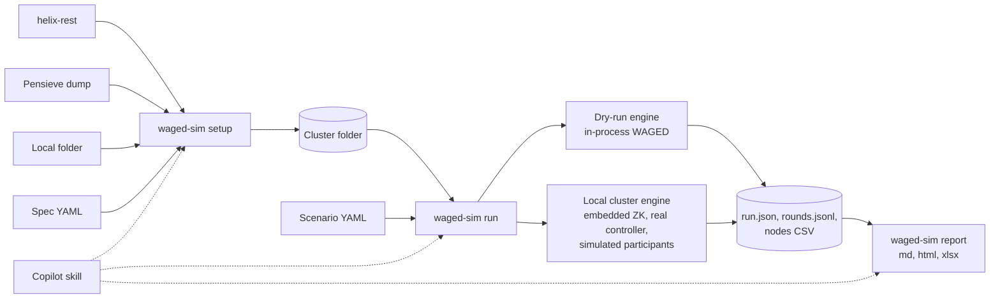
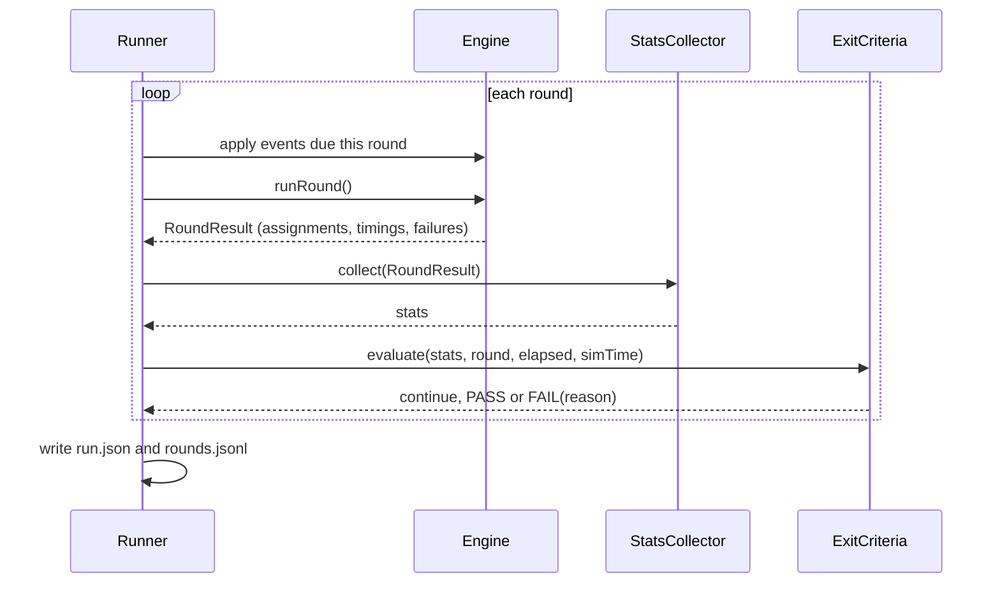

# WAGED simulation tool (`waged-sim`): local cluster setup, scenarios, exit criteria and reports

| Field       | Value |
|-------------|-------|
| **Authors** | sacchoud, Copilot |
| **Status**  | Implementing (v1 built and validated; see Implementation status) |
| **Created** | 2026-10-08 |
| **Updated** | 2026-10-08 |
| **Modules** | helix-waged-sim (new), helix-core (one additive seam) |
| **JIRA**    | Not assigned |

---

## Table of Contents

- [Summary](#summary)
- [Problem Statement](#problem-statement)
- [Goals / Non-Goals](#goals--non-goals)
- [Background](#background)
- [Design](#design)
- [Implementation status](#implementation-status)
- [API Changes](#api-changes)
- [Data / State Changes](#data--state-changes)
- [Implementation Plan](#implementation-plan)
- [Testing Strategy](#testing-strategy)
- [Rollout Plan](#rollout-plan)
- [Risks and Mitigations](#risks-and-mitigations)
- [Open Questions](#open-questions)

---

## Summary

`waged-sim` is a command-line tool with a thin Copilot skill on top. It does four things.

1. **Sets up a cluster locally** from one of four sources:
   - helix-rest;
   - a Pensieve point-in-time dump;
   - a local folder of already-copied data;
   - a direct spec (nodes, resources, partitions and other configs).
2. **Runs a scenario of changes in rounds**, in one of two modes:
   - **dry run**: calls WAGED in-process, the same way the controller pipeline does;
   - **local cluster**: a real local Helix cluster with embedded ZooKeeper, the real controller and simulated participants.
3. **Stops on exit criteria**: a number of rounds, a condition, a wall-clock timeout, or a mix.
4. **Writes an analysis report** (Markdown, HTML or xlsx) with predefined stats for every round and the final verdict.

It turns the one-off tooling built for a top-state skew investigation on production clusters into something any Helix engineer can run.

## Problem Statement

Answering one WAGED placement question took weeks of one-off work. Examples of such questions: why is top-state load skewed on this cluster, and what would a weight or config change do?

```
T0: Pull ZK state from backup pods by hand (Pensieve shell scripts per batch of clusters)
T1: Decode with Python into a single JSON per cluster (no ExternalView, no participant history)
T2: Run a TestNG harness driven by -D flags; weights changed by reflection on a static map
T3: Regex-parse stdout lines (LEVER / ATTR / COLDLIVE) with about 80 Python scripts
T4: Build sheets and docs by hand; repeat T2-T4 for every new question
```

Concrete problems with that workflow:

- **Duplicated weight and capacity resolution in Python.** This is the source of "default vs per-partition weight" mistakes.
- **No parallel runs.** Weights live in the static `ConstraintBasedAlgorithmFactory.MODEL` map and are changed by reflection, so runs cannot be parallel in one JVM.
- **No delay window.**
  - The replay treated every enabled node as active.
  - As a result it overstated leader skew by 0.06 to 0.13 on 3 of the 22 captured clusters.
- **No orchestration fidelity** (messages, throttling, transitions, missing top state). Questions such as "what happens during a rolling restart" cannot be answered.
- **No standard stats or report.** Every question needs new scripts, and the results are hard to compare.

## Goals / Non-Goals

### Goals

- **Local cluster setup** from helix-rest, Pensieve, a local folder, or a direct spec. All four produce one normalized cluster folder.
- **Two run modes from the same inputs.**
  - Dry run: deterministic, with a target of under 1 minute per round at the largest captured size (356 nodes, 38,556 partitions).
  - Local cluster: a real controller and ZooKeeper, with simulated participants.
- **Scenario file** with:
  - initial overrides;
  - events at rounds or at virtual times;
  - variants that run the same scenario under different settings.
- **Exit criteria**: `maxRounds`, `until` (with `stableFor` and `minRounds`), `failIf`, wall-clock `timeout`, and `maxSimTime`. Each run gets a PASS, FAIL or ERROR verdict and a matching exit code.
- **Report** in Markdown (default), self-contained HTML, or xlsx, with predefined stats per round and the final result. The raw data is kept so a report can be re-rendered without re-running.
- **Fidelity checks:**
  - Dry run reproduces the published RCA results: the replay lands within 0.03 of the served layout on 19 of 22 clusters, probe values match within 0.001, and the categories are the same.
  - Both modes produce the same best-possible placement for placement-only scenarios.
- **Read-only toward source clusters.** All data stays on the local machine.

### Non-Goals

- Not a load generator. Participants do not run real storage or real state transitions.
- No writes to any real cluster, and no automatic tuning or recommendations: v1 reports facts.
- No dry-run support for non-WAGED rebalancers in v1. The local-cluster mode works with any rebalancer, but the stats are capacity-oriented.
- No Helix task-framework resources.
- The skill is not published to a public skills catalog in v1.

## Background

**Existing pieces this design builds on (all verified in source):**

- `HelixUtil.getTargetAssignmentForWagedFullAuto` (`helix-core/src/main/java/org/apache/helix/util/HelixUtil.java`) is the canonical what-if.
  - It builds a `ResourceControllerDataProvider` from a `ZKHelixDataAccessor`.
  - It uses a `ReadOnlyWagedRebalancer` and runs `ResourceComputationStage`, `CurrentStateComputationStage` and `BestPossibleStateCalcStage` through `RebalanceUtil.runStage`.
  - It needs ZooKeeper and computes a single answer: no rounds, events or stats.
- `WagedRebalancer` has a protected constructor that takes an `AssignmentMetadataStore` and a `RebalanceAlgorithm`. `AssignmentMetadataStore` has a protected constructor that takes a `BucketDataAccessor`. Together they allow an in-memory metadata store; `MockAssignmentMetadataStore` in the tests is a precedent.
- `AssignmentManager` fills any resource missing from the stored baseline or best possible with the current state. This is the controller's own fallback when assignment metadata is absent.
- Delay window inputs (`DelayedRebalanceUtil.getInactiveTime`):
  - the ParticipantHistory offline time;
  - `InstanceConfig.getInstanceEnabledTime()`;
  - `ClusterConfig.getLastOnDemandRebalanceTimestamp()`;
  - all compared with `System.currentTimeMillis()`.
- Soft-constraint weights come from the static `MODEL` map, overridden once per JVM by `soft-constraint-weight.properties` on the classpath. `ConstraintBasedAlgorithm`'s constructor, `SoftConstraint` and `UsageSoftConstraint` are package-private.
- Local cluster building blocks in main code:
  - `ZkServer` (zookeeper-api);
  - `HelixControllerMain.startHelixController`;
  - `BestPossibleExternalViewVerifier` and `StrictMatchExternalViewVerifier` (`helix-core/.../tools/ClusterVerifiers/`).
- `commons-cli` (a helix-core dependency) and `snakeyaml` (managed in the root `pom.xml`, used by helix-rest) are already in the build, so the CLI and the YAML files need no new libraries.
- **helix-rest read endpoints** cover nearly everything:
  - cluster configs, state model definitions, and the controller (the leader's simple fields include `HELIX_VERSION`);
  - instances with `online`/`disabled` lists;
  - per-instance configs, history and current states;
  - resources with ideal states, external views and configs.
  - It does **not** expose WAGED `ASSIGNMENT_METADATA` (BASELINE, BEST_POSSIBLE).
- The investigation prototype (untracked test code) has the core logic this tool productizes: `WagedLocalSimulationSupport`, `TestWagedSnapshotLeverSweep`, `WagedFixVariants` and `WagedDecisionTrace`.

**Related analysis** (kept outside this change): a WAGED top-state assignment explainer, an evenness
analysis, and a proposal for a weighted top-state bound.

**Lessons from the investigation that shape this design:**

1. Place replicas only through production code; never re-implement scoring. This fidelity is why the replay matched the served layout.
2. Each pass has its own anchors and node set:
   - global: anchored to the previous baseline, over all assignable nodes;
   - partial: anchored to the served layout plus BaselineInfluence, over the active nodes;
   - emergency;
   - cold start.
3. The delay window needs offline times, disable timestamps and a clock.
4. Resolve weights the way WAGED does: per partition, then the resource `DEFAULT`, then the cluster default. Only `INSTANCE_CAPACITY_KEYS` count.
5. Measure every capacity key, for top-state replicas and for all replicas, over the serving node set including empty nodes. A highest-key composite hides imbalance.
6. One-setting-at-a-time probes on the captured state attribute causes. In this tool they become variants.

## Design

### Overview



### CLI

| Command | Purpose |
|---|---|
| `setup --from rest\|pensieve\|folder\|spec ... -o <cluster-dir>` | Create a local cluster folder |
| `inspect <cluster-dir>` | Static stats card, no simulation |
| `run <cluster-dir> --scenario <file> --mode dry-run\|local [-j N] [-o <run-dir>]` | Run rounds until the exit criteria are met. Exit code 0 PASS, 1 FAIL, 2 ERROR. |
| `report <run-dir> --format md,html,xlsx` | Render or re-render the report from the raw data |
| `up <cluster-dir> [--rest]` | Start a real local cluster and keep it running for inspection with helix-rest or helix-front |
| `trace <cluster-dir> --replica <resource>/<partition>/<state>` | Per-candidate scores for one placement: x, sigmoid and every constraint |

The default workspace is `~/.waged-sim/`, outside any repository, because captured data contains real host and cluster names.

### Cluster folder (the normalized local cluster)

Every source writes the same layout. It mirrors the ZooKeeper paths, with one ZNRecord JSON file per znode, so loading it into a local ZooKeeper is a direct copy.

| Path | Content | Sources |
|---|---|---|
| `manifest.json` | Format version, cluster name, source, capture time, controller `HELIX_VERSION`, fidelity flags, sha256 per file | all |
| `CONFIGS/CLUSTER/<cluster>.json` | ClusterConfig | all |
| `CONFIGS/PARTICIPANT/<instance>.json` | InstanceConfig | all |
| `CONFIGS/RESOURCE/<resource>.json` | ResourceConfig (partition weights) | all |
| `IDEALSTATES/<resource>.json` | IdealState | all |
| `STATEMODELDEFS/<model>.json` | StateModelDefinition | all (spec: built-in models) |
| `LIVEINSTANCES/<instance>.json` | LiveInstance (session ids synthesized when missing) | all |
| `EXTERNALVIEW/<resource>.json` | Served layout | rest, pensieve, folder |
| `INSTANCES/<instance>/HISTORY.json` | ParticipantHistory (offline times) | rest, pensieve, folder |
| `INSTANCES/<instance>/CURRENTSTATES/<resource>.json` | CurrentState, with the session level collapsed | rest, pensieve, folder (optional) |
| `ASSIGNMENT_METADATA/BASELINE.json`, `BEST_POSSIBLE.json` | Decoded WAGED assignments | pensieve, folder. Absent for rest: the controller fallback (current state) applies, with flag `assignmentMetadata=seeded-from-current-state`. |

### Sources (`waged-sim setup`)

- **`--from rest --url <helix-rest> --cluster <name>`**
  - Copies everything through the read endpoints listed in Background.
  - Without WAGED assignment metadata, a replay starts from the served layout. The report states this. Use Pensieve when the stored baseline matters.
- **`--from pensieve --dump <dir>`**
  - Imports a Pensieve output directory offline, including `ASSIGNMENT_METADATA`. The importer follows `LAST_SUCCESSFUL_WRITE`, then the version, then the buckets, and decompresses the ZNRecord.
  - The pull runs where the ZooKeeper backups are, with the user's own access:
    - access to production backups is privileged and needs the user's OK;
    - the tool never drives the user's login;
    - the CLI only generates the pull script and imports the result.
- **`--from folder --path <dir>`** validates and normalizes an existing cluster folder. It also converts the investigation's legacy single-file snapshots.
- **`--from spec --spec <file>`** generates a cluster from given constraints with a seeded generator:

```yaml
cluster:
  name: SIM_A
  capacityKeys: [CU, DISK, PARTCOUNT]
  instanceCapacity: {CU: 10000, DISK: 2000000, PARTCOUNT: 600}
  defaultPartitionWeight: {CU: 10, DISK: 1000, PARTCOUNT: 1}
  rebalancePreference: {EVENNESS: 1, LESS_MOVEMENT: 2}
  delayRebalance: {enabled: true, time: 16h}
  topology: {faultZoneType: zone, path: /zone/instance}
instances:
  - {count: 100, prefix: node, zones: 20}
  - {count: 10, prefix: big, zones: 20, capacity: {CU: 20000}}
resources:
  - {count: 10, prefix: db, partitions: 256, replicas: 3, stateModel: MasterSlave,
     weights: {CU: "lognormal(40, 1.0)", DISK: "uniform(100, 4000)"}}
  - {name: hot, partitions: 16, replicas: 3, weights: {CU: 4000}}
liveness: {down: 0, disabled: 0}
initialPlacement: cold-start        # cold-start (dry-run WAGED) | random | skewed
seed: 7
```

Weight distributions: `constant`, `uniform`, `normal`, `lognormal`, an explicit list, and `outliers(count, factor)` for a few very heavy partitions.

Transforms, available for every source:
- `--anonymize`: stable hashing of host, resource and cluster names;
- `--set <path>=<value>`: config overrides;
- `--scale <f>`: proportional down-sampling, flagged in the manifest because it changes lumpiness.

### Scenario file

```yaml
name: restart-hot-nodes
mode: dry-run                     # dry-run | local (CLI flag overrides)
focusKey: CU                      # key used by default stats and selectors
variants:                         # optional; each variant runs independently, compared in the report
  prod: {}
  ts-x4: {constraintWeights: {TopStateMaxCapacityUsageInstanceConstraint: 12}}
  cu-ts-x4:
    constraintWeights: {TopStateMaxCapacityUsageInstanceConstraint: 12}
    clusterConfig: {preferredScoringKeys: [CU]}
events:
  - at: 2
    disable: {pick: hottest-top, count: 3}
  - at: 4
    advanceClock: 16h             # delay window expires
  - at: 5
    enable: previously-disabled
  - every: 2
    from: 6
    times: 5
    restart: {pick: random, count: 1, seed: 7}
exit:
  until: "skew.top.CU <= 1.10"
  stableFor: 2
  failIf: "violations.capacity > 0"
  maxRounds: 30
  timeout: 20m
report: {formats: [md, html], stats: default, perNode: [start, end]}
```

**Events**

| Event | Parameters | Dry run | Local cluster |
|---|---|---|---|
| `disable` / `enable` | nodes or selector | InstanceConfig flag and timestamp | `HelixAdmin` |
| `setOperation` | `EVACUATE`, `SWAP_IN`, `UNKNOWN`, `ENABLE` | InstanceConfig | `HelixAdmin` |
| `kill` / `revive` / `restart` | nodes or selector, optional duration | remove or add the LiveInstance; record the offline time | stop or start the participant |
| `addNode` / `removeNode` | spec or names | InstanceConfig and liveness | `HelixAdmin`, then start the participant |
| `capacity` | nodes, map | InstanceConfig | `ConfigAccessor` |
| `addResource` / `removeResource` / `partitions` / `replicas` | resource spec | IdealState and ResourceConfig | `HelixAdmin` |
| `weights` | resource or partition, factor or map, or `fromFolder` | ResourceConfig | `ConfigAccessor` |
| `clusterConfig` | any ClusterConfig field (preferences, `preferredScoringKeys`, delay, ...) | ClusterConfig | `ConfigAccessor` |
| `constraintWeights` | per soft constraint | algorithm rebuilt with explicit weights | controller restarted with a regenerated `soft-constraint-weight.properties`, as in production |
| `maintenance` | on / off | maintenance signal | `HelixAdmin` |
| `advanceClock` | duration | timestamps shifted (see below) | wait for duration ÷ compression factor |
| `random` | seeded choice of any event above | yes | yes |

**Selectors**:
- explicit names;
- `hottest-top` / `hottest-all` (by the focus key);
- `random` (seeded);
- `zone:<z>`;
- `previously-disabled`.

**Pass override (dry run only)**: `pass: auto | partial | global | cold`. It forces a pass type, which is how the investigation's probes (anchors off, TopState x4, CU keys and so on) become one-round variants of a `rca` preset.

**Presets** ship as scenario files:
- `rca`: probes, cold starts, floor, then the A / A+Y / A+S category;
- `levers`;
- `rehome`;
- `genesis` (weight drift);
- `converge`.

### Rounds and time in each mode

| | Dry run | Local cluster |
|---|---|---|
| One round | Apply the events due, run the real stages once, then set the served layout to the best possible (instant transitions). WAGED itself decides global, partial or emergency from the changes. | Apply the events due through ZK and the admin APIs, then wait until settled: the verifier passes and no messages are pending, or `roundTimeout` expires. |
| Time | Virtual clock. `advanceClock Δ` subtracts Δ from recorded offline times, disable timestamps and the last on-demand rebalance time, which is what `DelayedRebalanceUtil` compares with the wall clock. | Compressed wall clock. Time-based configs (delay, rebalance timer) are divided by a factor k (default 3600, so 1 h becomes 1 s), recorded in the manifest. |
| Transitions | Instant | Simulated participants: configurable latency and failure rate |
| Fidelity | Placement plus WAGED orchestration (change detection, delay window, state mapping) | Also messages, throttling, intermediate states, P2P relay and missing top state |
| Determinism | Byte-identical output | Best effort (timing) |



### Engines

**Dry-run engine** (`engine/dryrun`), which mirrors `getAssignmentForWagedFullAutoImpl`:
1. Load the cluster folder into an in-memory `BaseDataAccessor<ZNRecord>`.
2. Wrap it in a `ZKHelixDataAccessor` and refresh a real `ResourceControllerDataProvider`.
3. Run `ResourceComputationStage`, `CurrentStateComputationStage` and `BestPossibleStateCalcStage` with a `SimWagedRebalancer`. It subclasses `WagedRebalancer` through the protected constructor, and uses:
   - an in-memory `AssignmentMetadataStore`, seeded from `ASSIGNMENT_METADATA`;
   - an algorithm built with explicit weights through the new factory seam;
   - synchronous global rebalance.
4. Write the best possible back as current states for the next round.

Variants run in parallel threads with no shared mutable state.

A pass runner (direct `ClusterModelProvider` pass plus the algorithm) serves forced pass types and `trace`, reusing the logic of `WagedDecisionTrace`.

**Local cluster engine** (`engine/local`):
1. Start an embedded `ZkServer` on 127.0.0.1 at a free port.
2. Write the cluster folder to ZooKeeper. `ASSIGNMENT_METADATA` goes through `ZkBucketDataAccessor`.
3. Start the controller with `HelixControllerMain.startHelixController` in a child JVM. Its classpath carries the generated `soft-constraint-weight.properties`, the production mechanism for weights; a weight change restarts it, as in production.
4. Start the participant simulator:
   - Real `HelixManager` participants with a simulated state model that accepts any transition after a configurable latency, for clusters of up to 100 instances. This keeps the full participant-side fidelity, including P2P relay.
   - A single-process simulator above that size. It owns the LiveInstance nodes, watches `MESSAGES` and writes `CURRENTSTATES`. P2P messaging is turned off in the copy and flagged.
5. Detect a settled round with `BestPossibleExternalViewVerifier` plus "no pending messages".
6. Read stats from `EXTERNALVIEW`, `CURRENTSTATES` and `ASSIGNMENT_METADATA`.

`waged-sim up` stops after step 4 and prints the ZooKeeper address. With `--rest` it also starts a local helix-rest pointed at it.

### Exit criteria

| Field | Meaning | Default |
|---|---|---|
| `maxRounds` | Hard stop; with neither `until` nor `stableFor`, the fixed length of the run | 20 |
| `until` | Success condition, evaluated after each round | none |
| `stableFor` | Consecutive rounds `until` must hold; without `until`, rounds in which nothing moved | 1 |
| `minRounds` | Earliest round at which the run may stop | round of the last scheduled event |
| `failIf` | Early failure condition | none |
| `timeout` | Wall-clock limit for the whole run | 30m |
| `roundTimeout` | Local mode: maximum wait for a round to settle | 5m |
| `maxSimTime` | Virtual-time limit | none |

Verdicts, one per variant:
- **PASS (round r)**: `until` held for `stableFor` consecutive rounds ending at r, and r ≥ `minRounds`.
  - Without `until` but with `stableFor`: no replica or top state moved for `stableFor` rounds.
  - With neither: the run is exactly `maxRounds` rounds and passes when they complete ("number of runs").
- **FAIL** with a reason:
  - `maxRounds`, `timeout`, `maxSimTime` or `roundTimeout`;
  - `failIf@r`;
  - `rebalanceFailure:<type>@r`. A WAGED failure such as `CAPACITY_DEFICIT` is a simulation outcome, not a tool error.
- **ERROR**: a tool or infrastructure problem, such as invalid input or a ZooKeeper failure. Partial results are kept.

Condition grammar: a small parser in the tool (no `eval`).

```
cond := or ; or := and ('or' and)* ; and := unary ('and' unary)*
unary := 'not' unary | '(' cond ')' | stat op number
op := '<' | '<=' | '>' | '>=' | '==' | '!='
stat := name ('.' name)*            e.g. skew.top.CU, moves.replicas
```

### Stats catalog

All stats are computed with production `AssignableNode` and `AssignableReplica`, so they share WAGED's weight and capacity resolution. They are measured over the serving node set (enabled, live and assignable, including empty nodes). The top state comes from the state model definition.

| Stat | Meaning |
|---|---|
| `skew.top.<KEY>`, `skew.all.<KEY>` | Max/mean of top-state (or all-replica) load on KEY |
| `maxUtil.top.<KEY>`, `maxUtil.all.<KEY>` | Highest node load ÷ that node's capacity, % |
| `util.all.<KEY>`, `util.top.<KEY>` | Cluster load ÷ cluster capacity, % |
| `exposure.<KEY>` | `util.top.<KEY>` ÷ `util.top.<focusKey>`. Above 1, KEY sets the TopState target. |
| `skew.topCount`, `skew.replicaCount` | Max/mean of counts |
| `moves.replicas`, `moves.topState`, `moves.cumulative` | Changes vs the previous round |
| `moves.kept`, `moves.roleSwap`, `moves.toNonHolder` | What happened to each top-state replica vs the previous round |
| `drift.baseline` | Fraction of replicas whose node or state differs from the baseline |
| `yardstick.targetKey`, `yardstick.misrated` | The key that sets the TopState target, and how many nodes below the mean on the focus key are rated at or above target |
| `floor.top.<KEY>` | Pigeonhole lower bound on `skew.top.<KEY>` |
| `violations.capacity`, `unplaced`, `missingTopState` | Health |
| `time.roundMs`, `time.settleMs` (local) | Timing |
| `messages.sent`, `transitions.failed` (local) | Orchestration |

The cluster card (capacity vs required and util % per key, max host %, skew for all replicas and for top-state replicas) is shown at the start and the end.

### Report

- **Markdown (default) and HTML sections:**
  1. Verdict for each variant: round reached, elapsed time, reason.
  2. Setup: source, fidelity flags, cluster card at the start.
  3. Scenario: overrides and the event timeline.
  4. Per-round table: events, passes run, selected stats, condition status.
  5. Charts (HTML only): stats across rounds with event markers; per-node distributions at the start and the end.
  6. Final state: start vs end; the k hottest nodes and what they hold.
  7. Variant comparison.
  8. Reproducibility: tool and Helix versions (tool and source controller), cluster folder and scenario hashes, seed, command line.
- **HTML** is a single self-contained file with inline SVG charts and no external scripts or CDNs.
- **xlsx** uses the colour scales of the investigation sheets. It is rendered from the raw data by the skill's Python script, and the skill can upload it as a Google Sheet on request.
- **Raw data**: `run.json`, `rounds.jsonl`, `nodes_<variant>_<round>.csv`.

### Copilot skill (thin)

`SKILL.md` lives at `helix-waged-sim/skill/` and is installed to `~/.copilot/skills/waged-sim`. Its workflow:

1. **Pick the source.** A helix-rest URL; a Pensieve pull (the user approves access to the backups and does their own login); a local folder; or a spec built from the user's words, with the key numbers confirmed.
2. **Set up.** Run `waged-sim setup` and show the stats card.
3. **Build the scenario.** Turn the request into a scenario file and show it before running.
4. **Run and report.** Run in the requested mode, summarize the verdict and key stats, and link the report. Offer xlsx or a Google Sheet only on request.

Guardrails:
- read-only toward real clusters;
- the local cluster binds to localhost;
- data stays in `~/.waged-sim`;
- captured data is never committed.

## Implementation status

Built on 2026-10-08 as module `helix-waged-sim` (CLI, both engines, all four sources, reports, presets,
skill) plus the helix-core seam. All 36 module tests pass; the seam has its own test in helix-core.

**Validated:**
- **RCA parity.** The `rca` preset reproduces the published probe values exactly on the two captured
  production snapshots tried (180 and 245 nodes): replay, anchors off, TopState x4, CU keys, CU keys +
  TopState x4, the cold starts and the yardstick effects. 13 probes on a 245-node, 19k-partition cluster take
  about 40 seconds with `-j 4`; a full-pipeline round takes about 5 seconds.
- **Sources.** A real Pensieve pull imports to the same stats as the legacy snapshot of the same capture.
  REST and Pensieve imports are also covered by tests on generated data (an HTTP stub; generated dumps).
- **Engines.** The local cluster (embedded ZooKeeper, controller in a child JVM, real participants)
  settles, honours the compressed delay window, and gives the same best possible placement as the dry
  run started with a controller restart.

**Deviations from the design:**
- Both engines simulate WAGED resources only; other resources stay in the folder untouched.
- Constraint weights in a variant apply from round 1. To model deploying new weights (which recomputes
  the baseline through a controller restart), set `firstRound: restart`.
- The local cluster starts participants before the controller, so the controller's first pipeline sees
  every live instance.
- `report.xlsx` is rendered by the skill's `render_xlsx.py`, not by the Java tool.

**Not built yet:**
- The single-process participant simulator for clusters over about 100 instances. Local mode uses real
  participants for every instance.
- `trace`, `--anonymize`, `--scale`, and `up --rest`. `up` prints the command to start helix-rest instead.
- An RC classification table for the `rca` preset (the variant comparison table shows the probe values).

## API Changes

- **No REST or ZooKeeper API changes.**
- **Java, helix-core, additive.** One overload, so callers can build an algorithm with explicit weights without touching the static `MODEL` map:

```java
// Existing (unchanged behavior; delegates with an empty override map)
public static RebalanceAlgorithm getInstance(
    Map<ClusterConfig.GlobalRebalancePreferenceKey, Integer> preferences);

// New
public static RebalanceAlgorithm getInstance(
    Map<ClusterConfig.GlobalRebalancePreferenceKey, Integer> preferences,
    Map<String, Float> constraintWeightOverrides);
```

- **New CLI**, described in Design.

## Data / State Changes

- **No changes to cluster data, znodes or configs.**
- New local file formats, each versioned by a `format` field and documented in `helix-waged-sim/README.md`:
  - cluster folder v1;
  - scenario v1;
  - run output v1 (`run.json`, `rounds.jsonl`, nodes CSV).

## Implementation Plan

Phases:
- **P0, dry-run core:** steps 1 to 8.
- **P1, sources and skill:** steps 9, 10, 11 and 13.
- **P2, local cluster:** step 12. It can start in parallel with P1 once step 7 is done.
- **P3, later:** repeated randomized trials, plugin constraints (see Open Questions) and CI.

Package root: `org.apache.helix.wagedsim`, under `helix-waged-sim/src/main/java/org/apache/helix/wagedsim/` (shortened to `.../wagedsim/` below).

Validation commands assume `mvn install -pl helix-core -am -DskipTests` has been run once.

### Step 1: Explicit-weights seam in the algorithm factory
- **Module**: helix-core
- **Files to modify**: `helix-core/src/main/java/org/apache/helix/controller/rebalancer/waged/constraints/ConstraintBasedAlgorithmFactory.java`
- **Files to create**: `helix-core/src/test/java/org/apache/helix/controller/rebalancer/waged/constraints/TestConstraintBasedAlgorithmFactoryWeights.java`
- **What**: Add `getInstance(preferences, constraintWeightOverrides)`. Existing callers are unchanged, and the static `MODEL` map is never mutated by the new path.
- **Depends on**: None
- **Validation**: `mvn test -pl helix-core -Dtest=TestConstraintBasedAlgorithmFactoryWeights`

### Step 2: Module skeleton, cluster folder and CLI shell
- **Module**: helix-waged-sim (new), root
- **Files to modify**: `pom.xml` (add `<module>helix-waged-sim</module>` after `helix-rest`)
- **Files to create**:
  - `helix-waged-sim/pom.xml`
  - `.../wagedsim/cli/WagedSimCli.java`
  - `.../wagedsim/cluster/ClusterFolder.java`
  - `.../wagedsim/cluster/Manifest.java`
  - `helix-waged-sim/src/test/java/org/apache/helix/wagedsim/cluster/TestClusterFolder.java`
- **What**: Read, write and validate the ZK-path folder layout (ZNRecord JSON, manifest with hashes). The CLI dispatches subcommands with commons-cli. The build produces a runnable jar with dependencies.
- **Depends on**: None
- **Validation**: `mvn test -pl helix-waged-sim -Dtest=TestClusterFolder`

### Step 3: Spec source (cluster from given constraints)
- **Module**: helix-waged-sim
- **Files to create**:
  - `.../wagedsim/source/SpecSource.java`
  - `.../wagedsim/source/WeightDistribution.java`
  - `helix-waged-sim/src/main/resources/examples/spec-small.yaml`
  - `helix-waged-sim/src/test/java/org/apache/helix/wagedsim/source/TestSpecSource.java`
- **What**: Turn a YAML spec into a cluster folder: seeded distributions, validation of capacity keys and weights, and built-in state models. The initial placement hook is completed in step 5.
- **Depends on**: Step 2
- **Validation**: `mvn test -pl helix-waged-sim -Dtest=TestSpecSource`

### Step 4: Folder source and legacy snapshot converter
- **Module**: helix-waged-sim
- **Files to create**:
  - `.../wagedsim/source/FolderSource.java`
  - `.../wagedsim/source/LegacySnapshotConverter.java`
  - `helix-waged-sim/src/test/java/org/apache/helix/wagedsim/source/TestFolderSource.java`
- **What**: Validate and normalize copied folders, and convert the investigation's single-file snapshots. Test fixtures come from the spec generator, never from production data.
- **Depends on**: Step 3
- **Validation**: `mvn test -pl helix-waged-sim -Dtest=TestFolderSource`

### Step 5: Dry-run engine
- **Module**: helix-waged-sim
- **Files to create**:
  - `.../wagedsim/engine/Engine.java`
  - `.../wagedsim/engine/RoundResult.java`
  - `.../wagedsim/engine/dryrun/DryRunEngine.java`
  - `.../wagedsim/engine/dryrun/InMemoryBaseDataAccessor.java`
  - `.../wagedsim/engine/dryrun/InMemoryAssignmentMetadataStore.java`
  - `.../wagedsim/engine/dryrun/SimWagedRebalancer.java`
  - `.../wagedsim/engine/dryrun/VirtualClock.java`
  - `.../wagedsim/engine/dryrun/PassRunner.java`
  - `helix-waged-sim/src/test/java/org/apache/helix/wagedsim/engine/dryrun/TestDryRunEngine.java`
- **What**: Run the real stages on in-memory data with explicit weights. Transitions are instant; the delay window uses time shifting. Forced pass types and `trace` go through the pass runner. The spec's `cold-start` initial placement is filled in here.
- **Depends on**: Steps 1 and 4
- **Validation**: `mvn test -pl helix-waged-sim -Dtest=TestDryRunEngine`. The test covers determinism, the delay window via time shift, and agreement with `HelixUtil.getTargetAssignmentForWagedFullAuto` on a small cluster.

### Step 6: Stats catalog
- **Module**: helix-waged-sim
- **Files to create**:
  - `.../wagedsim/stats/StatsCatalog.java`
  - `.../wagedsim/stats/StatsCollector.java`
  - `.../wagedsim/stats/Floor.java`
  - `helix-waged-sim/src/test/java/org/apache/helix/wagedsim/stats/TestStatsCollector.java`
- **What**: Compute every stat in the catalog. Hand-computed cases cover:
  - weight resolution order;
  - empty nodes counted;
  - non-capacity keys ignored;
  - top state taken from the state model.
- **Depends on**: Step 5
- **Validation**: `mvn test -pl helix-waged-sim -Dtest=TestStatsCollector`

### Step 7: Scenario, runner and exit criteria
- **Module**: helix-waged-sim
- **Files to create**:
  - `.../wagedsim/scenario/Scenario.java`
  - `.../wagedsim/scenario/ScenarioLoader.java`
  - `.../wagedsim/scenario/Event.java`
  - `.../wagedsim/scenario/Selector.java`
  - `.../wagedsim/run/Condition.java`
  - `.../wagedsim/run/ExitCriteria.java`
  - `.../wagedsim/run/Runner.java`
  - `.../wagedsim/run/Verdict.java`
  - `helix-waged-sim/src/test/java/org/apache/helix/wagedsim/run/TestCondition.java`
  - `helix-waged-sim/src/test/java/org/apache/helix/wagedsim/run/TestRunner.java`
- **What**: YAML loading, the event vocabulary, selectors and variants (in parallel). Verdict tests cover:
  - PASS with `stableFor`;
  - `minRounds`;
  - `failIf`;
  - `maxRounds`;
  - `timeout` with a fake clock;
  - `rebalanceFailure` from a forced `CAPACITY_DEFICIT`;
  - ERROR on invalid input;
  - exit codes.
- **Depends on**: Step 6
- **Validation**: `mvn test -pl helix-waged-sim -Dtest='TestCondition,TestRunner'`

### Step 8: Raw outputs and Markdown and HTML reports
- **Module**: helix-waged-sim
- **Files to create**:
  - `.../wagedsim/report/RunData.java`
  - `.../wagedsim/report/MarkdownReport.java`
  - `.../wagedsim/report/HtmlReport.java`
  - `.../wagedsim/report/Svg.java`
  - `helix-waged-sim/src/test/java/org/apache/helix/wagedsim/report/TestReports.java`
- **What**: Write `run.json`, `rounds.jsonl` and the node CSVs. Render the report sections, with inline SVG charts in HTML.
- **Depends on**: Step 7
- **Validation**: `mvn test -pl helix-waged-sim -Dtest=TestReports`. The test renders a golden small report and checks that the HTML has no external references.

### Step 9: helix-rest source
- **Module**: helix-waged-sim
- **Files to create**:
  - `.../wagedsim/source/RestSource.java`
  - `helix-waged-sim/src/test/java/org/apache/helix/wagedsim/source/TestRestSource.java`
- **What**: Copy through the read endpoints and synthesize LiveInstances from the `online` list. Set the `seeded-from-current-state` flag. Tests use a JDK `HttpServer` stub that serves recorded fixtures.
- **Depends on**: Step 4
- **Validation**: `mvn test -pl helix-waged-sim -Dtest=TestRestSource`

### Step 10: Pensieve import
- **Module**: helix-waged-sim
- **Files to create**:
  - `.../wagedsim/source/PensieveImporter.java`
  - `helix-waged-sim/scripts/pensieve-pull.sh.template`
  - `helix-waged-sim/src/test/java/org/apache/helix/wagedsim/source/TestPensieveImporter.java`
- **What**: Parse Pensieve output, including the base64 compressed `ASSIGNMENT_METADATA` buckets. Generate the pod-side script; the skill runs it.
- **Depends on**: Step 4
- **Validation**: `mvn test -pl helix-waged-sim -Dtest=TestPensieveImporter`

### Step 11: Variants, presets and the parity check
- **Module**: helix-waged-sim
- **Files to create**:
  - `helix-waged-sim/src/main/resources/presets/rca.yaml`, `levers.yaml`, `rehome.yaml`, `genesis.yaml`, `converge.yaml`
  - `helix-waged-sim/src/test/java/org/apache/helix/wagedsim/TestPresets.java`
  - `helix-waged-sim/src/test/java/org/apache/helix/wagedsim/TestRcaParity.java`
- **What**: Encode the investigation's probes and scenarios as presets. The parity test is skipped unless `-Dwagedsim.goldenRoot=<dir>` points at local snapshots and golden values; production data is never committed.
- **Depends on**: Steps 7, 9 and 10
- **Validation**: `mvn test -pl helix-waged-sim -Dtest=TestRcaParity -Dwagedsim.goldenRoot=<local dir>`

### Step 12: Local cluster engine and `up`
- **Module**: helix-waged-sim
- **Files to create**:
  - `.../wagedsim/engine/local/LocalClusterEngine.java`
  - `.../wagedsim/engine/local/EmbeddedZk.java`
  - `.../wagedsim/engine/local/ClusterLoader.java`
  - `.../wagedsim/engine/local/ControllerProcess.java`
  - `.../wagedsim/engine/local/ParticipantSimulator.java`
  - `.../wagedsim/engine/local/SimulatedStateModelFactory.java`
  - `.../wagedsim/engine/local/SettleWaiter.java`
  - `.../wagedsim/engine/local/TimeCompression.java`
  - `.../wagedsim/cli/UpCommand.java`
  - `helix-waged-sim/src/test/java/org/apache/helix/wagedsim/engine/local/TestLocalClusterEngine.java`
  - `helix-waged-sim/src/test/java/org/apache/helix/wagedsim/engine/TestCrossEngineAgreement.java`
- **What**:
  - embedded ZooKeeper;
  - folder loaded into ZK;
  - controller in a child JVM with generated weights;
  - participants (real for 100 instances or fewer, single-process simulator above);
  - settle detection and time compression;
  - the `up` command.
- **Depends on**: Steps 6 and 7
- **Validation**: `mvn test -pl helix-waged-sim -Dtest='TestLocalClusterEngine,TestCrossEngineAgreement'`

### Step 13: Skill, xlsx renderer and README
- **Module**: helix-waged-sim
- **Files to create**:
  - `helix-waged-sim/skill/SKILL.md`
  - `helix-waged-sim/skill/scripts/waged-sim` (launcher that builds or locates the jar)
  - `helix-waged-sim/skill/scripts/render_xlsx.py`
  - `helix-waged-sim/skill/install.sh`
  - `helix-waged-sim/README.md`
- **What**: The thin skill, colour-coded xlsx output, and a runbook covering formats, presets and examples.
- **Depends on**: Steps 8 to 11
- **Validation**:
  - `python3 -m py_compile helix-waged-sim/skill/scripts/render_xlsx.py`
  - Manual: ask the skill to copy an EI cluster via REST and run a disable-and-recover scenario until `skew.top.CU <= 1.10`, failing after 20 rounds or 10 minutes.

## Testing Strategy

### Unit Tests
- One test class per component, as listed with each step.
- Key edge cases:
  - weight resolution order and non-capacity keys;
  - empty and disabled nodes in the measured set;
  - the condition grammar, including `not`, parentheses and unknown stats;
  - verdict precedence when `failIf` and `until` hold in the same round;
  - time shifting across the delay boundary;
  - variants run in parallel without interference.

### Integration Tests
- Local cluster engine on embedded ZooKeeper; cross-engine placement agreement; dry run vs `HelixUtil.getTargetAssignmentForWagedFullAuto`.
- Run with: `mvn verify -pl helix-waged-sim -P integration-test`. The profile mirrors helix-core's.
- Files: `TestLocalClusterEngine.java`, `TestCrossEngineAgreement.java`, `TestDryRunEngine.java`.

### Golden parity (local only)
- The 22 captured snapshots through the `rca` preset must match:
  - the replay values;
  - the anchors-off, TopState x4 and CU-keys probes;
  - the yardstick and MaxCapacity effects (within 0.001);
  - the categories (13 A, 7 A+Y, 2 A+S).
- The data stays outside the repository.

### Determinism and scale
- **Determinism:** identical inputs give a byte-identical `rounds.jsonl` in dry-run mode.
- **Scale smoke tests:** dry-run round time at 356 nodes and 38,556 partitions; local cluster settle time at the same size with the single-process participant simulator.

### Manual Validation
- Run the skill end to end on an EI cluster copied via helix-rest, and on a spec cluster in both modes.

## Rollout Plan

- **Distribution.** Developer tool; nothing is deployed to production.
  - Build: `mvn -pl helix-waged-sim -am package -DskipTests`.
  - Run the jar with dependencies, or install the skill with `helix-waged-sim/skill/install.sh`.
- **Versioning.** `run.json` records the tool and Helix versions. The report warns when the source controller's `HELIX_VERSION` differs from the Helix version the tool was built with.
- **Safety.**
  - Source access is read-only.
  - The local cluster binds to 127.0.0.1.
  - Data is kept under `~/.waged-sim`.
  - Reports with real names carry a banner and are never committed.
- **Rollback.** Not applicable. The only helix-core change is an additive overload with unchanged default behavior.

## Risks and Mitigations

| Risk | Likelihood | Impact | Mitigation |
|---|---|---|---|
| The tool's WAGED code differs from the source controller's version, giving wrong conclusions | Medium | High | Record the controller `HELIX_VERSION`, warn on mismatch, allow building against a pinned Helix version |
| A REST copy lacks the WAGED baseline and best possible, so replays start from the served layout | High | Medium | Same fallback as the controller; flagged in the report; recommend Pensieve when the history matters |
| The local cluster is slow or heavy at 356 nodes and about 116k replicas | Medium | Medium | Single-process participant simulator, time compression, flagged scale-down transform |
| Time compression changes timer and throttle behavior | Medium | Medium | Document the factor; cross-check against the dry run's virtual clock |
| The lightweight participant simulator does not relay P2P messages | Medium | Low | Real participants up to 100 instances; P2P turned off and flagged above that |
| Captured data with real names leaks into a repository or report | Medium | High | Workspace outside repositories, `--anonymize`, report banner, skill guardrails |
| Pensieve pulls need privileged access to production backups | High | Medium | The CLI only generates the script and imports; the skill asks for the user's OK and never drives their login |
| Parallel variants interfere through static state | Low | Medium | Explicit-weights seam; no reflection; parallel-variant test |

## Open Questions

1. Module name and home: `helix-waged-sim` in this repository (proposed), or an internal repository?
2. xlsx rendering: a Python script in the skill (proposed; no new Java dependency) or Apache POI in the tool?
3. Local cluster participants: is 100 instances the right cut-over from real participants to the single-process simulator?
4. Plugin constraints for fix experiments (custom sigmoid alpha, decoupled keys, output-step leader balancing) need custom `SoftConstraint`s, which are package-private. Open a seam, or keep these experiments in test code?
5. Should `up --rest` start an embedded helix-rest by default? That adds a dependency on helix-rest.
6. Default exit policy when `until` is absent: "stable for 2 rounds after the last event" (proposed)?
7. ~~Packaging: a CLI and a thin skill~~. Resolved: confirmed on 2026-10-08.
8. ~~Run modes~~. Resolved: both a dry run that calls WAGED and a real local cluster.
9. ~~Sources~~. Resolved: helix-rest, Pensieve, a local folder of copied data, and a direct spec.
