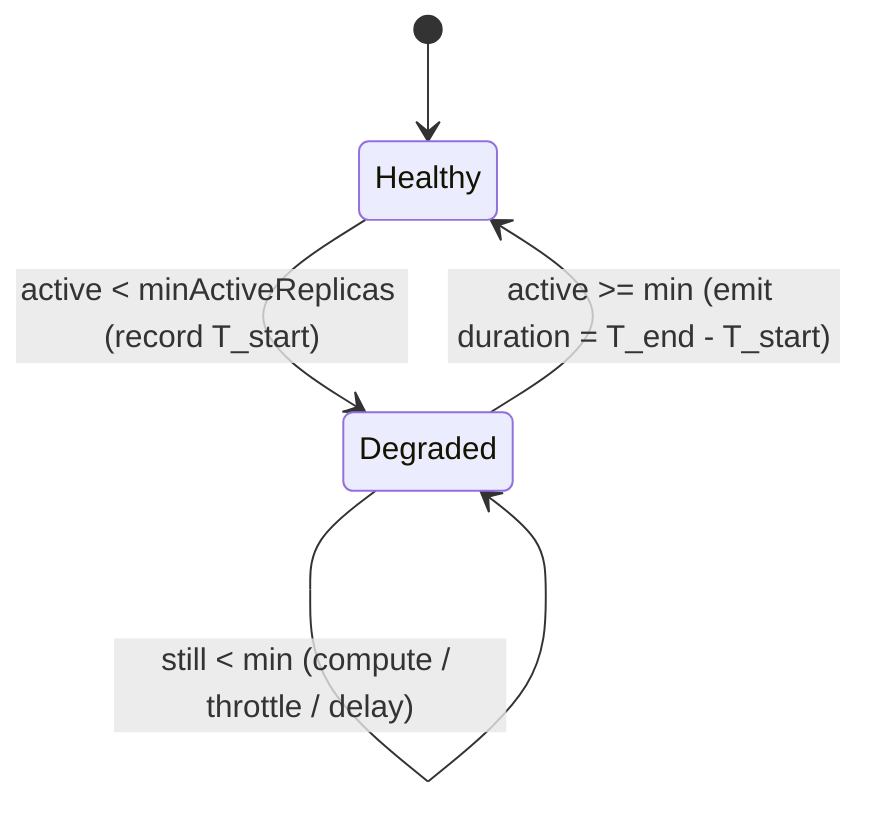

# Partition Recovery Time Metrics

## Summary

Helix measures how long a partition's **top state** (Master/Leader) is missing, but has **no metric for how long a partition stays below its minimum active replica count**. Today we can see *how many* partitions are under-replicated at a scrape instant, not *how long any takes to heal*. This doc proposes a per-resource **partition recovery duration** metric, reusing the existing top-state-handoff timing infrastructure. It is **Phase 1 (observe)**; using the data to reduce recovery time (throttle/delay tuning) is a separate Phase 2.

## Problem Statement

When a partition loses replicas (node crash, decommission, failed transition) it is **degraded** — fewer active replicas than `minActiveReplicas` — until the controller rebalances a replica back to an active state. That window is a direct availability/durability risk, yet Helix emits no duration signal for it.

What exists today are **point-in-time count gauges only** (`ResourceMonitor`): `MissingMinActiveReplicaPartitionGauge`, `MissingReplicaPartitionGauge`, `PendingRecoveryRebalanceReplicaGauge`, `RecoveryRebalanceThrottledReplicaGauge`. They answer *"how many partitions are degraded right now?"* — not *"how long does a partition remain degraded?"*. The only duration signal that exists (`PartitionTopStateHandoffDurationGauge`) covers **only** loss of the single top-state replica; a partition that keeps its Master but drops from 3 active replicas to 1 produces no duration metric at all.

```
T0: Partition P: 3 active (1 Master, 2 Slaves); minActiveReplicas = 2. Healthy.
T2: Two nodes crash -> P has 1 active -> BELOW min. Degraded.
T3: Controller computes recovery; RECOVERY_BALANCE throttle queues the transition.
T4: A replica bootstraps on a new node -> P back to 2 active. Recovered.
--> Recovery window = T4 - T2. Today this is never measured.
```

Consequences: no SLA/alerting on time-to-recover, no attribution of *where* the time went (throttle vs delay vs compute vs app bootstrap), and no baseline to measure any future improvement against.

## Goals / Non-Goals

**Goals**
- Define "partition recovery time" precisely (active replica count vs `minActiveReplicas`).
- Emit a per-resource **histogram** of recovery duration, plus **max single-partition duration** and a **count beyond a configurable threshold**.
- Split duration into **Helix latency** vs **participant (app) latency** where feasible, reusing the top-state pattern.
- Reuse existing timing infrastructure rather than build a parallel one.

**Non-Goals**
- Changing rebalancing/throttling/delay behavior to make recovery faster (Phase 2).
- Re-implementing top-state handoff metrics or the existing point-in-time count gauges.
- Task-framework partitions (already skipped by the report stage).
- REST/ZooKeeper exposure (JMX MBeans only).

## Background

Helix already has a proven pattern for timing a partition-level degradation, built for top-state loss; we mirror it:

- **`MissingTopStateRecord`** — small in-memory record holding `startTimeStamp` for one degraded partition.
- **`_missingTopStateMap`** in `ResourceControllerDataProvider` — persists records **across pipeline runs** so a start recorded in one run resolves to a duration later; `retainAll`-trimmed each run.
- **`TopStateHandoffReportStage`** — async stage iterating every resource/partition; records start when top state goes missing, computes duration when it returns.
- **`ResourceMonitor` / `ClusterStatusMonitor`** — hold and forward the JMX metrics (`HistogramDynamicMetric`, `updateStateHandoffStats(...)`).
- **Latency attribution** — the stage computes `helixLatency = totalDuration − userLatency`, where `userLatency` is the participant's own transition time read from durable timestamps.

"Degraded" reuses the controller's own notion of recovery: `ResourceMonitor.updateResourceState(...)` already counts a partition below-min when `activeReplicaCount < minActiveReplicas`. We reuse the **same definition** so the duration metric is consistent with the existing count gauge.

## Design

### Defining "partition recovery time"

A partition is in **recovery** while it is *degraded*:

- **Active replica count** = replicas whose current state is in the state model's active set (same computation `updateResourceState` uses).
- **T_end** = the moment the count returns to `>= minActiveReplicas`. This is unambiguous: it's the `END_TIME` (from the recovering replica's `CurrentState` znode) of the **gap-closing transition** — the last upward transition needed to reach the minimum.
- **T_start** = the moment the count first dropped `< minActiveReplicas`. **Deriving this accurately is the crux** — see the two options below.
- **Partition recovery time** = `T_end − T_start`.

We use `minActiveReplicas` (not full replica count) as the boundary because it is the availability/durability line the controller prioritizes via recovery rebalance.



#### Deriving T_start — Option A vs Option B (needs team consensus)

Unlike top state (a single named holder, for which Helix already caches the previous location in `_lastTopStateLocationMap`), the active-replica **set** has no remembered baseline today. So when we detect "1 active, need 3," we cannot, without help, name *which* replicas left or *when*. Two approaches:

**Option A — Reconstruct the causing event (accurate).**
Add a cross-run cache `_lastActiveReplicaMap: Map<resource, Map<partition, Set<instance>>>`, overwritten every pipeline run. On a drop, diff *previous* active holders − *current* active holders to identify the replica(s) that left, then date the loss from durable state:
  - crashed host → `InstanceOfflineTimeMap` (offline time);
  - graceful step-down → the downward transition's `END_TIME` in the loser's `CurrentState`;
  - pending downward message → its `createTimeStamp`;
  - none determinable → fall back to "now".
`T_start` = the most recent loss that crossed the `minActiveReplicas` line.
  - **Pro:** true failure-to-heal time, including the pre-detection lag (failure → controller notices).
  - **Con:** extra code; memory for the baseline map (order tens of MB on very large clusters — see the Design note under this option).

**Option B — Detection-time start (simple).**
No baseline cache. When a partition is first observed `< minActiveReplicas`, set `T_start = now` (or the last pipeline-finish timestamp). "Below min" is derivable from the current snapshot alone.
  - **Pro:** ~zero extra memory; minimal code.
  - **Con:** measures *detection-to-recovery*, excluding the pre-detection lag — a modest under-count of true recovery time.

| | Option A (reconstruct) | Option B (detection-time) |
|---|---|---|
| Accuracy | True failure → heal | Detection → heal (undercounts pre-detection lag) |
| Extra memory | `_lastActiveReplicaMap` (~tens of MB worst case) | ~zero |
| Extra code | Diff + date-the-loss logic | Minimal |
| Failover behavior | Open records lost (same as top state) | Open records lost |

**Recommendation:** start with **Option B** (correct end-to-end number, negligible cost), and add Option A's reconstruction only if operators need pre-detection accuracy. Both share everything below; they differ *only* in how `T_start` is stamped. Final choice is left to team review.

### Where detection happens

Reuse the existing per-partition loop in `TopStateHandoffReportStage.updateTopStateStatus(...)` — it already has the cache and `ClusterStatusMonitor` and skips task/invalid state models. Add a parallel min-active check (4-case edge detector): enter recovery → store record; still degraded → nothing; recovered → compute duration, emit, remove record; healthy → nothing. Only the two edges act. (A sibling `PartitionRecoveryReportStage` is an alternative but adds pipeline wiring for no benefit.)

### Latency attribution: Helix vs app

The recovery window contains two kinds of work, in order: **Helix coordinates** (detect the loss, run the pipeline, pick the target node, wait in the throttle/delay queue, dispatch the message), **then the participant executes** the transition (copy partition data, load, warm up). The two are separated by a single instant — **when the participant begins executing** — which it records durably as `START_TIME` in its `CurrentState` znode.

```
   T_start                         START_TIME                     END_TIME (= T_end)
     |                                 |                              |
     |<------ Helix coordinating ----->|<------ app executing ------->|
     |   detect / compute / throttle   |   copy data, load, warm up   |
     |   / delay-wait / dispatch       |   (participant @Transition)  |
```

So the split needs no new instrumentation — we measure the total and subtract the app's own execution time, which the participant already records:

```
totalDuration = T_end − T_start                     (end-to-end degraded window)
appLatency    = END_TIME − START_TIME               (gap-closing transition's own run)
helixLatency  = totalDuration − appLatency          (everything before the app started)
```

This is the **same formula top-state handoff uses today** (`helixLatency = totalDuration − userLatency`). Crucially, the **throttle wait and delayed-rebalance window fall into `helixLatency`** — exactly the Helix-tunable time Phase 2 will target. If `appLatency` dominates, Helix cannot help (the app must speed up bootstrap); if `helixLatency` dominates, tune throttling/delay/compute.

**Worked example** — `minActiveReplicas = 3`; two nodes crash (3 active → 1); two replicas rebuild in parallel:

```
T_start = 10:00:00   (loss)
Replica A: START 10:00:08  END 10:00:20      -> count reaches 2 (still < 3, not recovered)
Replica B: START 10:00:09  END 10:00:35      -> count reaches 3 (>= 3, RECOVERED)  <- gap-closing
```

| Quantity | Computation | Value |
|---|---|---|
| `totalDuration` | `END_B − T_start` = 10:00:35 − 10:00:00 | 35 s |
| `appLatency` | `END_B − START_B` = 10:00:35 − 10:00:09 | 26 s |
| `helixLatency` | 35 − 26 | 9 s |

**Gap-closing rule (multi-replica).** Recovery can bring up several replicas at once, so we attribute **only the gap-closing transition** — the last upward transition whose completion restored the count to `minActiveReplicas` (here, B). Its `END_TIME` is `T_end` and its `START_TIME→END_TIME` is `appLatency`. We deliberately do **not** sum the parallel transitions' app times (A's 12 s + B's 26 s = 38 s > 35 s total — impossible, since they overlapped); summing overlapping work double-counts. Attributing one transition keeps the math identical to the single-replica top-state case.

**Timestamp sources (all durable in ZK, already loaded into the controller cache):** `START_TIME` / `END_TIME` from the recovering instance's `CurrentState` znode; `T_start` per the Option A/B choice above.

The **primary metric is end-to-end `totalDuration`** (robust, hard to get wrong); `helixLatency` attribution can land as a follow-up once the end-to-end number is proven, since picking the gap-closing transition is the one added subtlety.

**v1 implementation note.** The shipped v1 stamps **both** boundaries at controller observation time: `T_start` = the pipeline run that first observes the partition below `minActiveReplicas` (Option B), and `T_end` = the pipeline run that first observes it recovered — so `totalDuration` is measured detection-to-detection. This avoids selecting the gap-closing transition, which is the one subtlety needed for `helixLatency`. The transition-`END_TIME` precision for `T_end` (line 56) and the `helixLatency` split therefore ship **together** as the Phase 2 follow-up: until then `PartitionRecoveryHelixLatencyGauge` is registered but left empty (the detector passes a negative `helixLatency`, which `updatePartitionRecoveryStats` skips). The active replica count is read from `CurrentStateOutput` in `TopStateHandoffReportStage` (ExternalView is not yet computed at that stage), reusing the same active-state definition as `ResourceMonitor.updateResourceState`.

### New metrics (`ResourceMonitor`, per resource)

| JMX attribute | Type | Meaning |
|---|---|---|
| `PartitionRecoveryDurationGauge` | `HistogramDynamicMetric` | Distribution of recovery durations (ms) — headline metric |
| `PartitionRecoveryHelixLatencyGauge` | `HistogramDynamicMetric` | Helix-controlled portion (ms) — follow-up |
| `PartitionsRecoveryDurationBeyondThresholdGauge` | `SimpleDynamicMetric<Long>` | # partitions currently past the recovery threshold — the alerting signal, and the only metric that catches a partition that never heals (the duration histogram records completed recoveries only) |
| `SucceededPartitionRecoveryCounter` | `SimpleDynamicMetric<Long>` | Count of completed recoveries (histogram exposes no count); denominator for breach rate |

Names mirror the existing `PartitionTopStateHandoff*` metrics so dashboards/alerts transfer by analogy. We deliberately omit two metrics that would look plausible but add little: a **max-single-partition gauge** (the histogram already exposes `Max`) and a **sum-of-durations counter** (its only clean derived value is a mean — the statistic the histogram intentionally supersedes — and, like the histogram, it only accumulates on *completed* recoveries, so it silently omits partitions that never heal).

For a true **"under-replication seconds/day" budget** — including partitions still degraded — integrate the *existing* point-in-time `MissingMinActiveReplicaPartitionGauge` over time in the monitoring backend (area under the degraded-partition-count curve). Because a stuck partition is re-counted on every scrape while degraded, this correctly captures never-healed partitions and needs no new Helix code.

## Risks and Mitigations

| Risk | Likelihood | Impact | Mitigation |
|------|-----------|--------|------------|
| Open records lost on controller failover (undercount long recoveries) | Medium | Low | Accepted; identical to top-state behavior. |
| Intentional scale-down / maintenance counted as "recovery" | Medium | Medium | Consider suppressing during maintenance mode / delay window (Open Q3). |
| Delay window inflates `totalDuration` | Medium | Medium | The Helix-vs-app split separates Helix from app time; document that total includes delay. |
| `_lastActiveReplicaMap` memory (Option A) on huge clusters | Low | Low | Store references not copies; `retainAll` trim; or choose Option B. |

## Open Questions

1. **Option A vs B** for deriving `T_start` — accuracy (pre-detection lag) vs memory/complexity. *Primary decision for team review.*
   - **Recommendation: Option B for v1.** The only thing B drops is the pre-detection lag (loss event → report stage first observing below-min); since the pipeline is triggered by that same change, it's usually sub-second to a few seconds — small against a bootstrap-dominated recovery. Keep `T_start` behind one pluggable method; if data later shows the lag is material, add accuracy via the IdealState-diff hybrid (expected-active vs current-active + offline-time map) rather than the full `_lastActiveReplicaMap`, to avoid the memory cost.
2. Ship end-to-end `totalDuration` first and defer the `helixLatency` attribution as a follow-up?
   - **Recommendation: Yes.** `totalDuration` is the robust headline SLA number; `helixLatency` needs the subtle gap-closing-transition selection. Phase it — immediate value, low risk.
3. Should the **delay window** and **maintenance mode** be excluded from recovery time (active recovery only) or included (true time-to-heal)?
   - **Recommendation: include the delay window, exclude maintenance mode.** The delay is real under-replication (and lands in `helixLatency`, so it stays separable; exclude configured delay from the beyond-threshold *alerting* gauge to avoid false alarms). Maintenance suspends rebalancing intentionally, so suspend recording there — otherwise durations balloon and alerts fire falsely.
4. Threshold cluster-level only (as drafted) or also per-resource via `ResourceConfig`?
   - **Recommendation: cluster-level for v1.** Matches the existing `missTopStateDurationThreshold` / `topStateHandoffDurationThreshold` precedent. Design the accessor so a per-resource `ResourceConfig` override can layer on later (since `minActiveReplicas` is per-resource), but don't build it now.
5. Also track time below **full** replica count as a secondary histogram, or is `minActiveReplicas` enough for v1?
   - **Recommendation: `minActiveReplicas` only for v1.** That's the availability/durability boundary the controller prioritizes; below-full-but-above-min is a redundancy concern with an existing point-in-time gauge (`MissingReplicaPartitionGauge`). The mechanism generalizes trivially (same code, different threshold) if a redundancy-restoration SLA is wanted later.
