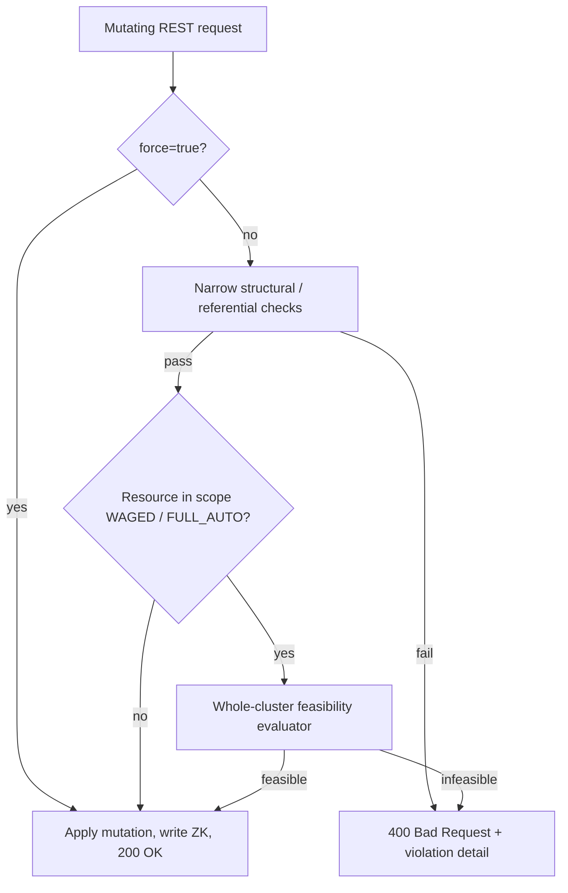
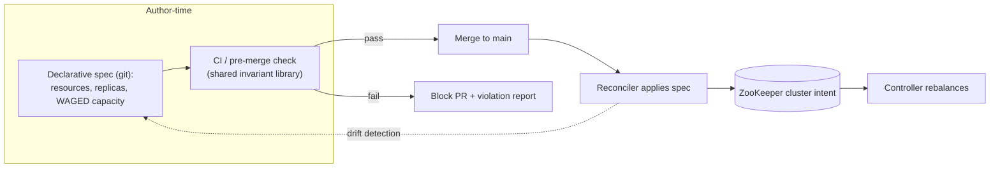

# Helix REST Guard Rails: Pre-Write Validation for Cluster and Resource Operations

## Summary

Several mutating Helix REST operations — dropping an instance, shrinking instance capacity,
marking an instance `EVACUATE`, onboarding a new resource, and enabling WAGED — are accepted
unconditionally and written straight to ZooKeeper. They only fail **later**, on the controller's
next rebalance cycle, when the rebalancer can no longer satisfy `minActiveReplicas` or capacity
constraints. By then the caller already received a `200 OK` and the cluster is degraded or stuck.

This document proposes a set of **guard rails**: a pre-write validation layer on mutating
helix-rest endpoints that rejects an operation (`400 Bad Request`) when it would corrupt cluster
intent or make the cluster un-rebalanceable, with a `?force=true` escape hatch for operators who
accept the risk. Section 2 catalogs the concrete validation rules, grouped by impact, as the
**short-term** deliverable. Section 3 lays out the **long-term** direction: a declarative
desired-state model whose invariants are validated in CI/pre-merge, so infeasible configurations
never reach a live cluster in the first place.

---

## 1. Problem Statement

Helix REST write endpoints mutate cluster intent — the instance set, instance capacity, instance
operation, resource set, and cluster/resource configuration — and return immediately after the
ZooKeeper write. The rebalancer (WAGED for FULL_AUTO resources) runs asynchronously on the
controller and only *then* discovers that the new intent is infeasible. The failure surfaces as a
stuck rebalance, unassigned partitions, a partition below its minimum active replicas, or a
`MissingTopState`-class alert — far in time and place from the API call that caused it.

### 1.1 How failures surface today

```
Scenario A — drop an instance below min-active-replica
T0: Resource MyDB: replicas=3, minActiveReplicas=2. Two replicas of MyDB_7 are already OFFLINE.
T1: Operator calls DELETE /clusters/c/instances/host-7  -> 200 OK (only a liveness check runs).
T2: Controller rebalances: MyDB_7 now has 0 active replicas. -> SLA breach, no top state.
```

```
Scenario B — remove a required WAGED capacity key
T0: Cluster requires INSTANCE_CAPACITY_KEYS = [CPU, MEMORY, DISK]. host-4 supplies DISK itself.
T1: Operator POSTs a config update to host-4 that drops the DISK key -> 200 OK.
T2: Next WAGED cycle: host-4 capacity no longer covers all required keys -> rebalancer errors out.
```

```
Scenario C — stop / evacuate more than the cluster can absorb
T0: WAGED cluster running at ~95% capacity utilization across remaining nodes.
T1: Operator EVACUATEs host-3 (or a batch stop passes each per-partition min-active check).
T2: Redistributed weight pushes some node over capacity. -> WAGED cannot place all partitions.
```

```
Scenario D — onboard a resource that does not fit
T0: Operator adds a WAGED resource whose partition weights exceed cluster headroom.
T1: Resource is created in IDEALSTATES -> 200 OK.
T2: Next WAGED cycle cannot place it. -> unassigned partitions, rebalance failure.
```

In every case, the information needed to reject the request was available **at request time**:
Helix can compute what the rebalancer *would* produce for the proposed cluster state without
applying it, and can check structural invariants against the proposed configuration.

### 1.2 Why current validation is insufficient

- Validation is **thin and inconsistent**. Some model setters throw on bad input (e.g.
  `InstanceConfig.setWeight` rejects non-positive weight,
  `ClusterConfig.setInstanceOperationMaintenanceBudgetPercentage` enforces `[0,100]`), but many
  mutating paths skip these by writing raw `ZNRecord`s.
- The natural extension points are **stubs**: `ResourceConfig.isValid()` and
  `InstanceConfig.isValid()` both `return true` today, and `IdealState.isValid()` only checks a
  narrow set (partition count, state-model ref, SEMI_AUTO preference-list size).
- There is **no whole-cluster feasibility check**. Per-field validation cannot catch cases where
  each partition passes individually but the cluster as a whole becomes un-hostable (Scenario C).
- Input-validation failures are sometimes reported as `500 Server Error` rather than `400`,
  obscuring that the caller supplied bad input.

The result is a class of operator actions that are silently accepted and later cause incidents.

---

## 2. Short-Term Solution: Pre-Write API Validation Guard Rails

The short-term goal is to **validate every mutating request before the ZooKeeper write** and
reject the ones that would corrupt intent or break rebalancing, while preserving an explicit
operator override.

### 2.1 Principles

1. **Validate before persisting.** No guard rail mutates ZK; it runs entirely on the proposed
   (un-applied) state and either lets the existing write proceed or returns `400`.
2. **Enforce by default, bypass with `?force=true`.** Operators who knowingly accept the risk
   pass `force=true` to preserve today's behavior.
3. **Uniform, actionable error contract.** Every rejection returns `400` with a structured body
   naming the failed rule and the specific resource/partition/key/instance involved.
4. **Reuse existing invariants, don't reinvent them.** Guard rails call the canonical validators
   already in helix-core (see [2.2](#22-architecture)) so the REST verdict matches the
   controller's own logic.
5. **No-op where placement is operator-controlled.** For SEMI_AUTO / CUSTOMIZED resources the
   guard rails apply only referential/structural rules; feasibility checks (which model the
   rebalancer) are skipped because Helix does not compute those placements.

### 2.2 Architecture

Two classes of checks, layered:

- **Narrow structural / referential checks** — cheap, per-field validators run inline in the
  accessor (e.g. capacity-key presence, id-matches-path, state-model-ref existence). Many reuse
  existing utilities: `WagedValidationUtil.validateAndGetInstanceCapacity` /
  `validateAndGetPartitionCapacity`, `InstanceConfig.validateTopologySettingInInstanceConfig`
  (via `Topology.computeInstanceTopologyMap`), and the model `isValid()` methods (to be
  fleshed out).
- **Whole-cluster feasibility check** — a shared, ZooKeeper-free evaluator in **helix-core** that
  takes the current cluster state plus a proposed delta, computes the would-be assignment using
  the existing compute-without-apply primitives, and asserts post-conditions. The primitives
  already exist and already power the dry-run optimizer endpoint
  (`ResourceAssignmentOptimizerAccessor.computePotentialAssignment`):
  `HelixUtil.getTargetAssignmentForWagedFullAuto(...)` (WAGED) and
  `HelixUtil.getIdealAssignmentForFullAuto(...)` (FULL_AUTO/CRUSH). Min-active-replica for a
  drop/stop delta reuses `InstanceValidationUtil.siblingNodesActiveReplicaCheckWithDetails(...)`,
  which already threads a `toBeStoppedInstances` set for batch scenarios.



**Where the code lives:** the feasibility engine and reusable invariants live in **helix-core**
(unit-testable without a REST server); **helix-rest** accessors build the delta, invoke the
checks, and render the result. This keeps the same invariant library reusable by the long-term
CI path (Section 3).

### 2.3 Validation rule catalog by impact

Impact is assessed as *severity of the failure* × *likelihood in normal operations* × *how
silently and late it surfaces today*. The tiers double as the implementation order.

#### 2.3.1 Highest impact

*Directly cause rebalance failures, stuck clusters, or SLA breaches. Accepted as `200 OK` today
and surface only on the controller's next cycle.*

| # | Rule | Endpoint(s) | Reuse hook |
|---|------|-------------|------------|
| H1 | Dropping an instance must not push any hosted partition below `minActiveReplicas` | `DELETE /instances/{n}` | `InstanceValidationUtil.siblingNodesActiveReplicaCheckWithDetails` |
| H2 | A config update must not remove or reduce a required WAGED capacity key | `POST /instances/{n}/configs` | `WagedValidationUtil.validateAndGetInstanceCapacity` on the merged config |
| H3 | Every instance's `INSTANCE_CAPACITY_MAP` covers all `ClusterConfig.INSTANCE_CAPACITY_KEYS`; every WAGED resource's `PARTITION_CAPACITY_MAP` covers all required keys incl. `DEFAULT` | `PUT /instances/{n}`, `POST /instances/{n}/configs`, `addWagedResource`, `POST /resources/{r}/configs` | `validateAndGetInstanceCapacity` / `validateAndGetPartitionCapacity` |
| H4 | No single partition weight exceeds the largest single instance's capacity in any dimension (otherwise permanently unplaceable) | `addWagedResource`, resource/instance config updates | feasibility evaluator (per-dimension check) |
| H5 | Feasibility: `EVACUATE`, add-resource, and capacity-shrink leave enough headroom to place all partitions | `setInstanceOperation=EVACUATE`, `addResource`/`addWagedResource`, `POST /instances/{n}/configs` | feasibility evaluator (`getTargetAssignmentForWagedFullAuto`) |
| H6 | No previously-assignable partition becomes unassigned after the mutation | all feasibility-scoped endpoints | feasibility evaluator (post-condition) |
| H7 | Aggregate batch-stop / stoppable: the combined effect of stopping N instances is feasible (each may pass individually while the total fails) | `POST /instances` (batch), `/instances/{n}/stoppable` | evaluator with a deactivate delta honoring `toBeStoppedInstances` |
| H8 | `stateModelDefRef` on a resource must exist in `STATEMODELDEFS` (a missing state model yields a resource that can never transition) | `addResource`, `addWagedResource`, `POST /resources/{r}/configs` | lookup against `STATEMODELDEFS` |
| H9 | Enabling WAGED (per-resource or cluster-wide) requires all in-scope resources and instances to already be WAGED-valid | `enableWagedRebalance`, `enableWagedRebalanceForAllResources` | `WagedValidationUtil` over the in-scope set |

#### 2.3.2 Medium impact

*Cause wrong placement, failed operations, or misconfiguration needing manual cleanup — but not
always an immediate rebalance failure.*

| # | Rule | Endpoint(s) | Reuse hook |
|---|------|-------------|------------|
| M1 | `logicalId` (derived from instance `DOMAIN`) is unique across instances — duplicates break WAGED placement and instance swap | `PUT /instances/{n}`, `POST /instances/{n}/configs` | compare against existing instance configs |
| M2 | Topology consistency: if topology-aware, `TOPOLOGY` + `FAULT_ZONE_TYPE` are set and consistent, fault zone is one of the topology keys, and each instance `DOMAIN` supplies all topology-path keys | instance + cluster config updates | `Topology.computeInstanceTopologyMap`, `validateTopologySettingInInstanceConfig` |
| M3 | `InstanceOperation` transitions are legal — e.g. `SWAP_IN` requires a matching `SWAP_OUT` of the same `logicalId` | `POST /instances/{n}?command=setInstanceOperation` | operation-transition check |
| M4 | Rebalance mode/strategy compatibility: WAGED ⇒ FULL_AUTO; USER_DEFINED ⇒ `rebalancerClassName` set and loadable; SEMI_AUTO ⇒ preference-list size == replicas | `addResource`, `updateResourceIdealState` | `IdealState.isValid` (extended), class-load check |
| M5 | `replicas` ≤ eligible instance count (and ≤ fault-zone count when fault-zone-aware); `minActiveReplicas` in `[0, replicas]`; `maxPartitionsPerInstance` feasible vs `numPartitions × replicas / numInstances` | `addResource`, resource config/ideal-state updates | count checks against instance set |
| M6 | Cascade / referential deletes: reject deleting a state model def or instance still referenced by a resource; reject deleting a cluster with live instances / active resources | `DELETE` on statemodeldef / instance / cluster | reference scan |
| M7 | Instance-operation-maintenance markers respect the cluster budget *before* the write; delayed-rebalance settings are consistent with the resource's mode | `instanceOperationMaintenance`, resource config updates | `ClusterConfig` budget getters |

#### 2.3.3 Low impact

*Input hygiene, defensive correctness, and better error messages. Rarely cause rebalance
failures; several are already enforced in model setters — the gap is surfacing them cleanly at the
REST layer as `400`.*

| # | Rule | Notes |
|---|------|-------|
| L1 | ZNRecord `id` matches the path parameter (`clusterId` / `resourceName` / `instanceName`) | prevents writing a config under the wrong key |
| L2 | Resource-name uniqueness on add; cluster / customized-state-type existence on the operations that require them | clearer errors than the current admin-exception path |
| L3 | Numeric hygiene already in setters, surfaced at REST: `numPartitions` > 0, `bucketSize` ≥ 0, instance `weight` > 0, capacities ≥ 0, maintenance budget % in `[0,100]`, `numOfflineInstancesForAutoExit ≤ maxOfflineInstancesAllowed`, `globalRebalancePreference` contains EVENNESS **and** LESS_MOVEMENT | map `IllegalArgumentException` to `400` |
| L4 | Implement the currently-stubbed `ResourceConfig.isValid()` / `InstanceConfig.isValid()` (both `return true`) and invoke them at the REST layer | central home for structural rules |
| L5 | Schema hygiene: payload parses to a `ZNRecord`, required fields present for the declared mode, map-shaped fields well-typed and non-negative | first line of defense |
| L6 | Error-contract fix: input-validation failures return `400`, not `500` | applies across all mutating endpoints |

### 2.4 Cross-cutting delivery framework

These are the delivery mechanisms shared by every rule above, not rules themselves:

- **`?force=true` bypass** on each mutating endpoint (default `false`): skips the guard rails and
  applies the mutation, preserving pre-guard-rail behavior for operators who accept the risk.
- **Uniform `400` violation body**, e.g.:

  ```json
  {
    "error": "REBALANCE_FEASIBILITY_CHECK_FAILED",
    "violations": [
      {"rule": "H1", "resource": "MyDB", "partition": "MyDB_7", "activeReplicas": 1, "required": 2}
    ],
    "hint": "Pass force=true to override."
  }
  ```

- **ACM stoppable integration**: surface the min-active-replica + feasibility verdict as a
  `HealthCheck` on the read-only `/instances/{n}/stoppable` (and batch) path that ACM already
  consumes, honoring the "instances already slated to stop" set. The `HealthCheck` enum already
  carries `MIN_ACTIVE_REPLICA_CHECK_FAILED` in `STOPPABLE_CHECK_LIST`; add a feasibility check
  alongside it. ACM needs no new endpoint — it simply observes a new failed-check reason.
- **Dry-run affordance**: allow callers to run the guard rails and return the verdict *without*
  mutating (the evaluator is effectively the dry-run the optimizer endpoint already exposes).

### 2.5 Endpoint-to-rule mapping

| Method | Path | Rules |
|--------|------|-------|
| DELETE | `/clusters/{c}/instances/{n}` | H1, H6, M6 |
| POST | `/clusters/{c}/instances/{n}/configs` | H2, H3, H4, H5, H6, M1, M2, L1, L4, L6 |
| PUT | `/clusters/{c}/instances/{n}` | H3, M1, M2, L1, L4, L5 |
| POST | `/clusters/{c}/instances/{n}?command=setInstanceOperation` | H5, H6, M3 |
| POST | `/clusters/{c}/instances` (batch) | H7 |
| GET/POST | `/clusters/{c}/instances/{n}/stoppable` (+ batch) | H1, H7 (as HealthCheck) |
| PUT | `/clusters/{c}/resources/{r}` (`addResource`/`addWagedResource`) | H3, H4, H5, H6, H8, M4, M5, L1, L2 |
| POST | `/clusters/{c}/resources/{r}/configs` | H3, H8, M4, M5, L1, L4, L6 |
| POST | `/clusters/{c}/resources/{r}/idealState` | M4, M5, L1, L4 |
| POST | `/clusters/{c}/resources/{r}?command=enableWagedRebalance` | H9 |
| POST | `/clusters/{c}?command=enableWagedRebalanceForAllResources` | H9 |
| POST | `/clusters/{c}/configs` | M2, L1, L3, L6 |

### 2.6 Implementation sequencing

Each step is independently mergeable and testable. Order follows the impact tiers.

- **Step 1 — Feasibility engine (helix-core).** Create the ZooKeeper-free feasibility evaluator
  and its value types; extract the hypothetical-state builder currently private in
  `ResourceAssignmentOptimizerAccessor` into a shared helper so the evaluator and the optimizer
  endpoint use one code path. *Validation:* `mvn test -pl helix-core -Dtest=Test<Evaluator>`.
- **Step 2 — Highest-impact instance guard rails (helix-rest).** Wire H1–H6 into
  `PerInstanceAccessor` (`deleteInstance`, `updateInstanceConfig`, `updateInstance`), with the
  `force` bypass and uniform `400`. *Validation:* `mvn test -pl helix-rest -Dtest=TestPerInstanceAccessor`.
- **Step 3 — Resource onboarding guard rails (helix-rest).** Wire H3–H8, M4–M5 into
  `ResourceAccessor` (`addResource`, `addWagedResource`, config/ideal-state updates).
  *Validation:* `mvn test -pl helix-rest -Dtest=TestResourceAccessor`.
- **Step 4 — WAGED-enable + batch/ACM (helix-rest).** Add H9 to the enable-WAGED paths and H7
  to the batch/stoppable path via a new `HealthCheck`. *Validation:*
  `mvn test -pl helix-rest -Dtest=TestInstancesAccessor,TestMaintenanceManagementService`.
- **Step 5 — Medium/low structural rules.** Flesh out `ResourceConfig.isValid()` /
  `InstanceConfig.isValid()` (M/L tiers), topology and logicalId checks (M1–M2), identity/schema
  hygiene (L1–L6), and the `500 -> 400` contract fix. *Validation:* module unit tests.

### 2.7 Testing strategy

- **Unit (helix-core).** Feed synthetic `ClusterConfig` / `InstanceConfig` / `IdealState` /
  `ResourceConfig` to the evaluator and assert feasible vs infeasible verdicts for each highest-
  impact rule, plus the "non-WAGED/non-FULL_AUTO scope → not evaluated" no-op.
- **Integration (helix-rest).** Using the existing embedded-ZK Jersey harness, stand up a cluster,
  drive it to the boundary condition, attempt the mutation and assert `400` + violation detail,
  then repeat with `?force=true` and assert `200`. Extend `TestPerInstanceAccessor`,
  `TestResourceAccessor`, `TestInstancesAccessor`, `TestMaintenanceManagementService`.
- **Backward-compatibility.** Non-WAGED / non-FULL_AUTO cluster → mutation still returns `200`
  (evaluator no-ops); `?force=true` on each endpoint preserves the pre-guard-rail `200`.

### 2.8 Rollout and backward compatibility

- **Posture:** enforce-by-default + `?force=true`, applied uniformly across the enforcing
  endpoints. Behavior change: an operation that would make the cluster un-rebalanceable now
  returns `400` instead of `200`.
- **Phasing:** land Step 1 (engine, no behavior change) → per-endpoint guard rails behind the
  `force` contract → enable in dev/staging → canary → production.
- **Caller migration:** inventory callers of the affected endpoints (ACM stoppable flow,
  deployment/evacuation tooling, resource-onboarding tooling); callers that must preserve old
  behavior add `force=true` — the single migration action required. ACM needs no code change to
  *call*, only to interpret the new failed-check reason if it surfaces check names.
- **Rollback:** guard rails are gated per request by `force`; an emergency bypass is `force=true`,
  and code-level revert is per-endpoint and isolated.
- **Monitoring:** count guard-rail rejections and `force=true` overrides per endpoint to detect
  false positives and bypass abuse.

### 2.9 Risks and mitigations

| Risk | Likelihood | Impact | Mitigation |
|------|-----------|--------|------------|
| False positive blocks a legitimate operation | Medium | High | `?force=true` escape hatch; structured violation detail; reject-rate monitoring; keep cheap narrow checks where exact |
| Full-assignment computation adds latency on large clusters | Medium | Medium | Fast narrow pre-filters; scope the evaluator to affected resources; bound/measure compute time |
| `force=true` becomes the default in tooling, defeating the guard rail | Medium | Medium | Monitor override rate per caller; require a reason; alert on high bypass usage |
| Behavior change breaks automation expecting `200` | Medium | Medium | Documented migration to `force=true`; phased rollout; non-WAGED clusters unaffected |
| Evaluator verdict diverges from the controller's actual rebalance | Low | High | Reuse the *same* `HelixUtil` primitives the optimizer/controller path uses; integration tests assert parity at boundaries |

---

## 3. Long-Term: Declarative Config Model with CI Validation

The guard rails in Section 2 catch bad mutations at the REST boundary, one imperative call at a
time. They are necessary but reactive: the validation logic lives at the edge of a live cluster,
and an operator still discovers a rejection only when they attempt the change. The long-term
direction is to move the point of validation **left of the cluster entirely**.

### 3.1 Vision

Treat a cluster's shape — its resources, replica/partition topology, WAGED capacity model, and
per-instance capacity — as a **declarative desired-state specification** that lives in source
control, is reviewed like code, and is validated in **CI/pre-merge** using the *same* invariant
library that backs the runtime guard rails. Helix then **reconciles** the live cluster toward the
declared spec. Infeasible configurations are caught before they are ever committed, let alone
applied — the guard rail becomes a build failure, not a production incident.



### 3.2 Declarative desired-state spec

- A versioned document (per cluster) capturing the pieces most prone to rebalance-breaking edits:
  the resource set and each resource's rebalance mode, replica count, `minActiveReplicas`, state
  model, and partition weights; the cluster's `INSTANCE_CAPACITY_KEYS` and defaults; and the
  instance capacity model.
- The spec is the **single source of truth** for intent. Ad-hoc REST writes become the exception
  (break-glass), not the norm, which also gives auditability and easy rollback (revert the commit).

### 3.3 CI / pre-merge validation

- Package the Section 2 invariants (min-active-replica, WAGED capacity coverage, partition-weight
  vs instance-capacity feasibility, mode/strategy compatibility, topology consistency, referential
  integrity) as a **standalone, cluster-independent validation library** in helix-core.
- Run it in CI against the proposed spec, optionally seeded with a snapshot of live instance
  capacity, to answer "is this configuration rebalanceable?" *before* merge. A failing check
  blocks the PR with the same structured violation report the REST layer returns.
- Because the runtime guard rails and the CI check call the **same** library, a config that passes
  CI is guaranteed to pass the runtime guard rails — no drift between the two enforcement points.

### 3.4 Reconciliation and drift detection

- A reconciler (a controller extension or an external operator) diffs the declared spec against
  live ZK intent and applies the delta through the already-guard-railed write paths.
- **Drift detection** flags any live intent that diverges from the spec (e.g. a break-glass REST
  write), so the source of truth and the cluster stay reconciled.

### 3.5 Migration path from guard rails to declarative

1. Ship the Section 2 guard rails (invariants live in helix-core, invoked from helix-rest).
2. Extract those invariants into the standalone validation library and expose a CI entry point
   that validates a spec document.
3. Introduce the declarative spec format and onboard clusters read-only (validate-and-report,
   no reconciliation) to build confidence.
4. Enable reconciliation cluster-by-cluster, with REST writes demoted to break-glass and drift
   detection alerting on divergence.

This sequencing means the short-term work is not throwaway: the guard-rail invariants **are** the
long-term CI library — the only change is *where* they run (REST edge → pre-merge CI) and *when*
(at mutation time → before commit).

---

## Open Questions

1. Naming of the aggregate feasibility `HealthCheck` (e.g. `REBALANCE_FEASIBILITY_CHECK_FAILED`
   vs a more specific `WAGED_CAPACITY_CHECK_FAILED`) — leaning general, since it also covers
   no-unassigned and cluster-scope min-active-replica.
2. Should the dry-run be a first-class `?dryRun=true` on each mutating endpoint, or left to the
   existing optimizer endpoint?
3. Per-cluster opt-out vs the per-request `force` flag — current lean is per-request `force`
   only, to avoid a second, persistent bypass path.
4. For the long-term model: what is the spec's storage/format (in-repo YAML vs a Helix-native
   document), and does the reconciler live inside the controller or as a separate operator?
